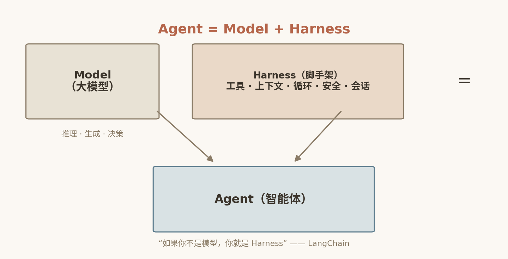

# 1. Agent 时代的关键认知：Model + Harness = Agent

2026 年，AI 工程圈悄然完成了一次叙事重心转移：过去两年所有人都在追逐"更强的模型"，如今最顶尖的实验室和最赚钱的编程工具厂商却在争夺同一样东西——模型外面那层壳。这层壳有一个正式的名字：**Harness**（马具，驾驭系统）。

本章的任务是把这层认知讲透：Harness 这个概念从哪里来、为什么 Anthropic 和 OpenAI 先后为它写下纲领性工程博客、为什么说"Harness 比模型更重要"不是营销话术而是有实验数据支撑的结论，以及为什么 Harness 会成为 2026 年 AI 编程工具竞争的绝对焦点。读完本章，你将建立起后续所有源码剖析所需要的概念坐标系——因为 DeepSeek Harness 的每一个设计决策，几乎都能在本章的脉络中找到出处。

## 1.1 命名：一匹需要被驾驭的野马

"Harness" 作为 AI Agent 工程术语，公认由 HashiCorp 联合创始人 **Mitchell Hashimoto** 于 2026 年 2 月正式命名（Mitchell Hashimoto，2026-02）。他给出的核心隐喻极为传神：

> Harness 不帮野马跑得更快，但它能拽住方向、控制节奏、防止闯祸。

*图 1-1 Harness 的隐喻：不替野马奔跑，但能拽住方向*

大语言模型就是那匹野马：能力惊人、速度极快，但本质上是概率性的、不可预测的、没有记忆也没有边界意识的。你无法让模型"变得更有责任心"，但你可以给它套上一副马具——规定它能调用哪些工具、在什么条件下必须停下来等待人类批准、上下文快满了该怎么压缩、失败了该重试还是降级。

真正让这个概念公式化的，是 LangChain 团队提出的著名定义：

$$Agent = Model + Harness$$

用一句更直白的话说：**"如果你不是模型，你就是 Harness。"** Harness 是除模型权重本身之外的每一块代码、每一条配置、每一段执行逻辑。原始模型不是 Agent——它只是一个"文本进、文本出"的函数；只有当 Harness 赋予它**状态、工具执行能力、反馈循环和可执行约束**时，它才真正成为 Agent。

*图 1-2 Model + Harness = Agent*

在使用这个公式时，需要区分两个经常被混用的层次：

| 术语 | 性质 | 含义 |
|---|---|---|
| **Agent Harness** | 技术实体 | 管理 Agent 如何运行的控制系统：工具调用管理、记忆注入与清理、重试与降级、人工审批、上下文注入、子 Agent 调度 |
| **Harness Engineering** | 方法论 | 如何设计、构建和维护 Harness 的工程学科 |

本书的主角 DeepSeek Harness 属于前者——一个可下载、可运行、可魔改的技术实体；而本章接下来要介绍的两篇纲领性文献，则属于后者——两家顶级实验室对"Harness 工程到底该怎么做"的系统性回答。

## 1.2 OpenAI 的实验：100 万行代码，零人工编写

2026 年 2 月 11 日，OpenAI 技术人员 Ryan Lopopolo 发表了《Harness Engineering: Leveraging Codex in an Agent-First World》（OpenAI 官方博客，2026-02-11），这可能是 Harness Engineering 作为一门学科被正式宣告成立的标志性文章。

文章披露了一组至今读来仍令人震撼的数字：

- 团队用 **5 个月**时间，从零构建并交付了一个内部 Beta 产品；
- 全程**没有一行人工编写的代码**——约 **100 万行代码**、约 **1500 个 PR**，全部由 Codex Agent 产出；
- 团队规模从 3 人扩到 7 人，平均每个工程师每天产出 **3.5 个 PR**；
- 整体耗时约为纯手写开发的 **1/10**。

支撑这场实验的核心口号只有一句话：

> **Humans steer. Agents execute.（人类掌舵，智能体执行。）**

但比数字更有价值的，是他们在 Harness 工程实践中沉淀下来的几条原则——这些原则几乎原封不动地出现在后来所有严肃的 Harness 设计中。

### 1.2.1 "Agent 看不到的东西等于不存在"

OpenAI 团队最重要的认知是：**Agent 在运行上下文中看不到的东西，等于不存在**。这听起来像句废话，但它直接颠覆了很多团队的文档习惯。

人类工程师可以凭记忆知道"这个仓库的发布流程要先跑 staging 再跑 prod"，可以口耳相传"这段历史代码不要动"。但 Agent 没有这些记忆——每次会话它都是一张白纸。因此，仓库知识必须成为 **system of record**：所有约定、流程、架构决策都必须以机器可读的形式沉淀在仓库里，并且在 Agent 的运行上下文中可被获取。

### 1.2.2 渐进式披露：不要写臃肿的 AGENTS.md

OpenAI 的早期教训颇具戏剧性：他们最初把所有规范塞进一个巨大的 `AGENTS.md`，结果 Agent 注意力涣散——上下文里 90% 的规范与当前任务无关，反而稀释了关键指令的权重。

改进方案是**渐进式披露（Progressive Disclosure）**：主文件只作目录索引，详细内容按需加载；用结构化的 `docs/` 目录取代单文件；再用 linter 和 CI **机械地强制文档新鲜度**——文档过期不是道德问题，而是构建失败。

### 1.2.3 可观测性与可验证目标

文章还提出了两条经常被忽视的原则：

- **让日志、指标、trace 成为 Agent 可调用的运行时能力**——Agent 不应该"被观测"，而应该能"自己查观测数据"；
- **给 Agent 可验证的目标**——"写得好一点"不是目标，"`pnpm test` 全绿"才是。

这两条我们会在 DeepSeek Harness 的会话日志插件与权限审批系统中看到清晰的回响。

## 1.3 Anthropic：更早、更系统的 Harness 论述

如果说 OpenAI 的文章是"工程战报"，那么 Anthropic 的系列文章则是"理论奠基"。事实上，Anthropic 是最先系统性提出 Harness 设计理念的公司，分别于 2025 年 11 月 26 日和 2026 年 3 月 24 日发布《Effective Harnesses for Long-Running Agents》与《Harness Design for Long-Running Application Development》（后者作者为 Anthropic Labs 团队 Prithvi Rajasekaran；anthropic.com/engineering）。

### 1.3.1 长任务 Harness：换班工程师问题

《Effective Harnesses for Long-Running Agents》（2025-11-26）直面一个核心矛盾：Agent 在**离散会话**中工作，而每一个新会话都没有之前的记忆。文章用了一个精准的类比——**换班工程师**：早班工程师下班前必须留下交接文档，晚班工程师照着文档继续干活，否则项目必然烂尾。

Anthropic 给出的解决方案是**双 Agent 结构**：

- **Initializer agent**：首次运行，把环境搭好、把任务拆解成工件（artifacts）；
- **Coding agent**：每次会话做增量推进，结束前留下清晰的工件供"下一班"接续。

文章还诊断出长任务的两大失控根源：

1. **上下文一致性下降**：会话越长，早期指令的约束力越弱；
2. **上下文焦虑（context anxiety）**：模型在接近自以为的上下文上限时会过早收尾、草草交差——哪怕实际上下文预算还有富余。

这两个问题在后续所有长任务 Harness（包括 DeepSeek Harness 的压缩与子 Agent 调度设计）中都是一等公民。

### 1.3.2 工具设计：非确定性用户与确定性工具

在《Writing Effective Tools for Agents》中，Anthropic 提出了 Harness 工具设计的核心洞察：

> **Agents are non-deterministic users of deterministic tools.（Agent 是确定性工具的非确定性用户。）**

由此推导出的设计原则包括：

- **少而精**：策略性地选择工具，而非"多多益善"；
- **清晰的命名空间**：让模型从名字就能推断工具的用途与边界；
- **返回有意义的上下文**：工具返回值是给模型读的 prompt，不是给人看的日志；
- **Token 高效**：返回值要克制，别把整个文件 dump 回去；
- **把工具描述当作 prompt engineering**：工具描述写得好，模型就能用得好。

最硬的一手实证是：**Claude Sonnet 3.5 仅靠精细化的工具描述与脚手架设计、不改模型权重，就把 SWE-bench Verified 刷到了当时的 SOTA**（Erik Schluntz《Raising the Bar on SWE-bench Verified with Claude 3.5 Sonnet》，Anthropic，2025-01）。Anthropic 倡导的方法论是**评估驱动开发**：原型 → 评测 → 分析失败 → 迭代。

### 1.3.3 渐进式披露的另一面：Skills

与 OpenAI 的文档渐进式披露异曲同工，Anthropic 在工具与能力加载上也践行同一原则：**不要把全部工具定义一次性载入上下文**。Skills 机制只在上下文中放"名称 + 短描述"，模型需要时再按需加载完整内容。官方案例中，上下文占用从 **150,000 token 降到 2,000 token**，降幅约 98.7%（Anthropic，2026）。在 token 就是钱的今天，这个数字本身就是商业竞争力。

## 1.4 "Harness 比模型更重要"：一条完整的论据链

"Harness 比模型更重要"听起来像反直觉的口号，但 2025—2026 年间积累的一系列实验数据，让这句话成了工程界的共识。我们按从宏观到微观的顺序梳理这条论据链：

**论据一：TerminalBench 2.0 的排名跃迁。** LangChain 在 TerminalBench 2.0 上**仅改变 Harness、模型（gpt-5.2-codex）保持不变**，得分从 52.8 提升到 66.5（+13.7 个百分点），排名从 30 名开外跃升到**第 5 名**（LangChain 官方博客，2026-04）。同一份模型权重，换一个壳，就是从"不入流"到"第一梯队"的距离。

**论据二：文件编辑接口的 61.6 个百分点。** 安全研究员 Can Boluk 的实验：在编码基准测试中**仅更换文件编辑接口的调用方式**（其余全部不变），Grok Code Fast 1 的分数从 **6.7% 跳到 68.3%**（2026，详见本章参考资料）。接口设计——一个纯 Harness 层的决策——决定了这个系统究竟是"不可用"还是"可生产"。

**论据三：同一模型，换个 harness 从 61.5% 到 87.2%。** Endor Labs 的交叉基准（2026-05）：同一个 GPT-5.5 模型、同一周，跑在原生 Codex harness 中功能正确率 **61.5%**，换到 Cursor 的 harness 中达到 **87.2%**——25.7 个百分点的差距，全部来自模型外面的那层代码。同一测试中，Opus 4.7 在 Cursor harness（91.1%）下的得分甚至高于 Anthropic 自家 Claude Code harness（87.2%）。

**论据四：Composio 八 Harness 横评。** 2026 年 8 月 11 日，Composio 发布《Finding the Best Harness for DeepSeek V4 Flash》：同一 DeepSeek V4-Flash 模型、30 个工作流 × 8 个 harness、共 240 次运行，结果如下：

| Harness | 通过率 | 备注 |
|---|---|---|
| Pi Agent | **66.7%** | $0.028/成功，成本最低 |
| Prime Agent | 62.5% | |
| OMP | 56.7% | |
| Claude Code / Codex / DeepAgents | 53.3% | Claude Code 单次成功成本最高（$0.195，prompt cache 命中率仅 1.5%） |
| Hermes | 50% | |
| OpenCode | 46.7% | |

总通过率仅 53.8%，报告的结论耐人寻味："**No harness had the best result for every measure.**"（Composio，2026-08-11）——Claude Code 中位完成时间最短（122.7 秒）却最贵。其姊妹篇用同一 Kimi K3 模型在 8 个 harness 下测得通过率从 **68% 到 88%**——20 个百分点差距完全来自 Harness。

**论据五：成本维度。** Databricks 内部基准显示：同一模型经不同 harness，任务成本相差 **2 倍以上而输出质量相同**——高效的 harness 每轮少发约 3 倍上下文（Databricks，2026）。

**论据六：反向证据。** Anthropic 2026 年 4 月的事故复盘：系统提示、缓存策略、reasoning effort 三处 **harness 层改动**叠加导致 Claude 被用户大面积反馈"变笨"——而模型权重没有任何变化（Anthropic，2026-04）。Harness 能让模型变强，也能让模型变笨；模型没变，变的是壳。

六条论据合在一起，结论已经无可回避：**在模型能力趋同的时代，Harness 是决定 Agent 产品质量的第一变量。**

## 1.5 设计哲学谱系：五种 Harness，五种世界观

理解了"Harness 很重要"，下一个问题自然是"好的 Harness 长什么样"。有意思的是，主流产品给出了截然不同的答案。我们把五种代表性设计排成一条光谱——从"Harness 替模型决策"到"一切皆插件"。

### 1.5.1 Claude Code：精心雕琢的状态机

Anthropic 的 Claude Code 是"重 Harness"路线的极致。源码层面，它是一台庞大的状态机：

- **7 种 Continue reason + 10 种 Terminal reason**，把 Agent 循环的每一步流转全部枚举化；
- **5 层上下文压缩漏斗**，分层对抗长会话的上下文膨胀；
- 应用层做 **AST 解析级别的权限管控**；
- **27 种 Hook + Skills 懒加载**；
- **prompt cache 字段字节级对齐**作为头号成本优化手段。

设计哲学：**Harness 替模型决策**。模型只负责在它被允许的空间里推理，其余一切由 Harness 提前算好。

### 1.5.2 Codex：给模型递工具的薄壳

OpenAI 的 Codex 走了几乎相反的路：开源的 Rust workspace，核心是一个朴素的 `loop {}` 加 4 种退出原因；安全边界不自己造轮子，直接甩给操作系统（Landlock / Seatbelt / Seccomp）；高风险操作交人工审批；扩展全部走 MCP 协议；上下文按需读取。

设计哲学：**给模型递工具的薄壳**。值得注意的是，两家哲学看似对立，共识却高度一致——"**Harness 承担不变量，模型承担决策**"，以及那句流传甚广的判断："**prompt 不是产品力，harness 才是产品力**"。

### 1.5.3 Pi Agent：极简主义宣言

Mario Zechner 的 Pi Agent 把极简做到了极致：核心只有 `read / write / edit / bash` **四个工具**，刻意不做 MCP、不做子 Agent、不做 plan 模式、不做权限弹窗，一切交给用户扩展——README 原文斩钉截铁："By default, pi gives the model four tools: `read`, `write`, `edit`, and `bash`"，并明确列出 "**No MCP**"、"**No sub-agents**"、"**No permission popups**"，缺什么就自己用扩展造（github.com/badlogic/pi-mono）。而正是这个"什么都缺"的 Pi，在 Composio 与 Databricks 的基准里拿下了最高通过率、最低成本——极简不是缺陷，是对"模型已经够聪明"的信念投票。

### 1.5.4 Aider：git 原生

Aider 的答案是**以版本控制为中心**：每次修改自动 commit、用 tree-sitter 摘要生成仓库 map 注入上下文、提供多种"编辑格式"适配不同模型能力。在 Aider 的世界观里，Harness 首先是一套 git 工作流机器。

### 1.5.5 对照表

| Harness | 厂商/作者 | 核心哲学 | 关键词 |
|---|---|---|---|
| Claude Code | Anthropic | Harness 替模型决策 | 状态机、5 层压缩漏斗、27 种 Hook |
| Codex | OpenAI | 递工具的薄壳 | `loop {}`、OS 级沙箱、MCP |
| OpenCode | 社区 | 开源多模型 | 曾暴露 harness 层"重排版 bug"——三个模型都试图重排既有代码，证明问题在 harness 而非模型 |
| Pi Agent | Mario Zechner | 极简 | 4 个工具、No MCP、No sub-agents、No permission popups |
| Aider | 社区 | git 原生 | 自动 commit、repo map、编辑格式 |

那么 DeepSeek Harness 站在光谱的哪个位置？预告一下：它选择了比上述所有产品都激进的一条路——"Everything is a Plugin"，连 Agent 循环本身都是插件。这将是第 2 章和全书后半部分的主线。

## 1.6 为什么 Harness 成为竞争焦点：七条理由

综合以上事实，我们把"模型之外的脚手架为何成为兵家必争之地"归纳为七条：

1. **模型同质化，Harness 成差异化壁垒。** 同一模型换 harness，基准差距可达 20—26 个百分点、成本差 2—7 倍（Composio 2026-08、Endor Labs 2026-05、Databricks 2026-07）。模型可以租，Harness 必须自己造。
2. **Context Engineering 是核心战场。** "Agent 看不到的东西等于不存在"（OpenAI）；上下文一致性下降与"上下文焦虑"是长任务失控主因（Anthropic）。压缩策略直接决定成本与稳定性。
3. **缓存命中是真金白银。** prompt cache 字节级对齐、渐进式披露（15 万 token → 2 千 token），直接换算成毛利率。
4. **工具设计是杠杆最大的低成本改进。** 仅靠工具描述与脚手架调整、不改模型权重即刷新 SWE-bench Verified SOTA（Anthropic 2025-01）——没有哪个模型升级能有这种投入产出比。
5. **商业逻辑：从卖 token 到卖工作流结果。** API 价格战之下，按 token 计费没有护城河；按"交付一个可用的工作流结果"计费才有。
6. **可控性与安全成为准入门槛。** Harness 层决定数据出境、权限边界与可审计性——对企业客户而言，这比跑分重要得多。
7. **协同进化原则。** Harness 会随模型变强而变薄，但永远不会消失——因为"约束、审计、交接、验证"这些职责，本质上不属于概率模型。

## 1.7 本章小结

- **Harness** 由 Mitchell Hashimoto 于 2026 年 2 月正式命名，LangChain 给出公式化定义：**Agent = Model + Harness**——模型之外的一切代码、配置与执行逻辑皆为 Harness。
- OpenAI 的 Harness Engineering 实验（2026-02-11）用 5 个月、100 万行代码、零人工编写证明了"Humans steer. Agents execute."的可行性，并沉淀出"看不到等于不存在"、渐进式披露、可验证目标三大原则。
- Anthropic 更早地系统论述了长任务 Harness（换班工程师、双 Agent 结构、上下文焦虑）与工具设计原则（"Agent 是确定性工具的非确定性用户"）。
- 六组实验数据构成"Harness 比模型更重要"的完整论据链：TerminalBench 排名跃迁（52.8→66.5，Top 30→Top 5）、编辑接口 6.7%→68.3%、同一模型跨 harness 61.5% vs 87.2%、Composio 八 harness 横评、Databricks 成本差 2 倍、Anthropic 事故反向证据——全部来源见 1.8 节。
- 主流 Harness 呈现五种设计哲学：Claude Code 的重状态机、Codex 的薄壳、Pi 的极简、Aider 的 git 原生——而 DeepSeek Harness 选择了更激进的"一切皆插件"。
- Harness 成为竞争焦点的七条理由，归根结底是两条：它决定产品体验的天花板，也决定商业模式的护城河。

下一章，我们把镜头转向 DeepSeek：这家以"极致模型性价比"著称的公司，为什么、以及如何躬身入局 Harness 战场。

## 1.8 本章参考资料

- [Harness Engineering: Leveraging Codex in an Agent-First World（Ryan Lopopolo，OpenAI，2026-02-11）](https://openai.com/index/harness-engineering/) — OpenAI 官方工程博客：5 个月、约 100 万行代码、零人工编写的内部实验全记录，含 "Humans steer. Agents execute."、"Agent 看不到的东西等于不存在" 与渐进式披露等原则的原始阐述。
- [Anthropic Engineering：Effective Harnesses for Long-Running Agents（2025-11）](https://www.anthropic.com/engineering/effective-harnesses-for-long-running-agents) — Anthropic 工程博客：长任务 Agent 的"换班工程师"问题、Initializer/Coding 双 Agent 结构，以及上下文一致性下降、上下文焦虑两大失控根源的系统论述。
- [DeepSeek Harness 仓库](https://github.com/deepseek-ai/deepseek-harness) — 本书剖析对象的官方仓库，README 中有 "everything is a plugin" 的定位、四种运行模式与快速上手命令。
- [Cordis 论文仓库](https://github.com/cordiverse/paper) — 《A Programming Paradigm for Spatiotemporal Composability》论文与配套代码，摘要中把 "self-evolving agent harnesses" 列为研究动机。
- [Agent Harness 对比卷（harness-books）](https://harness-books.agentway.dev/book2-comparing/exported/book2-comparing.pdf) — 社区编写的 Agent Harness 横向对比电子书（非官方），逐条拆解 Claude Code、Codex 等产品的设计理念与实现差异。
- [LangChain：The Anatomy of an Agent Harness（2026-03）](https://blog.langchain.com/the-anatomy-of-an-agent-harness/) — LangChain 官方博客，提出 "Agent = Model + Harness" 的公式化定义，并逐层解剖 Harness 的组成部分。
- [LangChain：Improving Deep Agents with Harness Engineering（2026-04）](https://blog.langchain.com/improving-deep-agents-with-harness-engineering/) — LangChain 官方博客：只改 harness、模型 gpt-5.2-codex 不变的 TerminalBench 2.0 实验全记录，得分 52.8→66.5（+13.7），排名从 30 名开外升至第 5。
- [虎嗅：提示词工程、上下文工程都过时了，现在是 Harness Engineering 的时代（2026-03-13）](https://www.huxiu.com/article/4841931.html) — 中文行业综述：梳理 Mitchell Hashimoto 2026 年 2 月命名 Harness Engineering 的时间线，并报道 Can Boluk 的文件编辑接口实验（Grok Code Fast 1 得分 6.7%→68.3%）。
- [MindStudio：Cursor SDK vs Claude Code Harness 对比（2026-05）](https://www.mindstudio.ai/blog/cursor-sdk-vs-claude-code-harness-comparison) — 第三方对比文章，引用 Endor Labs 交叉基准数据：同一 GPT-5.5 在 Codex 与 Cursor harness 下 61.5% vs 87.2%，Opus 4.7 在 Claude Code 与 Cursor harness 下 87.2% vs 91.1%。
- [Composio：Finding the Best Harness（2026-08-11）](https://composio.dev/content/best-ai-agent-harnesses) — Composio 基准报告：同一 DeepSeek V4-Flash 模型在 8 个 harness 下 30 个工作流、共 240 次运行的横评数据（总通过率 53.8%，单次成功成本 $0.028–$0.195），另有 Kimi K3 模型的姊妹篇（68%→88%）。
- [Databricks 官方博客：Benchmarking Coding Agents on Databricks' Multi-Million Line Codebase（2026-07-08）](https://www.databricks.com/blog/benchmarking-coding-agents-databricks-multi-million-line-codebase) — Databricks 在数百万行自有代码库上基准测试多个 coding agent 的实测报告，含不同 harness 下任务成本相差 2 倍以上、高效 harness 每轮上下文少约 3 倍的数据。
- [华尔街见闻：Opus 4.6 连续降智翻车一个月，Anthropic 终于公开认错（2026-04-24）](https://wallstreetcn.com/articles/3770813) — 中文报道：详述 Anthropic 官方事故复盘《An update on recent Claude Code quality reports》（2026-04-23），含 reasoning effort 降级、clear_thinking 缓存 bug、system prompt 限长指令三处 harness 层改动的来龙去脉。
- [Erik Schluntz：Raising the Bar on SWE-bench Verified with Claude 3.5 Sonnet（Anthropic，2025-01）](https://www.anthropic.com/research/swe-bench-sonnet) — Anthropic 研究博客：仅靠工具描述与脚手架设计、不改模型权重，把 SWE-bench Verified 刷到当时 SOTA 的实验记录。
- [Prithvi Rajasekaran：Harness Design for Long-Running Application Development（Anthropic，2026-03-24）](https://www.anthropic.com/engineering/harness-design-long-running-apps) — Anthropic 工程博客：面向长任务应用开发的 Harness 设计方法论，含生成器-评估器多智能体架构与上下文焦虑的结构性解法。
- [Pi Agent 仓库 README（badlogic/pi-mono，Mario Zechner）](https://github.com/badlogic/pi-mono) — Pi Agent 官方 README："四个工具 read/write/edit/bash"、"No MCP"、"No sub-agents"、"No permission popups" 极简宣言的原文与扩展机制说明。
