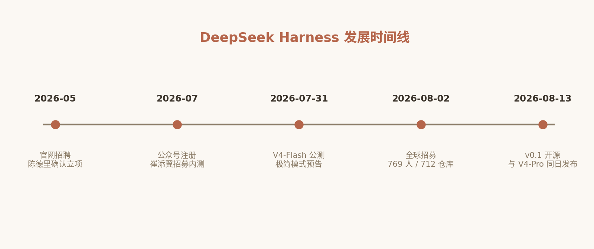

# 2. DeepSeek 的 Harness 之路：从招聘启事到 v0.1 开源

第 1 章解决了"Harness 是什么、为什么重要"的问题。本章回答另一个问题：DeepSeek——这家以模型层极致性价比著称的公司——为什么在 2026 年决定亲自下场做 Harness，又是如何只用不到三个月，就从一纸招聘启事走到 v0.1 开源的。

理解这段历程不只是"了解背景"。DeepSeek Harness（下称 dsh）的每一个架构决策——为什么是插件框架、为什么是 Cordis、为什么 MIT 开源、为什么带着 Developer Preview 的警告——都能在这三个月的时间线中找到动机。读完本章，你会对 dsh 的项目定位有一个立体的认知，为后续逐层剖析源码扫清"它为什么被设计成这样"的疑问。

## 2.1 一纸招聘启事（2026-05）

DeepSeek 入局 Harness 的第一个公开信号，出现在 2026 年 5 月 18 日：官网上线了 **Agent Harness 产品经理与研发工程师**岗位（工作地点：北京）（科创板日报，2026-05-20）。

这份职位描述有两处细节值得玩味。

其一，职位描述里**原文写明了第 1 章的公式**：

> Model + Harness = Agent。除模型本身以外的所有工作，都属于 Harness 的范畴。

一家以模型见长的公司，在招聘启事里公开宣称"模型之外的一切都是 Harness"，这本身就是战略转向的宣言——DeepSeek 对行业共识的背书方式，不是发论文，而是发 JD。

其二，产品经理岗位要求应聘者**深度使用过 Claude Code、Codex、Cursor、OpenCode、GitHub Copilot、Manus** 等产品。这份"竞品清单"几乎就是第 1 章设计哲学谱系的翻版——DeepSeek 显然不打算闭门造车，而是要在充分理解整个光谱之后选择自己的生态位。

两天后的 2026 年 5 月 20 日，DeepSeek 资深研究员**陈德里**（Deli Chen）在 X 上发帖正式证实了这项新业务：

> "来 DeepSeek 从零做 Code Harness"，"简单来说就是对标 Claude Code。"（陈德里，X，2026-05-20）

媒体很快给出了战略层面的解读。36kr 的评论一针见血：API 价格越低，卖 token 越不赚钱；"**DeepSeek 需要从卖模型调用，转向卖工作流结果。**"（36kr，2026-05）这条商业逻辑我们在第 1.6 节已经作为行业通则讲过——DeepSeek 的入局，是这条通则最激进的实践者样本：模型价格战本就是它掀起的，如今它也要亲手为自己创造的低价世界寻找新出路。

## 2.2 两条人马的汇合：量化纪律与插件基因

dsh 的技术气质，由两个人的背景共同写成。读懂这两个人，就读懂了 dsh 为什么长这样。

**第一个人是 Harness 团队负责人崔添翼**（Cui Tianyi）：浙大计算机系毕业（NOIP 保送、六枚 ACM 亚洲区域赛金牌），在量化交易巨头 **Jane Street** 香港/纽约办公室任职九年，后联合创立量化交易公司 TSY Capital；2026 年 3 月加入 DeepSeek，挂帅 Harness 团队（量子位、36氪，2026-06）。

为什么选一个量化背景的人来做 Agent Harness？官方与媒体的解释颇具启发性：

> 量化交易的本质，是把"模型"翻译成可审计、可回退、无隐性行为的执行系统——这与 Agent Harness 的工程挑战高度同构。

仔细想来确实如此。一个量化交易系统和一个 Agent Harness 共享同样的核心命题：底层是一个概率性的信号源（行情模型 / 大语言模型），上层必须是一个**确定性的执行框架**——风控、审计、回退、幂等、无隐性行为。信号可以错，框架不能乱。Jane Street 以用函数式编程（OCaml）构建极致可靠的交易系统闻名，这种"确定性驾驭不确定性"的工程文化，正是 Harness Engineering 的精髓。

**第二个人对本书读者更加重要：史一凡**（Yifan Shi，GitHub ID：**Shigma**）——Cordis 上游生态（Koishi / cordiverse）的作者。如果你混过中文开源社区，大概率听说过 Koishi——一个基于插件框架的跨平台聊天机器人框架，经年累月积累了广泛的用户基础与庞大的社区插件生态，核心思想就是"一切皆插件"。而 Cordis，正是 2022 年从 Koishi 项目中沉淀、抽象出来的通用插件框架（2022-05-22 Koishi 4.7.1 release notes 首次公告；github.com/cordiverse/cordis）。史一凡后来加入 DeepSeek（2024 年已署名 DeepSeek-V3 技术报告），也是这篇时空可组合性论文的第一作者（论文由北京大学张伟（Wei Zhang）组与 DeepSeek 联合署名，崔添翼为三作；36 氪，2026-08）。

现在把两块拼图合起来：

- dsh 的官方定位写着 **"powered by Cordis"**——整个 Harness 建立在这个插件框架之上；
- 而 Cordis 的作者本人就在 DeepSeek，与量化出身的团队负责人汇合。

这解释了 DeepSeek Harness 技术选型上最大的"意外"：一家 AI 公司的 Agent Harness，没有从零自研框架，也没有选用社区里更"AI 原生"的方案，而是建在一个人畜无害的 TypeScript 插件框架之上。这不是拍脑袋——Cordis 在 Koishi 生态经过了经年累月的实战检验，其生命周期管理、依赖注入、配置热重载的成熟度，远非一个三个月的新框架可比；而量化纪律决定了这套框架被组装成产品时守住的不变量（第 15 章展开）。

同时请注意，这里埋下了本书书名的一半伏笔：**《从 Cordis 到 DeepSeek Harness》**。要真正读懂 dsh 的源码，必须先读懂 Cordis 的插件模型——这正是第 3、4 章的主题。

## 2.3 三个月冲刺：2026 年 7–8 月时间线

团队就位之后，DeepSeek Harness 的推进节奏堪称闪电战。我们把公开的时间线整理如下：

| 日期 | 事件 |
|---|---|
| 2026-07-06/07 | "DeepSeek Harness 团队"微信公众号注册（07-06）并完成企业认证（07-07），黑鲸 Logo，认证主体为北京深度求索（21 世纪经济报道查证公众号信息，2026-08-11） |
| 2026-07-31 | V4-Flash 正式版 API 公测，官方文档首次出现"DeepSeek Harness 极简模式（即将发布）" |
| 2026-08-01/02 | 崔添翼在 X 上面向全球公开招募内测用户，优先有 Agent Harness 开源项目经验者 |
| 2026-08-03（截至） | 内测招募变成全球开源 Agent 生态大摸底：**769 位开发者报名、712 个去重仓库、累计 120 万+ Stars、覆盖 18 个赛道** |
| 2026-08-11/12 | 公众号注册被 IT之家、界面新闻、21 世纪经济报道等媒体集中报道，Harness 发布预期升温 |
| 2026-08-13 | **DeepSeek Harness v0.1 与 DeepSeek-V4-Pro 同日开源（MIT 协议）**，GitHub 发布 |



*图 2-1 DeepSeek Harness 发展时间线*

这条时间线里有三个节点值得单独展开。

**其一，8 月初的内测招募是一次教科书级的生态情报战。** 崔添翼没有关起门做产品，而是把招募帖发向全球，并优先选择"有 Agent Harness 开源项目经验"的开发者。结果 769 人报名、712 个去重仓库、120 万+ Stars、18 个赛道——这份名单本身就是一份"全球 Agent Harness 生态普查报告"。团队在动工前就掌握了所有主流与长尾竞品的设计细节与痛点，同时也圈定了第一批种子用户与潜在的插件作者。一鱼三吃。

**其二，V4-Flash 的"极简模式"透露了模型与 Harness 的协同设计。** 7 月 31 日 V4-Flash 公测时，文档中出现了"DeepSeek Harness 极简模式（即将发布）"的字样——这意味着模型层在发布时就已经为自家 Harness 预留了专用的交互模式。第 1.6 节说过"Harness 随模型协同进化"，DeepSeek 把这条原则做到了 API 层面：模型为 Harness 优化接口，Harness 为模型优化上下文，这是只有"模型 + Harness 双修"的厂商才玩得动的打法。

**其三，8 月 13 日的"同日开源"是一次精心编排的双响炮。** Harness v0.1 与旗舰模型 V4-Pro 同日发布，传递的信号再明确不过：模型与 Harness 从此是 DeepSeek 的两条同等重要的产品线，互为犄角。社区响应验证了这个策略——**内测期间社区就已产出约 300 个插件（新浪等媒体报道）；开源后更呈爆发式增长，截至 8 月 18 日，GitHub topic `dsh-plugin` 下的公开仓库已超过 7000 个**。对于一个以"一切皆插件"为核心理念的项目来说，没有什么比插件生态的爆发更能证明架构的吸引力。

## 2.4 战略解读：三股力量汇成的风口

把 DeepSeek 入局 Harness 放到更大的棋盘上，可以看到三股力量在同一时间窗口汇合。

### 2.4.1 商业逻辑：从卖 token 到卖工作流结果

第一条力量是钱。2026 年的 API 市场，价格战已经把 token 的毛利打到地板上——而这场价格战在很大程度上正是 DeepSeek 自己发起的。36kr 的解读（2026-05）点破了悖论：**API 价格越低，卖 token 越不赚钱**。

出路在哪里？从"卖模型调用"转向"**卖工作流结果**"。用户真正想要的不是几万个 token，而是"修复这个 bug"、"交付这个 feature"。Harness 恰恰是完成这个转换的载体：它把裸模型包装成可交付结果的工作流系统。没有自家 Harness 的模型厂商，定价权永远握在别人的客户端手里——这正是 Cursor、Claude Code 们吃过的红利，也是 DeepSeek 不愿再让出的阵地。

### 2.4.2 安全事件：国产化替代的时间窗口

第二条力量是安全。2026 年 6 月，Claude Code 被曝"**隐写回传**"事件（客户端将代理域名、系统时区等信息以 Unicode 隐写方式回传）；工信部 NVDB 随后于 2026-07-08 发布安全后门风险提示（受影响版本 2.1.91–2.1.196）；阿里、腾讯、美团、京东等公司相继排查并转向自研 Harness（东方财富，2026-08-11；河北网信网转载《中国信息安全》，2026-07-15）。

这件事的行业影响立竿见影：企业突然意识到，Harness 层决定着**数据出境、权限边界与可审计性**——模型可以是黑盒，但 Harness 必须是白盒。一个 MIT 开源、可完全自托管、插件机制透明可审计的国产 Harness，恰好踩在了这个需求爆发的时间窗口上。DeepSeek Harness 选择 MIT 协议与全开源路线，商业之外的这层战略考量不言而喻。

### 2.4.3 成本叙事：几十分之一的 Claude Code 体验

第三条力量是 DeepSeek 的传统艺能——成本。第三方实测显示，用 DeepSeek V4 实现类似 Claude Code 体验的成本"**仅为几十分之一**"（潮新闻，2026-05-20；火山引擎开发者社区实测同量级任务账单 $26.4 → $2.3，2026-05-28）。这个成本优势由两部分构成：更便宜的模型，加上更好的 Harness 优化（缓存对齐、上下文裁剪、渐进式披露——第 1 章的每一条原则都在省钱）。市场也够大：2025 年全球 AI 编程工具市场规模 295.7 亿美元，预计 2030 年达 646.8 亿美元（Research and Markets，转引自钛媒体，2026-04）。

三股力量合流：商业模式需要它、安全环境呼唤它、成本优势成就它。DeepSeek Harness 的出现，与其说是产品创新，不如说是战略必然。

## 2.5 dsh 官方定位：四句话读懂这个项目

热身完毕，让我们第一次正面审视本书主角的官方定义。DeepSeek Harness（命令行名 `dsh`）的 GitHub 仓库（github.com/deepseek-ai/deepseek-harness）用四句话交代了自己的身份，每一句都暗藏深意：

**第一句："Everything is a Plugin."（一切皆插件。）** 这不是口号，而是字面意义的架构事实：模型适配器、工具注册表、会话日志、**甚至 Agent 循环本身**，全部是插件，全部可以从配置层替换。在第 1 章的哲学光谱里，Claude Code 把逻辑写死在状态机里，Codex 把扩展交给外部 MCP 协议，而 dsh 选择让"系统内核"小到极致、把一切功能推给插件——这条路线比 Pi Agent 的极简更激进：Pi 是"功能少"，dsh 是"连核心都可替换"。

**第二句："Powered by Cordis."** 插件体系的地基是 Cordis 框架（github.com/cordiverse/cordis），由史一凡（Shigma）创作、经 Koishi 生态多年检验，其本人已加入 DeepSeek 并为论文一作。本书前半部分（第 3—4 章）将系统讲解 Cordis 的插件模型、生命周期与依赖注入——那是读懂 dsh 一切源码的钥匙。

**第三句："MIT."** 完全开源、可自由商用与二次开发。对内测期摸底的 712 个社区仓库而言，这意味着无障碍的借鉴与融合；对企业用户而言，这意味着可审计、可自托管——直接回应了 2.4.2 节的安全诉求。

**第四句是警告："Developer Preview — THERE WILL BE COMPATIBILITY-BREAKING CHANGES."** v0.1 是开发者预览版，官方明确警告：所有 API、配置字段、目录结构**都可能随版本发生破坏性变更**。这既是诚实的风险提示，也给本书读者提出了要求：不要背 API，要学架构思想——API 会变，但"一切皆插件"的架构骨架不会。

顺手给出尝鲜命令（后续章节会逐一剖析其背后的机制）：

```sh
npx @deepseek-ai/dsh web
```

这条命令启动 dsh 的 Web UI（默认 `http://127.0.0.1:3080`）。`dsh web` 其实是 `dsh --profile web` 的硬编码别名——而 profile 又是什么？这正是本书第 7 章要逐层剥开的第一个概念：一个 profile，就是一组有序的插件 bundle 补丁层。一切皆插件，从启动命令就开始了。

## 2.6 本章小结

- **2026-05-18**，DeepSeek 官网挂出 Agent Harness 岗位，JD 原文写明 "Model + Harness = Agent"；**05-20**，资深研究员陈德里在 X 证实"从零做 Code Harness，对标 Claude Code"。
- 团队负责人**崔添翼**：浙大计算机系、Jane Street 九年量化背景（2026-03 加入 DeepSeek）——量化系统"把概率模型翻译成可审计、可回退的确定性执行"与 Harness 工程高度同构；Cordis / Koishi 生态的作者**史一凡（Shigma）**同样已在 DeepSeek（论文一作），这两条人马的汇合直接决定了 dsh 的技术底座，也为本书"从 Cordis 讲起"埋下伏笔。
- 7–8 月闪电推进：公众号注册并完成企业认证（07-06/07，21 世纪经济报道查证）→ V4-Flash 公测剧透"Harness 极简模式"（07-31）→ 全球内测招募（08-01，769 人 / 712 仓库 / 120 万+ Stars / 18 赛道）→ 媒体集中报道公众号（08-11/12）→ **v0.1 与 V4-Pro 同日 MIT 开源（08-13）**——内测期间社区已产出约 300 个插件，开源后一周 GitHub topic 公开仓库突破 7000 个（2026-08-18 实时计数）。
- 战略解读：卖 token 的商业逻辑见顶，转向"卖工作流结果"；Claude Code 隐写回传事件（2026-06）催生国产可审计 Harness 的窗口期；"更便宜的模型 + 更好的 Harness 优化"构成几十分之一的成本叙事。
- dsh 官方定位四要素：**Everything is a Plugin**、**Powered by Cordis**、**MIT 开源**、**Developer Preview 破坏性变更警告**——它们是贯穿全书的四条主线。

至此，概念篇完成。我们已经知道 Harness 为何重要、DeepSeek 为何入局、dsh 定位几何。下一篇进入 Cordis 原理篇：一切从其要解决的问题讲起。

## 2.7 本章参考资料

- [DeepSeek Harness 官方发布文（微信公众号）](https://mp.weixin.qq.com/s/mANdGRI4fO_sEbC1ECEoZQ) — 官方《DeepSeek Harness 开发者预览版：一切皆插件》，支撑本章 v0.1 发布、"一切皆插件"总纲与四种运行模式的表述。
- [DeepSeek Harness 官网](https://deepseek.com/harness/) — 官方产品入口与文档，支撑本章 dsh 官方定位与获取渠道。
- [崔添翼（tianyi）MIT 发布原推](https://x.com/tianyi/status/2087888089759015218) — dsh 作者在 X 宣布开源发布的一手来源，支撑本章 2026-08-13 开源时间线。
- [Jiayuan Zhang 推文](https://x.com/jiayuan_jy/status/2087911060154314963) — DSH 乐高汽车隐喻与"自进化软件雏形"的解读，支撑本章对 dsh 定位的形象化阐释。
- [华尔街见闻转载的官方发布文](https://wallstreetcn.com/articles/3779385) — 发布文全文转载（澎湃转载确认系公众号原文），支撑本章发布细节与 132 插件截图事实。
- [36 氪《在做 Harness 这件事上，DeepSeek 更信搞量化的》](https://m.36kr.com/p/3828532121837831) — 支撑本章崔添翼履历与 DeepSeek 组建 Harness 团队的背景报道。
- [腾讯云开发者社区报道](https://developer.cloud.tencent.com/news/4358005) — 支撑本章 V4-Flash 文档中"DeepSeek Harness 极简模式"作为官方基准底座的线索。
- [界面新闻：DeepSeek 智能体要来了？公众号已完成注册认证（2026-08-12）](https://m.jiemian.com/article/14910886.html) — 支撑公众号注册时间（08-11/12，认证主体北京深度求索、黑鲸 Logo）与"Model + Harness = Agent"招聘原文。
- [智东西：DeepSeek 全球内测招募报道（2026-08-04，腾讯新闻转载）](https://view.inews.qq.com/a/20260804A0BP5100) — 支撑 769 位开发者报名 / 712 个去重仓库 / 120 万+ Stars / 18 个赛道的内测统计数据（截至 2026-08-03）。
- [量子位：DeepSeek 缺 Agent 人才缺疯了（2026-06-22）](https://qbitai.com/2026/06/437249.html) — 支撑崔添翼 5 月起公开招聘、三岗位 JD（Harness 研究员/工程师/产品经理）与"笔试+三轮面试"流程。
- [新浪：DeepSeek Harness 发布时间？v0.1 开发者预览版 8 月 13 日上线，内测插件超 300 个（2026-08-13）](https://cj.sina.cn/articles/view/7880069125/1d5b0500506801tym4) — 支撑"内测期间社区已产出约 300 个插件"的时间归属。
- [GitHub topic: dsh-plugin](https://github.com/topics/dsh-plugin) — 插件生态实时计数来源：截至 2026-08-18 已超 7000 个公开仓库。
- [21 世纪经济报道：DeepSeek Harness 公众号正式上线（2026-08-11）](https://www.sfccn.com/2026/8-11/wOMDE0MDdfMjIwNjAwOQ.html) — 直接查证公众号信息（2026-07-06 注册、07-07 完成认证），并含宋斐"行业统一脚手架"论述原文。
- [东方财富：官方公众号落地，DeepSeek 的智能体工具团队来了（2026-08-11）](https://finance.eastmoney.com/a/202608113838103894.html) — 支撑 Claude Code 隐写回传事件（2026-06 社区曝光、NVDB 通报、大厂排查）的完整脉络。
- [河北网信网转载《中国信息安全》：谨防境外 AI"后门"风险（2026-07-15）](https://www.caheb.gov.cn/system/2026/07/15/030389582.shtml) — 工信部 NVDB 风险提示（受影响版本 2.1.91–2.1.196）的权威转载。
- [潮新闻：鲸鱼哥前脚离开，DeepSeek 被曝组建 Harness 团队（2026-05-20）](https://tidenews.com.cn/news.html?id=3450320) — 支撑"第三方实现类 Claude Code 体验、成本仅几十分之一"的早期报道（DeepSeek-TUI）。
- [火山引擎开发者社区：Claude Code 实战 400 万 Tokens，接入 DeepSeek V4 从 $26 降到 $2.3（2026-05-28）](https://developer.volcengine.com/articles/7644841957348343844) — 成本论断的同量级账单实测。
- [钛媒体：AI Coding，终究是大厂的（2026-04-20）](https://www.tmtpost.com/7960048.html) — 转引 Research and Markets 市场规模数据（2025 年 295.7 亿美元 → 2030 年 646.8 亿美元）。
- [36 氪：DeepSeek 的「自进化」蓝图，曝光了（2026-08-14）](https://www.36kr.com/p/3938795963137411) — 支撑论文三位作者署名（史一凡一作、北京大学张伟组、崔添翼三作）与史一凡曾署名 DeepSeek-V3 技术报告的核查。
