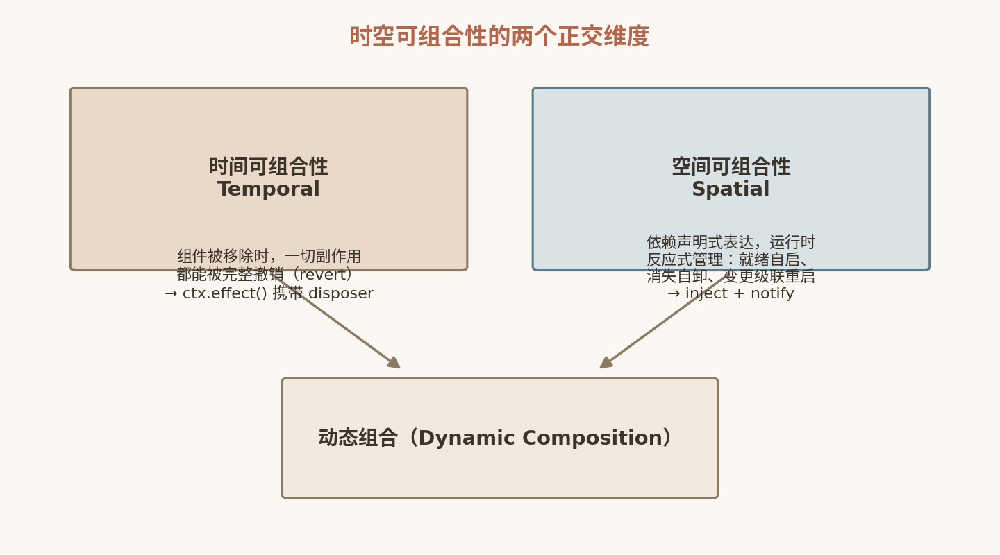

# 3. Cordis 要解决什么问题：动态组合的形式化缺失

在深入 Cordis 的实现细节之前，我们必须先回答一个更根本的问题：插件系统已经存在了几十年，VS Code、Eclipse、webpack、Spring 都各有其组合机制，为什么还需要一个新的框架，甚至一篇新论文？答案在于，过去所有的插件机制都在回避一个硬核问题——**动态组合（dynamic composition）从来没有被形式化过**。组件"装得上"不等于"拆得掉"，更不等于"拆了还能正确影响别人"。本章从插件系统的历史痛点讲起，引出 Agent Harness 时代的新需求，最后给出论文《A Programming Paradigm for Spatiotemporal Composability》对问题的精确陈述：两个正交的可组合性维度——时间与空间。

## 3.1 插件系统的历史痛点

### 3.1.1 VS Code：deactivate 全靠自觉

VS Code 的插件模型是业界标杆，但它的卸载语义非常朴素。插件在 `activate()` 中获得一个 `ExtensionContext`，约定俗成地把所有注册得到的 `Disposable` 推入 `context.subscriptions`：

```ts
export function activate(context: vscode.ExtensionContext) {
  const cmd = vscode.commands.registerCommand('demo.hello', () => { /* ... */ })
  context.subscriptions.push(cmd)   // 全靠作者记得 push
}

export function deactivate() {
  // 框架几乎无法强制你在这里清理什么
}
```

这个机制有两个结构性缺陷。第一，**覆盖面不全**：`subscriptions` 只约束那些"返回 Disposable 的 API"。如果插件直接改了全局状态——比如往某个共享注册表里塞了一个条目、monkey-patch 了某个模块、启动了一个后台定时器——框架对此一无所知，自然也谈不上清理。第二，**强制力为零**：忘记 push 没有任何编译期或运行期报错，唯一的表现是插件禁用后行为诡异地残留。

也就是说，VS Code 把"撤销副作用"这件事**委托给了插件作者的纪律**。在插件数量可控、插件作者相对专业的编辑器生态里，这个约定大体运转良好；但它本质上是一种社会契约，而不是技术保证。

### 3.1.2 npm：动态加载的清理难题

Node.js 世界里的"插件"往往就是动态 `require()` 一个模块。这条路线的清理问题更加赤裸：CommonJS 模块加载后进入 `require.cache`，你可以 `delete require.cache[id]` 让它下次重新求值，但**模块顶层代码已经执行过的副作用无法回滚**——它注册的监听器、打上的补丁、连接的句柄，全都留在了进程里。更要命的是引用泄漏：只要进程里任何地方还持有旧模块导出对象的引用，旧代码就永远活着，于是"热重载"变成了"新旧两份代码并存"的隐蔽炸弹。

Node 社区给出的答案向来是"重载太难，直接重启进程"——nodemon、PM2 都是这个思路的工业化封装。这在服务端部署场景可以接受，但对于一个要"在运行时重组自身"的宿主来说，重启进程等于放弃了动态性本身。

### 3.1.3 DI 容器：依赖图在启动那一刻就静止了

另一条路线是依赖注入容器。Inversify（JS/TS 生态）和 Spring（Java 生态）都提供了声明式的依赖表达——`@inject`、`@Autowired`——由容器在启动期解析依赖图并完成装配。这解决了"组件之间如何找到彼此"的问题，但有一个隐含前提：**依赖图是静态的**。

容器启动时把图解析一次，之后 Bean 的集合基本不变。如果运行时一个服务消失了怎么办？Spring 的回答大体是"不支持，除非你引入 `@RefreshScope` 这类补丁式机制，而且它只是重建 Bean，并不处理依赖它的组件该何去何从"。Inversify 更直接：运行期 `unbind` 之后，已经注入的引用依然有效，容器不会通知任何人。

### 3.1.4 痛点小结

把三条路线摆在一起，可以看到一个共同的结构性缺失：

| 痛点 | 代表 | 缺失的保证 |
|---|---|---|
| 卸载靠自觉 | VS Code deactivate | 副作用是否被完整撤销，框架无法验证 |
| 清理不可能 | npm 动态 require | 已执行副作用没有逆操作 |
| 依赖图静止 | Inversify / Spring | 服务动态上下线时，依赖方无法反应 |

这三点都不是工程粗糙，而是**概念模型的缺失**：没有任何一个主流框架把"副作用"和"依赖"建模为运行时可以追踪、可以撤销、可以反应的一等对象。

## 3.2 Agent Harness 时代的新需求

如果说上述痛点在传统软件里还可以用纪律和重启来掩盖，那么 Agent Harness（智能体运行时框架）把它们逼到了墙角。

DeepSeek Harness 的设计哲学是"**一切皆插件**"（everything is a plugin）：模型接入、工具、技能、会话管理、沙箱、存储、主循环、调度器乃至 UI，全部是可插拔的组件，整个系统是插件的组合而非"核心 + 扩展"。其 README 明确写道："It uses an architecture where everything is a plugin, and is powered by Cordis."

更激进的是其"创造模式"：**Agent 可以在运行时检查自己的插件树，动态挂载或卸载它自己即时编写的插件**。一个 Agent 发现自己缺少某种能力，就写出一段新插件代码、挂载、试用、不满意就卸载换掉——社区里有人把这形象地称为"给高速行驶的汽车换发动机"。

请仔细体会这个场景对底层框架的要求：

1. **挂载的插件是不受信任的**。它是 LLM 生成的代码，随时可能有 bug、需要被撤回。框架必须保证：无论插件干了什么，卸载后一切副作用有明确的清理路径。VS Code 式的"靠自觉"在这里根本不成立——你不能指望生成代码的模型有纪律。
2. **插件之间有真实的运行时依赖**。一个工具插件依赖沙箱服务，一个技能插件依赖某个模型服务。Agent 换掉一个模型插件时，依赖它的所有组件必须自动、有序地停摆和重启，而不是拿着悬空引用继续跑。静态 DI 图在这里直接失效。
3. **重组是常态而非异常**。组件的增删改每秒都可能发生，框架必须以增量方式维护全局一致性，不能靠重启。

换言之，Agent Harness 把"动态组合"从插件系统的可选高级特性，变成了**系统的基本运行方式**。这正是 Cordis 要解决的问题域。

## 3.3 论文的问题陈述

Cordis 背后有一篇论文：《A Programming Paradigm for Spatiotemporal Composability》（托管于 github.com/cordiverse/paper，截至本书写作时仍是草稿，未上 arXiv）。其摘要开宗明义：

> Modern software—from plugin systems to self-evolving agent harnesses—increasingly requires *dynamic composition*, yet its formal foundations remain underdeveloped.

"现代软件——从插件系统到自进化 Agent Harness——越来越需要动态组合，但其形式化基础仍然欠发展。"这句话精确地概括了前两节的全部内容：需求侧（插件系统 → Agent Harness）在快速升级，供给侧（形式化基础）却停留在上世纪。

论文的贡献是把"动态组合"这个含混的工程词汇分解为**两个正交的维度**，并分别给出形式定义与运行机制：

- **时间可组合性（temporal composability）**：组件被移除时，它产生的一切副作用都能被完整撤销。
- **空间可组合性（spatial composability）**：组件之间的依赖可以被声明，并由运行时反应式地管理。

"正交"是关键：一个框架可以只做好其中一个而完全不做另一个，而完整的动态组合**两者缺一不可**。下面我们分别精确定义它们，并用失败案例说明边界。



*图 3-1 时空可组合性的两个维度*

## 3.4 时间可组合性：一切副作用皆可撤销

**定义**：对任意组件 C，若 C 在运行期间对系统状态产生了一组副作用 S₁, S₂, …, Sₙ，则移除 C 后，系统状态必须等价于"这些副作用从未发生过"。注意"一切"二字——不是"框架知道的那些"，而是全部。

形式化地看，这等价于要求每一次状态变换 `T` 都是**可逆的**：存在逆变换 `T⁻¹`，使得 `T⁻¹ ∘ T = id`。组件移除 = 按相反顺序执行所有逆变换。

**失败案例 1：泄漏的监听器。** 插件 A 在激活时执行 `emitter.on('data', handler)`，卸载时没有 remove。之后每次 `data` 事件都会调用一个属于已死插件的 `handler`——轻则内存泄漏，重则 handler 访问已释放的资源而崩溃。这正是 VS Code 忘记 push subscriptions 的后果。

**失败案例 2：污染的共享注册表。** 插件 B 往全局命令表注册了 `'run' → fn`，卸载只清掉了 B 自己的对象，没清命令表条目。其他组件调用 `'run'` 时拿到一个悬空函数。

**失败案例 3：顺序错误的撤销。** 插件 C 先开了数据库连接，再启动了一个使用该连接的工作协程。卸载时若先关连接再停协程，协程在垂死阶段向已关闭的连接写入，报错甚至数据损坏。**撤销必须逆序（LIFO）**，这是可逆性的直接推论，而"靠自觉"的清理代码极少保证这一点。

时间可组合性回答的问题是："**拆掉一个组件之后，世界干净吗？**"

## 3.5 空间可组合性：依赖声明驱动反应式管理

**定义**：组件可以**声明**自己依赖哪些服务（而非在代码里自行查找）；运行时持续维护"依赖—提供"关系，并按依赖声明反应式地驱动组件生命周期：

- 依赖**就绪** → 组件才启动；
- 依赖**消失** → 组件自动卸载（进入休眠，而非崩溃）；
- 依赖**变更**（服务实现被替换）→ 依赖方自动级联重启，拿到新实现。

关键在"反应式"三个字：依赖图不是启动时解析一次的静态产物，而是**随服务上下线持续演化的活结构**，组件状态是这张图的函数。

**失败案例 1：启动顺序地狱。** 传统插件系统里，插件 D 依赖数据库服务，作者只能祈祷数据库插件先激活，或者在代码里手写轮询等待。声明式依赖让"先启动谁"变成运行时的推导结果而非作者的负担。

**失败案例 2：悬空引用。** 服务插件 E 被卸载，消费方 F 手里还握着旧服务实例的引用，继续调用——在 Inversify 里 `unbind` 之后这正是常态。空间可组合性要求 F 在 E 消失的瞬间被自动卸载，根本不存在"拿着旧引用继续跑"的窗口。

**失败案例 3：热替换失语。** 运维把模型服务从 v1 热替换为 v2（同名、不同实现）。静态 DI 容器里，所有已注入的组件继续用 v1，直到进程重启。空间可组合性要求替换自动传播为依赖方的级联重启——这正是 Agent Harness"换发动机"场景的最小语义。

空间可组合性回答的问题是："**组件如何感知并响应邻居的来去？**"

## 3.6 为什么现有框架都不满足

现在可以对常见框架做一次系统的"二维体检"：

| 框架 | 时间可组合性 | 空间可组合性 |
|---|---|---|
| VS Code Extensions | ✗ 靠作者自觉 push 到 subscriptions，覆盖面不全，无强制 | ✗ 激活事件静态，无运行时依赖图；依赖变化只能 reload 整个窗口 |
| Inversify (JS) | ✗ 无撤销概念 | ✗ 构造器注入，启动时一次性解析；unbind 不通知依赖方 |
| Spring (IoC) | △ DisposableBean.destroy 仅在容器关闭时触发 | ✗ @Autowired 启动期织入；@RefreshScope 属附加机制且处理有限 |

可以看到，没有任何一个框架在两个维度上同时给出机制级保证。更本质地说，它们的问题不是实现不足，而是**模型不足**：

- VS Code 有"撤销"的雏形（Disposable），但撤销不是一个覆盖一切副作用的普适机制，只是部分 API 的返回值约定；
- DI 容器有"依赖声明"的雏形，但依赖解析不是反应式的持续过程，而是启动期的一次性动作；
- 两者都缺乏一个把"副作用"与"依赖"统一起来的运行时对象，因此二维机制无法交织出完整的动态组合。

而 Agent Harness 的需求——一切皆插件、运行时自重组、插件代码不可信——恰恰要求两个维度同时成立且相互咬合：挂载一个插件时它的副作用必须全程可追踪（时间），它的依赖必须驱动它在正确的时机启停（空间）；卸载时逆序撤销副作用的同时，必须向所有依赖方广播它的消失（空间）。缺任何一条，"给高速行驶的汽车换发动机"都会变成"给高速行驶的汽车拆发动机然后听天由命"。

这正是论文所说的 formal foundations remain underdeveloped 的具体含义，也是 Cordis 的出发点：**把副作用和依赖从"约定"提升为"机制"**。下一章我们将看到，Cordis 如何借用编程语言理论中的 effect 与 coeffect 概念，把这两个维度落地为不到两千行 TypeScript 的运行时。

## 3.7 本章小结

- 插件系统的三大历史痛点——VS Code 卸载靠自觉、npm 动态加载无法清理、DI 容器依赖图静止——根源相同：**副作用与依赖从未被建模为可追踪、可撤销、可反应的运行时对象**。
- Agent Harness 把动态组合从高级特性变为基本运行方式："一切皆插件"加上 Agent 运行时挂载自写插件（创造模式），要求任意插件的注册副作用都有明确的清理路径，依赖关系必须反应式管理。
- 论文《A Programming Paradigm for Spatiotemporal Composability》将动态组合分解为两个正交维度：**时间可组合性**（组件移除时一切副作用可被完整、逆序地撤销）与**空间可组合性**（依赖声明驱动组件的就绪自启、消失卸载、变更级联重启）。
- VS Code、Inversify、Spring 在两个维度上均有结构性缺失，其根源是概念模型而非工程实现；这一形式化缺失正是 Cordis 要填补的空白。

## 3.8 本章参考资料

- [Cordis 论文仓库（preprint）](https://github.com/cordiverse/paper) — 论文摘要一手来源，支撑本章动态组合的时间/空间两个正交维度的形式化分解。
- [《可逆的插件系统》（Koishi 官方 cookbook）](https://koishi.chat/zh-CN/cookbook/design/disposable.html) — Shigma 的设计长文，支撑本章"软件文明在退步"动机与可逆性三大好处（可组合性、可靠性、可访问性）。
- [Cordis 仓库](https://github.com/cordiverse/cordis) — "Meta-Framework of Spatiotemporal Composability"，支撑本章 Cordis 作为问题答案的定位。
- [DeepSeek Harness 仓库](https://github.com/deepseek-ai/deepseek-harness) — "一切皆插件"与创造模式运行时挂载自写插件的需求来源，支撑本章 Agent Harness 为何把动态组合变为基本运行方式。
