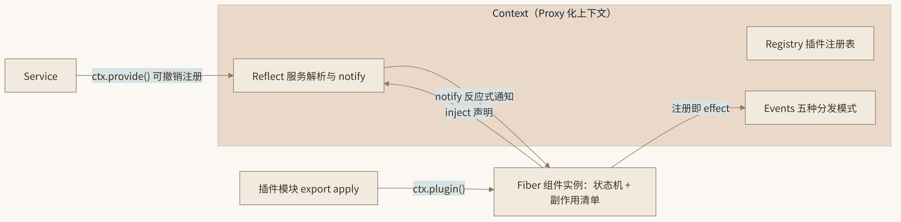
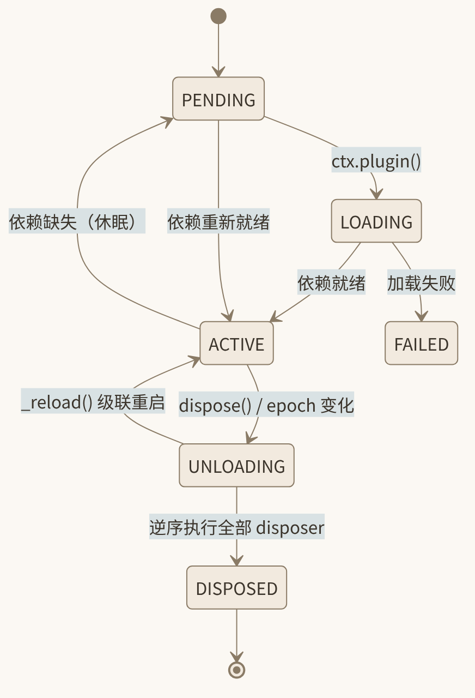

# 4. 核心原理：Effect 与 Coeffect 的运行时化

上一章我们得出结论：动态组合需要时间与空间两个维度的机制保证，而现有框架缺失的不是工程，而是概念模型。本章介绍 Cordis 给出的模型。它的核心手法优雅得近乎大胆：**把编程语言理论中两个描述程序静态性质的概念——effect 与 coeffect——提升为运行时可追踪、可撤销、可反应的机制**。我们先花一点篇幅科普这两个概念，然后看论文如何将它们运行时化为 Revertible Effects 与 Reactive Coeffects，再给出概念到代码实体的完整映射，最后用两个插件的最小示例把整套心智模型串起来。



*图 4-1 Cordis 核心概念关系*

## 4.1 Effect 与 Coeffect：编程语言理论速览

### 4.1.1 Effect：计算对环境做了什么

在编程语言理论中，**effect（效果）** 指一个计算在求值之外对外部环境产生的影响：写文件、发网络请求、修改全局变量、抛出异常……都是 effect。纯函数式语言（如 Haskell）用类型系统把 effect 显式化——`IO a` 这个类型就在说”我是一个会产生 I/O 效果、返回 a 的计算”。

Effect 系统关心的问题是：**这个函数会不会动外部世界？动什么？** 它是对计算”输出侧”（对环境的写）的刻画。

### 4.1.2 Coeffect：计算从环境中需要什么

**Coeffect（余效果）** 是 effect 的对偶概念，知名度低得多（主要由 Tomas Petricek、Dominic Orchard 等人 2013 年前后的工作推广）。它刻画计算的”输入侧”：这个计算**从它的上下文环境中要求什么资源**？比如：需要读取某个配置、依赖某个服务、要求某些隐式参数可用。

Effect 问”你会对世界做什么”，coeffect 问”你需要世界给你什么”。一个是输出对偶于输入，一个是写对偶于读。依赖注入框架里 `@Autowired` 声明的”我需要一个 DataSource”，本质上就是程序员在手工表达 coeffect——只不过没有任何语言或框架把它当成一等概念来对待。

### 4.1.3 为什么这对概念与动态组合天然契合

现在请回头对照第 3 章的两个维度，对偶关系几乎是一一对应的：

- **时间可组合性**关心”组件对环境产生的副作用能否撤销”——这是 **effect** 的问题，只不过加上了”可逆”的要求；
- **空间可组合性**关心”组件的依赖能否被声明并由运行时反应式管理”——这正是 **coeffect** 的问题，只不过加上了”反应式”的要求。

传统的 effect/coeffect 研究停留在**静态**层面：用类型系统在编译期标注和检查。论文《A Programming Paradigm for Spatiotemporal Composability》的关键一步，是把这对概念从”编译期的标注”变成”运行时的机制”——这就是”运行时化”的含义。

## 4.2 Revertible Effects：每次变换携带逆操作

论文的第一个运行时机制是 **Revertible Effects（可撤销效果）**：

> 每一次对上下文的变换（effect），都必须同时携带一个”逆操作”（disposer）；运行时负责追踪所有这些逆操作，在组件被移除时执行它们。

这个思想并不神秘——它就是把”注册”和”注销”焊死成一个不可分割的整体。你不能只注册不注销，因为注册动作本身就返回注销函数。框架把每个 disposer 登记在册，卸载时**逆序**（LIFO，类似 Go 的 defer 栈）依次执行。

落地到 Cordis 代码，就是 `ctx.effect()`：

``` ts
const dispose = ctx.effect(() => {
  const server = startListening(port)      // 执行体：产生副作用
  return () => server.close()              // 返回逆操作：撤销它
})
```

执行体可以同步返回 disposer、返回 `Promise<disposer>`，甚至用（异步）生成器逐个 `yield` 多个 disposer——框架的 `DisposableList` 会把它们全部收编。这一设计对应论文的时间可组合性：**任何”装得上”的东西，从语法上就”拆得掉”**。

## 4.3 Reactive Coeffects：依赖声明驱动反应式通知

第二个机制是 **Reactive Coeffects（反应式余效果）**：

> 每个组件声明自己的 coeffect 规格（即依赖声明）；上下文每次发生变化（服务上线、下线、替换），运行时都按各组件的依赖声明计算影响，并通知相关组件做出反应。

落地到代码，是两件相互配合的东西：

1.  插件元数据中的 **`inject` 声明**：`inject: ['database']` 声明”我需要 database 服务”；
2.  服务注册/注销时的自动 **`notify()`**：任何服务上下线，框架找出所有依赖该服务的组件，触发它们重新评估自己的状态。

其反应逻辑由每个组件内部的 **epoch（纪元）** 字符串承载：组件把所有依赖的当前提供方的唯一 ID 拼成 epoch；每次收到通知就重算一遍——

- 某个依赖缺失 → epoch 变为”未激活”，组件**自动卸载进入休眠**（即 Fiber 的 PENDING 态，详见 5.4 节）；
- 依赖重新就绪 → epoch 恢复，组件**自动启动**；
- 依赖的实现被替换（提供方 ID 变了）→ epoch 变化，组件**自动级联重启**，在新上下文里重新执行。

于是”启动顺序”“依赖消失处理”“热替换传播”这些在传统框架里要手写的大量胶水代码，全部坍缩为一个声明加一套运行时机制。这对应论文的空间可组合性：**组件的状态是其依赖声明的函数，由运行时持续求值**。

## 4.4 统一的 Context 与组件演算

Revertible Effects 和 Reactive Coeffects 如果各管各的，还只是两个好用的小机制。论文的第三个动作是把它们**统一**：effect context（副作用挂载的环境）与 coeffect context（依赖解析的环境）被合并为单一的 **Context** 类型，组件（**Component**）是定义在 Context 上的、同时携带 effect 与 coeffect 的计算单元。

由此，论文得以在 Context 上定义一套**动态组合演算**：组件的挂载、卸载、交错组合都有精确的操作语义；其元理论（metatheory）则把”单个组件满足时空可组合性”推广到”任意交错组合的整个系统仍满足时空可组合性”——这是形式化带来的真正红利：性质不是逐案检查出来的，而是由构造保证的。本书不展开演算规则与证明细节（论文仍在修订中），读者只需记住这个直觉：

> Context 是唯一的舞台；组件在舞台上一举一动（effect）都自带回滚键，对环境的每一口呼吸（coeffect）都被运行时感知并做出反应。

## 4.5 从论文概念到代码实体

Cordis 的工程实现（`packages/core/src/`，约 1848 行 TypeScript）与论文概念之间有非常工整的映射关系：

| 论文概念 | 代码实体 | 位置 |
|----|----|----|
| Component（组件） | **Fiber**：插件的一次实例化，带状态机与副作用清单 | `fiber.ts` |
| Effect context | **Context**：Proxy 化的服务容器 + 副作用挂载点 | `context.ts` |
| Revertible effect | `ctx.effect(execute, label?)` 返回 `Disposable` | `fiber.ts` |
| Reactive coeffect | `inject` 声明 + 服务上下线时的 `notify()` | `registry.ts` / `reflect.ts` |
| 服务 | `Service` 基类 / `ctx.provide()` | `service.ts` |
| 插件 | `Plugin = Function \| Constructor \| { apply }` 三种形态 | `registry.ts` |
| 事件通信 | `EventsService` 五种分发模式 | `events.ts` |

逐一解释几个关键映射。

**Context** 在构造时把自身包成 Proxy，拦截一切属性访问：沿 Fiber 链向上查找服务实现，未声明 inject 就访问服务会抛出带溯源信息的错误（`cannot get property "x" without inject`）。这使依赖声明不仅是生命周期依据，还是**访问控制**——没声明的依赖在语法层面就拿不到。此外 Context 支持原型链派生（`extend`）、服务隔离域（`isolate`）与配置分层覆盖（`intercept`），为复杂组合提供结构化手段。

**Fiber**（纤程）是组件的运行时化身。每次 `ctx.plugin(p, config)` 创建一个 Fiber；同一个插件可以被多次实例化，每个实例一个 Fiber，各自持有独立的副作用清单与 epoch。Fiber 的生命周期是一个六态状态机：

```
PENDING → LOADING → ACTIVE
   ↓         ↓         ↓
 （依赖缺失休眠）   FAILED   UNLOADING → DISPOSED
```



*图 4-2 Fiber 生命周期状态机*

`PENDING`/`LOADING` 是启动中的瞬态；`ACTIVE` 表示依赖全部就绪、插件体已执行完毕；`FAILED` 记录启动异常；`UNLOADING → DISPOSED` 是卸载路径——逆序执行全部已登记的 disposer。由依赖驱动的”休眠—重启”循环在 ACTIVE 与休眠态之间往复，正是 Reactive Coeffects 的机械体现。

**插件的三种形态**给了作者充分的表达自由：

- **函数**：`function myPlugin(ctx, config) { ... }`，最常用；
- **构造函数**：插件是一个类，`new` 之，适合搭配 `Service` 基类提供服务；
- **对象**：`{ name, inject, apply(ctx, config) { ... } }`，便于携带元数据。

三者都可附带元数据：`name`（命名）、`inject`（依赖声明）、`provide`（声明提供的服务名）、`intercept?: Dict<boolean>`（声明对哪些服务做配置拦截）、`Config`（基于 Standard Schema 的配置校验，zod/schemastery 皆可）。

**服务**由 `ctx.provide(name, value)` 注册——注意它本身是一个 effect：注册时把实现写入服务注册表并 `notify` 唤醒依赖方；返回的 disposer 负责注销并再次 `notify`，通知所有依赖方卸载。`Service` 基类则是在构造时自动 `provide` 自身的语法糖。于是”服务上线/下线”与”依赖方启停”之间建立了严格的双向反应通道。

**事件**提供组件间的显式通信，五种类型化分发模式：`emit`（广播观察）、`parallel`（并行扇出，错误聚合为 AggregateError）、`serial`（按序执行可短路）、`bail`（同步短路）、`waterfall`（环绕中间件，监听器收到 `next` 决定是否委托下游）。`ctx.on()` 内部同样走 `fiber.effect()` 登记——**事件监听也自动可撤销**，这正是”一切皆 effect”的一致性红利。

## 4.6 最小示例：两个插件看遍整个心智模型

理论到此为止。下面用一个完整可运行级别的最小示例，把 Fiber、effect、inject、provide、notify、级联重启全部串起来。场景：一个 `database` 插件提供数据库服务，一个 `api` 插件依赖它并对外提供 HTTP 接口。我们将依次观察：**依赖就绪自启、依赖消失自动卸载、依赖重载级联重启**。

### 4.6.1 提供方：database 插件

``` ts
import { Context } from 'cordis'

export function database(ctx: Context, config: { url: string }) {
  ctx.provide('database')                 // ① 声明本插件提供 database 服务

  const conn = connectTo(config.url)      // ② 建立真实连接（副作用）

  ctx.set('database', conn)               // ③ 把连接实现写入服务注册表

  return () => conn.close()               // ④ 插件体返回 disposer：卸载时关连接
}
```

逐段讲解：

- **① `ctx.provide('database')`**：向框架声明”这个上下文里现在有名为 database 的服务了”。`provide` 内部是一个 effect——注册的同时返回注销路径，并 `notify` 所有依赖方：“database 上线了”。
- **② 建立连接**：这是真正的副作用。注意插件作者没有（也无法）把它登记到任何外部清单——`ctx.plugin()` 的执行环境本身就是一个 effect。
- **③ `ctx.set('database', conn)`**：把服务实现挂上注册表，供依赖方通过 `ctx.database` 访问。
- **④ 返回 disposer**：插件函数的返回值本身就是最后一个 disposer。卸载该插件时，框架会依次撤销 `provide`（下线服务并通知依赖方）和关闭连接，且**逆序执行**——先关”服务可见性”，再关连接，避免消费方在清理途中访问到半死状态。

### 4.6.2 消费方：api 插件

``` ts
export const api = {
  name: 'api',
  inject: ['database'],                   // ① 声明 coeffect：我需要 database

  apply(ctx: Context) {
    const server = startHttpServer(8080)

    server.get('/users', async () => {
      return ctx.database.query('SELECT * FROM users')   // ② 直接使用服务
    })

    ctx.effect(() => {                    // ③ 登记副作用
      return () => server.close()
    })
  },
}
```

- **① `inject: ['database']`**：这就是论文中 coeffect 规格的代码形态。它向框架宣告：只有当 `database` 服务存在时，我才应该活着。
- **② `ctx.database`**：因为声明了 inject，Proxy 化的 Context 放行这个访问；沿 Fiber 链向上找到 database 插件注册的连接实现。如果没声明 inject，这里会抛出 `cannot get property "database" without inject`——依赖声明同时是编译期之外的访问控制。
- **③ `ctx.effect()`**：HTTP 服务器的开关被显式建模为可撤销效果。其实这里也可以直接 `return () => server.close()`，两种写法等价。

### 4.6.3 宿主装配

``` ts
import { Context } from 'cordis'
import { database } from './database'
import { api } from './api'

const app = new Context()

const apiFiber = app.plugin(api)           // 先挂 api
const dbFiber  = app.plugin(database, { url: 'postgres://localhost/demo' })
```

注意我们**故意先挂载 api 再挂载 database**。在传统框架里这会立刻炸掉（启动顺序地狱）；在 Cordis 里：

1.  `api` 的 Fiber 创建，检查发现 `inject` 中的 `database` 尚无提供方 → epoch 为”未激活” → **api 插件体根本不执行**，Fiber 休眠。没有报错，没有轮询。
2.  `database` 挂载，执行体注册服务 → `provide` 内部 `notify(['database'])`。
3.  通知到达 api 的 Fiber → 重算 epoch → 依赖就绪 → **自动启动**，`apply` 执行，HTTP 服务器上线。

**依赖就绪自启**就这样由机制而非代码顺序保证。

### 4.6.4 卸载：依赖消失自动卸载

``` ts
await dbFiber.dispose()
```

一行代码触发的连锁反应：

1.  database Fiber 进入 UNLOADING，逆序执行 disposer：先撤销 `provide` ——服务从注册表摘除，并 `notify(['database'])`；再关闭数据库连接。
2.  通知到达 api Fiber → 重算 epoch → `database` 缺失 → **api 自动卸载**：`server.close()` 执行，HTTP 端口释放。
3.  两个 Fiber 依次进入 DISPOSED。此刻进程里不存在任何悬空的数据库连接，也不存在握着旧连接的空转 HTTP 服务器。

**世界干净了**——时间可组合性（逆序撤销）与空间可组合性（通知驱动卸载）在同一个操作中咬合运转。

### 4.6.5 热替换：依赖重载级联重启

``` ts
// 把 database 换成新配置的实现（比如换了一个数据库实例）
await dbFiber.dispose()
app.plugin(database, { url: 'postgres://localhost/demo-v2' })
```

api 插件经历”自动卸载 → 新 database 上线 → 自动重启”的完整循环，重启后的 api Fiber 在新 epoch 下拿到的是 v2 连接。即使替换发生在毫秒级窗口内，也不存在 api 拿着 v1 连接处理请求的竞态——因为撤销 `provide` 时通知是**同步**发出的，api 先停，连接后关。

这就是”给高速行驶的汽车换发动机”的最小语义：**发动机（服务）更换时，所有依赖发动机的部件自动熄火、等待、换新发动机、自动重启**——全程无需停机，更无需人工编排顺序。

## 4.7 心智模型总结

回过头看，Cordis 的全部原理可以浓缩为四条：

1.  **一切皆组件**：每次插件实例化是一个 Fiber，Fiber 自带状态机与副作用清单。
2.  **一切副作用皆可撤销**（Revertible Effects）：注册即返回注销，disposer 逆序执行——时间可组合性。
3.  **一切依赖皆声明且反应式**（Reactive Coeffects）：`inject` 声明 + 服务上下线通知 + epoch 机制，驱动组件自启、自卸、级联重启——空间可组合性。
4.  **Context 是唯一舞台**：effect 与 coeffect 统一在同一个 Proxy 化上下文上，服务注册、事件监听、插件挂载全部走同一套 effect 通道，机制彼此咬合而非各自为政。

这套模型的力量不在于某个单点设计巧妙，而在于**一致性**：因为撤销是普适的，任何插件（包括 Agent 自己写的）都可安全卸载；因为依赖是反应式的，任意时刻的组合变动都能自动收敛到一致状态。DeepSeek Harness 的”一切皆插件、运行时自重组”正是站在这两条性质之上。

## 4.8 本章小结

- Effect 与 coeffect 是编程语言理论中一对对偶概念：前者刻画计算对环境的影响（输出侧），后者刻画计算对环境的要求（输入侧）。论文的贡献是把二者从静态标注**运行时化**为机制。
- **Revertible Effects** 落地为 `ctx.effect()`：每次变换携带逆操作，框架登记、卸载时 LIFO 执行，保证时间可组合性。
- **Reactive Coeffects** 落地为 `inject` 声明 + 服务上下线 `notify` + Fiber epoch 机制：依赖就绪自启、消失卸载、变更级联重启，保证空间可组合性。
- 论文将二者统一于单一 **Context** 类型并定义动态组合演算；工程上的概念映射为：Component→Fiber、Effect context→Context、Revertible effect→`ctx.effect()`、Reactive coeffect→inject+notify、服务→Service/`ctx.provide`、插件→Function/Constructor/`{apply}` 三形态、事件→emit/parallel/serial/bail/waterfall 五种分发模式。
- 两个插件的最小示例展示了完整闭环：提供方 `provide`+disposer，消费方 `inject`+`ctx.effect()`；先挂消费方则休眠等待，卸载提供方则级联卸载，热替换提供方则级联重启——动态组合的全部语义都由机制保证，而非作者自觉。

## 4.9 本章参考资料

- [Cordis 论文仓库（preprint）](https://github.com/cordiverse/paper) — 支撑本章 revertible effects / reactive coeffects 提升为运行时机制、统一为单一 Context 类型的理论框架。
- [Cordis 入门（dsh 官方文档）](https://deepseek-harness.github.io/deepseek-harness/reference/cordis-primer) — 官方 primer 总结的五个核心概念，支撑本章论文概念与代码实体的对应表。
- [Cordis 仓库](https://github.com/cordiverse/cordis) — 本章全部源码论断的上游仓库（`packages/core/src`，约 1848 行核心代码）。
- [context.ts（Cordis 源码）](https://github.com/cordiverse/cordis/blob/master/packages/core/src/context.ts) — 支撑本章 Context 的 Proxy 化构造与根 Fiber 引导。
- [fiber.ts（Cordis 源码）](https://github.com/cordiverse/cordis/blob/master/packages/core/src/fiber.ts) — 支撑本章 `ctx.effect()` 返回 disposer、FiberState 状态机等核心原理的代码依据。
