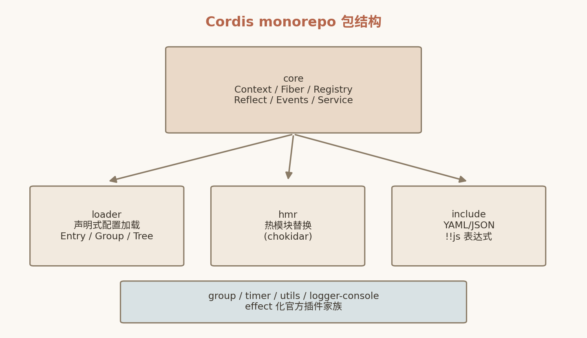

# 6. 声明式组合：Loader、HMR 与框架对比

第 5 章我们剖析了 cordis 核心包：Context、Fiber、Registry、Reflect、Events，约 1848 行代码实现了时空可组合性的运行时内核。本章向上走一层，看 core 之外的生态包如何把这些原语外化为"声明式组合"——插件系统不再需要命令式的 `ctx.plugin()` 调用序列，而是一份可持久化、可热更新的配置树。随后我们给出 Cordis API 速查表，并把 Cordis 放到与 VS Code Extensions、Inversify、Spring 的坐标系中逐维比较，最后回答全书的关键问题：为什么 Agent Harness 需要 Cordis。

## 6.1 Loader 包：配置即组件树



*图 6-1 Cordis 生态包结构*

`packages/loader/`（`@cordisjs/plugin-loader`）的核心抽象是三级结构：

- **Entry**：一个插件条目，字段包括 `id`、`name`（插件名）、`config`（插件配置）、`inject`（依赖声明覆盖）、`disabled`（禁用标记）、`group`（所属分组）。Entry 是"一次插件实例化"的声明式等价物——每个启用的 Entry 对应运行时的一个 Fiber 实例。
- **EntryGroup**：一组 Entry，支持整组启停。对应 `packages/loader/src/config/group.ts`。
- **EntryTree**：整棵配置树，负责把 Entry/EntryGroup 的层级映射为 Context 的派生层级（`ctx.extend()`），并承担配置文件的读写（`tree.write()`）。

关键思想：**组件树不再存在于代码里，而存在于配置里**。`packages/loader/src/config/{entry,group,isolate,tree,utils}.ts` 五个文件维护配置树与运行时 Fiber 树之间的双向同步——配置变了，运行时跟着变；运行时变了（如插件自己调用 `fiber.update(config)`），配置也要跟着变。后者就是下一小节的 reconciliation。

配合 `packages/include/`（`@cordisjs/plugin-include`，YAML/JSON 配置文件读写），配置文件还支持 **`!!js` 表达式**——配置值可以内嵌一段 JavaScript 表达式，在加载期求值。这使配置树兼具声明式的可读性和图灵完备的表达能力，例如让某个插件的配置引用另一个服务导出的值。

从 Entry 到 Fiber 的加载流程也值得梳理一遍：Loader 启动时读取配置树，按层级为每个 EntryGroup 创建对应的派生上下文（`ctx.extend()`），再对组内每个未禁用的 Entry 调用 `ctx.plugin(name, config)`。由于第 5 章的 PENDING 休眠机制，**Entry 在配置中的书写顺序与启动顺序无关**——声明在前的插件如果依赖后声明的插件所提供的服务，会自动休眠等待；后者的 Fiber 激活并 `provide` 后，`notify` 会唤醒前者。这意味着配置树的作者（无论是人还是 Agent）只需要描述"想要什么"，不需要编排"按什么顺序构造"——启动拓扑排序这件事被 epoch 机制彻底消除了。Entry 上的 `inject` 字段还可以**覆盖**插件自身的 inject 声明：同一插件在两棵子树中分别依赖 `session-a` 和 `session-b` 两份隔离服务，只需在两个 Entry 上各写一行配置，不必改插件代码。配合 `ctx.isolate()` 与 `config/isolate.ts`，这种"同插件多实例 + 依赖重定向"的组合正是多会话 Agent 场景的惯用模式。

## 6.2 internal/update：把配置变更回写文件的 reconciliation

传统配置加载器是单向的：文件 → 运行时。Cordis Loader 是双向的。第 5 章提到 `internal/update` 是一条 waterfall 元事件链，Fiber 配置更新时触发；Loader 在这条链的最前端（`prepend: true`）挂了一个全局监听器，把变更**回写配置文件**：

```ts
// packages/loader/src/index.ts
ctx.on('internal/update', function (config, noSave, next) {
  if (!this.entry || noSave || this.parent.fiber?.entry === this.entry) return next()
  const unparse = this.runtime?.Config?.['simplify']
  this.entry.options.config = unparse ? unparse(config) : config
  this.entry.parent.tree.write()          // 配置持久化
  return next()
}, { global: true, prepend: true })
```

逐行讲解这段 reconciliation 逻辑：

1. **守卫条件**。三种情况直接放行给下游（`return next()`）：当前 Fiber 不是由某个 Entry 创建的（`!this.entry`，即命令式 `ctx.plugin()` 加载的插件不回写）；调用方显式传了 `noSave`（例如批量调整时避免频繁落盘）；本 Fiber 与父 Fiber 共享同一 Entry（`this.parent.fiber?.entry === this.entry`，配置更新事件沿 Fiber 链冒泡，只在 Entry 归属的那个层级处理一次，避免重复写文件）。
2. **配置逆序列化**。`this.runtime?.Config?.['simplify']` 取插件 Config schema 上的 `simplify` 方法——Standard Schema 校验时通常会把用户配置"规范化"（补默认值、做类型转换），回写前用 `simplify` 把内部表示还原为用户友好的形式，保证配置文件不会因一次热更新而膨胀出一大堆默认字段。没有 `simplify` 则原样写入。
3. **落盘**。`this.entry.options.config = ...` 更新内存中的配置树节点，`this.entry.parent.tree.write()` 把整棵树持久化回配置文件。
4. **放行下游**。`return next()` 让 waterfall 链上的其他监听器（包括用户插件）继续处理这次更新。

`{ global: true, prepend: true }` 两个选项保证该监听器对所有上下文生效且最先执行——回写是框架级义务，必须抢在业务监听器之前完成。

这套机制的收益在 Agent 场景尤为显著：**Agent 在运行时修改自己的配置（例如调整某个工具插件的参数），改动会可靠地持久化**，重启后状态不丢失。配置树成为系统状态的单一事实来源（single source of truth），运行时只是它的投影。

## 6.3 HMR 包：chokidar + ModuleJob 依赖图热重载

`packages/hmr/`（`@cordisjs/plugin-hmr`）解决开发期的另一个问题：改了插件源码，如何只重载受影响的插件而不是重启整个应用？

其实现分两部分：

- **文件监听**：用 chokidar 监视源码文件变化；
- **影响面分析**：维护一张基于 `ModuleJob`（Node.js 内部 ESM 加载器暴露的模块任务对象）的**模块依赖图**。文件变化时，沿依赖图向上找出生效路径上的所有插件模块——被改文件本身、以及 require/import 了它的插件——对这些插件触发 `'hmr/reload'` 事件，执行卸载（LIFO 撤销全部副作用）并重载。

注意 HMR 本身并不需要理解 Fiber 的清理逻辑——它只是发事件，**真正的安全卸载完全由第 5 章的 disposer 机制兜底**。这正是核心原语设计良好的体现：热重载这种在传统框架里需要框架作者费尽心思特殊处理的能力，在 Cordis 里只是一个普通的生态插件。论文所说的 "declarative component loader with configuration reconciliation and hot module replacement"，落地就是这两个合计不到千行的包。

值得强调的是 HMR 与 epoch 机制的协同：被重载的插件如果提供了服务，其 Fiber 会重新实例化、获得新的 uid；所有依赖该服务的 Fiber 在 `_refresh()` 中算出不同的 epoch，于是**级联自动重启**——改一行底层服务代码，整条依赖链上的组件按正确的顺序（先撤销依赖方、再重启提供方、最后重启依赖方）完成热更新，全程不需要人工干预，也不会出现"新服务已上线、旧依赖方还持有旧实例"的中间态。对比传统 Node 开发中 `nodemon` 式的整进程重启，或 `require.cache` 手工清除式的脆弱热重载，这套组合的工程体验差距是数量级的。

## 6.4 辅助机制速览

core 与 loader 中还有一批小而精的辅助机制，此处一并速览（源码位置见第 5 章目录）：

- **`ctx.isolate(name)`**：为服务名生成独立 symbol 键，实现同名服务的命名空间隔离。同一 Context 树中可以存在多份互不可见的同名服务实现——例如两个 Agent 会话各自挂载自己的 `session` 服务，互不干扰。loader 侧有对应的 `config/isolate.ts` 支持配置级隔离声明。
- **`ctx.intercept(name, config)`**：沿 Context 原型链分层覆盖服务配置。服务实现侧通过 `Service[symbols.resolveConfig]` 自根向下合并各层配置——根上下文定全局默认，子上下文做局部覆盖，类似 CSS 的层叠。
- **`ctx.mixin()` / `ctx.accessor()`**：把子服务的方法或属性以 accessor 形式投射到 Context 上。ReflectService 构造时就把 `registry.inject/plugin`、`events.on/emit/...` 等 mixin 到 ctx，这就是 `ctx.plugin()`、`ctx.on()` 这些"顶层 API"的真相——它们只是服务的代理访问器。
- **`trace` / `bind`**：Proxy 追踪值与回调的上下文归属。服务实例经 `getTraceable` 包装后，跨上下文传递时仍保持身份可溯，`bind` 则把函数绑定到特定上下文执行，避免回调在错误的上下文中解析服务。

## 6.5 Cordis API 速查表

以下速查表覆盖 `packages/core` 的全部常用 API，可作日常开发的案头参考。

**`Context`**：

| API | 说明 |
|---|---|
| `ctx.plugin(plugin, config?) → Fiber & PromiseLike<Fiber>` | 实例化插件；返回值既是 Fiber 又可 await 等待激活 |
| `ctx.inject(deps, callback)` | 依赖就绪后执行 callback，依赖消失自动清理 |
| `ctx.effect(execute, label?) → Disposable` | 登记可撤销副作用；execute 可返回 disposer / `Promise<disposer>` / `(Async)Iterable<disposer>` |
| `ctx.provide(name, value?) → disposer` | 提供服务；返回的 disposer 即注销函数 |
| `ctx.get(name)` / `ctx.set(name, value)` | 显式服务存取 |
| `ctx.mixin(source, methods)` / `ctx.accessor(name, options)` | 把服务方法/属性投射到 Context |
| `ctx.isolate(name)` | 声明服务隔离域 |
| `ctx.intercept(name, config)` | 分层覆盖服务配置 |
| `ctx.extend(meta)` | 原型链派生子上下文 |

**事件**：

| API | 说明 |
|---|---|
| `ctx.on(event, listener, options?)` | 注册监听（自动可撤销），返回注销函数 |
| `ctx.once(event, listener)` | 单次监听 |
| `ctx.emit(event, ...args)` | 广播，不等待 |
| `ctx.parallel(event, ...args)` | 并行扇出，错误聚合为 AggregateError |
| `ctx.serial(event, ...args)` | 按序执行，返回非空即短路 |
| `ctx.bail(event, ...args)` | 同步短路 |
| `ctx.waterfall(event, ...args)` | 环绕中间件链，监听器收 `(...args, next)` |

**Fiber**：

| API | 说明 |
|---|---|
| `fiber.dispose()` | 卸载 Fiber，LIFO 执行全部 disposer |
| `fiber.restart()` | 卸载并重新实例化 |
| `fiber.update(config)` | 更新配置，触发 `internal/update` 瀑布链 |
| `fiber.await()` | 等待 Fiber 到达激活/终态 |
| `fiber.getEffects()` | 返回已登记 effect 的标签列表（调试/自检用） |
| `FiberState` 枚举 | `PENDING / LOADING / ACTIVE / FAILED / DISPOSED / UNLOADING` |

**服务与插件**：`Service` 基类（子类构造时自动 `provide`）；`@Inject()` 装饰器（类级/方法级依赖声明）；`Plugin.Config`（Standard Schema 配置校验，zod/schemastery 均可）。

## 6.6 八维对比：Cordis vs VS Code Extensions vs Inversify vs Spring

| 维度 | Cordis | VS Code Extensions | Inversify (JS) | Spring (IoC) |
|---|---|---|---|---|
| 组合单元 | Fiber，可多实例 | Extension 单实例 | 类型绑定 | Bean |
| 依赖表达 | inject + 反应式解析 | 静态激活事件 | 构造器注入 | @Autowired |
| 依赖变化 | 自动级联重启 | reload 整个窗口 | 不支持 | @RefreshScope 有限 |
| 副作用撤销 | effect/disposer 强制 | subscriptions 约定 | 无 | destroy 仅容器关闭 |
| 上下文结构 | Proxy + 原型链派生 | 全局无层级 | 层级但静态 | 父子上下文 |
| 事件模型 | 五种分发模式 | EventEmitter 单一 | 无内置 | 单一广播 |
| 配置 | Schema 校验 + 热写回 | settings.json | 无 | PropertySource |
| 形式化基础 | 论文 + 组合演算 | 无 | 无 | 无 |

逐维度点评：

**组合单元**。四者都能表达"组件"，但只有 Cordis 的 Fiber 是一等运行时对象——同插件多实例意味着"同一工具服务给不同会话各挂一份"是原生能力；VS Code 的 Extension 单实例 activate 模型天然排斥多租户场景。

**依赖表达**。表面上 `inject` 与 `@inject`/`@Autowired` 相似，本质差异在时机：Inversify 和 Spring 的依赖图在容器启动时**一次性解析完毕**，之后服务集合视为静止；Cordis 把解析推迟到运行时且持续进行——依赖缺失时 Fiber 合法地休眠在 PENDING，依赖出现后自动激活。`activationEvents` 是 VS Code 对"懒激活"的回答，但它是静态声明的启动触发器，无法表达"依赖消失了请把我卸载"。

**依赖变化**。这是差距最大的一维。epoch 机制（5.4.4 节）使"服务被替换实现 → 所有依赖方级联重启"成为框架内置行为；VS Code 的答案是 reload 整个窗口，Spring 需要 `@RefreshScope` 之类的附加机制且覆盖面有限，Inversify 完全没有对应概念。

**副作用撤销**。VS Code 的 `context.subscriptions` 是思想上最接近 Cordis 的设计，但它是**约定**而非机制——只覆盖编辑器 API 注册的 Disposable，插件自己开的定时器、连接、全局状态全靠自觉。Cordis 的 effect/disposer 是框架强制的：任何副作用不登记就没有标准方式产生，卸载时 LIFO 自动执行。Spring 的 `destroy` 只在容器关闭时触发，粒度是整个应用生命周期，无法支撑"组件级"的撤销。

**上下文结构**。Cordis 的 Proxy + 原型链派生在表达力上是 Spring 父子 ApplicationContext 的超集：isolate 提供命名空间隔离，intercept 提供配置层叠，且二者都是运行时动态生效的。

**事件模型**。EventEmitter 与 ApplicationEvent 都只有单一广播语义；Cordis 的五种模式里，waterfall 的环绕中间件语义使框架关键路径（`internal/get`、`internal/update`）全部可扩展——这是其他三者不具备的元能力。

**配置**。Inversify 无配置概念；VS Code 与 Spring 的配置是"应用向框架登记"的静态模型；Cordis 的配置树是双向的（6.2 节），运行时变更可回写，且经 Standard Schema 校验。

**形式化基础**。Cordis 背后有论文把 effect/coeffect 提升为运行时并给出组合演算；这不只是学术装饰——形式化保证了"撤销的完备性"与"组合的封闭性"这类关键性质可以被推理而非仅靠测试。

**小结相似与本质**：`inject` ≈ `@inject`/`@Autowired`，Context 层级 ≈ 父子 ApplicationContext，disposer 列表 ≈ `subscriptions`——形似之处不少。本质差异在于：Cordis 把"注册"和"依赖"都建模为**可逆的、反应式的一等运行时对象**（时间 + 空间两个维度），而上述框架要么撤销靠自觉、要么依赖图静态。

## 6.7 为什么 Agent Harness 需要 Cordis

回到本书的主角。DeepSeek Harness 的架构是"一切皆插件"——模型、工具、技能、会话、沙箱、存储、循环、调度、UI 全部由插件组合。其创造模式更进一步：Agent 可以在运行时检视自己的插件树，**动态挂载/卸载自己编写的临时插件**。

把这句话翻译成对底层框架的需求清单：

1. 任意插件的注册副作用必须有明确、完整的清理路径——否则 Agent 挂载几十次临时插件后系统状态将不可恢复 → **effect/disposer + LIFO 撤销**；
2. 插件间的依赖关系随 Agent 行为动态出现和消失，框架必须自动管理启停顺序 → **inject + epoch 反应式重启**；
3. Agent 对自身的修改必须可持久化、可审计 → **Loader 的配置回写 reconciliation**；
4. 修改和重载必须能局部进行，不能重启整个 Harness → **Fiber 粒度的独立生命周期 + HMR**；
5. 框架行为本身需要对 Agent 可观察、可干预（Agent 要能"理解"自己在做什么）→ **effect 标签、`internal/*` 元事件、`fiber.getEffects()` 自检接口**。

VS Code Extensions、Inversify、Spring 各自满足其中零到两条，Cordis 五条全满足——而且是用 1848 行核心代码满足的。这就是论文题名《A Programming Paradigm for Spatiotemporal Composability》中"Programming Paradigm"一词的含义：它不是又一个插件框架，而是把"动态组合"这件事本身变成了有形式化基础的运行时原语。

## 6.8 本章小结

本章沿生态包向上看了一层：

1. **Loader**（Entry/EntryGroup/EntryTree）把组件树外化为配置树，`internal/update` waterfall 链上的监听器把运行时配置变更回写文件，实现双向 reconciliation；
2. **HMR**（chokidar + ModuleJob 依赖图）以普通生态插件的身份实现局部热重载，安全清理由核心 disposer 机制兜底；
3. isolate/intercept/mixin/accessor/trace 一组辅助机制补齐了服务隔离、配置层叠、API 投射与身份追踪；
4. 八维对比显示：Cordis 与 VS Code/Inversify/Spring 的形似之处在表面 API，本质差异在于注册与依赖被建模为可逆、反应式的一等运行时对象；
5. Agent Harness 的"运行时自重组"需求清单，恰好就是时空可组合性的工程化展开。

至此，Cordis 的两章源码剖析完毕。从下一部分开始，我们将进入 DeepSeek Harness 本体，看这些原语如何支撑起一个真实的、可自进化的 Agent 运行时。

## 6.9 本章参考资料

- [@cordisjs/plugin-loader（Cordis 源码）](https://github.com/cordiverse/cordis/tree/master/packages/loader) — loader 包源码：Entry/EntryGroup/EntryTree 配置树与 `internal/update` 配置回写机制的实现。
- [@cordisjs/plugin-hmr（Cordis 源码）](https://github.com/cordiverse/cordis/tree/master/packages/hmr) — hmr 包源码：基于 chokidar 的热模块替换与 `hmr/reload` 事件的实现。
- [《可逆的插件系统》（Koishi 官方 cookbook）](https://koishi.chat/zh-CN/cookbook/design/disposable.html) — Cordis 作者 Shigma 的设计长文，给出"路径无关"的可逆性定义，并讨论热重载等工程红利。
- [Koishi 4.7.1 release notes](https://github.com/koishijs/koishi/discussions/691) — Cordis 从 Koishi 核心抽象为独立包时的官方发布说明，含时间线与首次表述。
- [Koishi 4.17.2 release notes](https://github.com/koishijs/koishi/discussions/1378) — `ctx.set()` 资源安全演进相关的发布说明，记录了这段 API 变迁的来龙去脉。
- [Cordis 仓库](https://github.com/cordiverse/cordis) — Cordis 上游仓库，本章与 VS Code Extensions / Inversify / Spring 对比时引用的源码都在这里。
