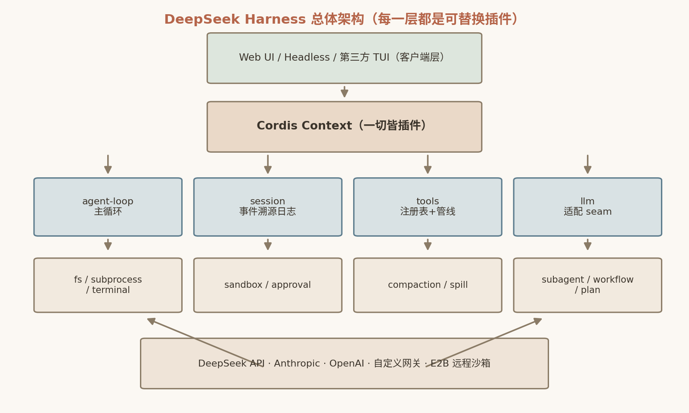
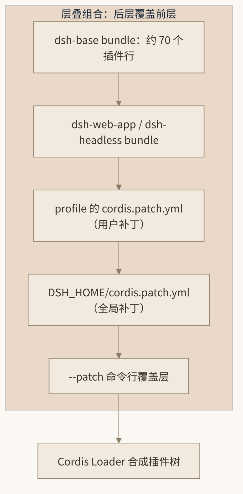

# 7. dsh 架构总览：Everything is a Plugin

从本章开始，我们进入本书的“dsh 架构篇”。dsh（DeepSeek Harness，版本 `0.1.0-rc.5`，MIT 协议）是 DeepSeek AI 开源的 agent harness——如果说 Cordis 提供的是“时空可组合”的插件范式，dsh 就是这套范式在一个真实生产级智能体系统上的完整落地。它的 README 用一句话概括了全部设计哲学：**everything is a plugin**。

本章先做总览：解读 README / CONTRIBUTING / AGENTS 三份文档构成的“工程宪章”，解释为什么 Cordis 要以 vendor 方式进入仓库，然后展开 monorepo 的职责地图，最后详细拆解 Profile / Bundle / Patch 三层组合机制——这是理解 dsh 一切运行行为的钥匙。

## 7.1 工程宪章：README、CONTRIBUTING 与 AGENTS.md

很多项目把 `AGENTS.md` 当作给 AI 编码助手看的提示文件，但 dsh 的 `AGENTS.md`（149 行）实际上是一份对整个项目生效的工程宪章。配合 README 与 CONTRIBUTING，它确立了六条贯穿全书的主线。

**第一，没有特权核心。** README 明确声明 dsh 由 Cordis 框架驱动、架构上 everything is a plugin。这句话不是修辞：连 agent 主循环本身（`agent-loop`）也只是注册在 `ctx.agentLoop` 上的一个可替换插件。替换模型适配器、工具注册表、session 日志乃至循环，都只是改一行配置。

**第二，注册即 effect（Registrations are effects）。** 一切注册必须经过 `ctx.effect()` / `ctx.on()`，注册函数返回 disposer。卸载插件时，它注册过的一切——事件监听、服务、工具、命令——全部自动回滚。这条约定让“插件可热插拔”从口号变成了类型系统保证的不变量。

**第三，Model-visible ⟺ logged。** 凡进入模型请求的内容，必须能从 session 日志重建；新增任何模型可见输入，就必须新增对应的 session 事件。这条不变量由运行时在请求派生时断言，它是第 8 章“Session 事件溯源”的根基。

**第四，Plugins, not loop changes。** 新行为必须挂到文档化的扩展点上，而不是去改循环；若确实改动了 `agent-loop`，必须同步更新 `docs/architecture.md`。这条纪律保证了扩展点的文档与实现永不漂移——事实上仓库里 `docs/tool-catalog.md`、`docs/config-catalog.md` 等文档是由 `scripts/gen-*.ts` 生成并由 CI 校验新鲜度的。

**第五，waterfall 必须 `next()`。** Cordis 的 waterfall 事件是 around-middleware：监听器收到 `(...args, next)`，不调用 `next()` 即短路整条链。这既是能力（任何插件都可以拦截、改写、否决一次调用），也是陷阱（忘记委派会静默掐断后续所有监听器），所以被写进宪章反复强调。

**第六，发布前立场：正确地基优先于兼容垫片。** `SESSION_FORMAT_VERSION` 保持 `0`，SQLite 使用单调递增的 `SCHEMA_VERSION`。README 也直言项目处于 developer preview，“明确声明会有兼容性破坏变更”。CONTRIBUTING 则更坦率：团队很小，暂不接受外部 PR，建议以写插件、写博客、答问题的方式参与生态——*"You may consider this repository an idea, an official showcase, and a source of inspiration, but not a mandate."*

其余工程约束也值得一提：每个 npm 包命名 `@deepseek-ai/dsh-<name>`；vendored 包重新 scoped 且 `private: true`；`@deepseek-ai/cordis` 是每个 harness 包的 peerDependency；全仓库 ESM（`"type": "module"`），CLI 源码启动走 `node --import tsx/esm`；Node 引擎要求 `^22.19.0 || >=24.0.0`，包管理器锁定 `pnpm@11.7.0`。

## 7.2 为什么 vendor 掉 Cordis

本书前半部分讨论的 Cordis（上游 `cordiverse/cordis@4.0.0-rc.7`）在 dsh 中**不是 npm 依赖，而是源码 vendored 进仓库**的：`vendor/cordis` 重新 scoped 为 `@deepseek-ai/cordis`。不止框架本体，连 `cosmokit`、`schemastery`（Zod 式校验库）、`loader`、`hmr`、`group`、`timer`、`include`、`logger-console` 也一并 vendored。

`vendor/README.md` 给出的动机只有一句话，但分量极重：

> so that the harness fully owns its framework layer (**auditable, patchable, pinned**)

三个关键词值得逐词咀嚼：

- **Auditable（可审计）**：框架层是 agent 系统所有权限、事件、副作用的汇流点。把它作为黑盒依赖，等于把安全审计的边界划到了别人仓库里。vendored 之后，框架的每一行都在同一个 Git 历史、同一套 code review 流程之内。
- **Patchable（可打补丁）**：上游是 rc 版本，API 与行为都在变动。harness 需要对 waterfall 语义、loader 行为做针对性修正时，不必等上游发版，直接改 vendor 目录即可。
- **Pinned（钉死）**：harness 的行为可复现性建立在框架版本绝对固定的前提上。vendoring 消除了“lockfile 之外”的一切漂移可能。

这是一个值得借鉴的通用决策模式：当某个框架是你的系统的“承载层”而非“工具层”时，依赖管理的默认姿态（semver + lockfile）是不够的，你需要的是所有权。

所有权不是免费的。以 rc.7 快照量化这笔账：上游 `packages/core/src` 共 1848 行，vendored 后 `vendor/cordis/src` 已增至 2693 行——`vendor/README.md` 用 18 条逐条留痕的本地修改（Local modifications）记录了全部差异，从 `@deepseek-ai` 重新 scoped、`.ts` 显式后缀、JSDoc 全面充实，到 `fiber.ts` 的三处重入处置缺口加固和 `include` patch 算法"插入行不可补丁"的上游缺陷修复（第 11 条）。每条修改都附带动机、行为边界和覆盖测试。换言之，vendoring 的真正成本不是复制代码，而是**建立起一套"分歧台账"纪律**——这也是第 15 章把 vendoring 归入量化交易式供应链纪律的原因。

## 7.3 Monorepo 全景

dsh 是一个 pnpm 11.7 workspace（根包 `@deepseek-ai/dsh-root@0.1.0-rc.5`）。`pnpm-workspace.yaml` 定义了成员结构：

```yaml
packages:
  - vendor/*                  # vendored Cordis 框架层
  - packages/*/*              # 全部 harness 包（<group>/<pkg> 两层结构）
  - native/landlock-run       # Linux Landlock 原生启动器
  - apps/*                    # apps/cli 拥有 dsh bin；apps/web 为 Web 入口
  - website                   # VitePress 文档站
  - examples                  # 仅依赖解析用途的可运行 cordis.yml 叶子
  - python/sdk-runtime        # 单 exe 构建的闭包根
```

注意 `packages/*/*` 的两层结构：第一层是**分组**，第二层才是包。`AGENTS.md` 给出的分组就是一张职责地图，我们将它整理为表 7-1。

**表 7-1　dsh `packages/` 分组职责地图**

| 分组 | 职责 |
|---|---|
| `core/` | 产品 API 脊柱：`session`（事件溯源日志）、`system-prompt`（提示词装配）、`tools`（工具注册表+执行管线）、`agent`（Agent 接口/注册表）、`agent-loop`（默认驱动）、`scope`（agent 作用域注册原语） |
| `llm/` | 模型接入层：`llm`（消息/流词汇 + adapter seam，`ctx.llm`）、`llm-deepseek`（DeepSeek 官方适配器）、`llm-pi-ai`（多 provider 适配器）、`llm-retry`、`token-meter` |
| `shell/`、`subprocess/`、`terminal/` | bash/pwsh 能力 seam + 本地/pwsh provider + 持久 PTY 会话 |
| `fs/` | 文件系统 seam + 策略（`tool-fs`、`tool-fs-search`、`fs-observation-policy`） |
| `sandbox/` | 进程沙箱 seam + 本地后端（bwrap/Landlock/Seatbelt/Windows ACL） |
| `compaction/` | 上下文压缩 seam + `compaction-basic` + `tool-result-pruner` + `/compact` 命令 |
| `subagent/`、`workflow/`、`plan/`、`preset/`、`goal/`、`todo/` | 子智能体、持久工作流、计划模式、agent 预设、目标管理、todo 工具 |
| `session/` | 持久化（JSONL/SQLite）、projection、标题、telemetry（OTLP） |
| `interaction/` | 审批（`user-approval`）、权限预设、命令系统、ask-user |
| `web/`、`client/`、`host/`、`api/` | Web 服务能力 seam、约 40 个 React 客户端 UI 插件、BFF/API 网关 |
| `boot/`、`bundle/` | 启动胶水与 profile 分层 bundle；`apps/cli` 提供 `dsh` bin |
| `e2b/`、`lsp/`、`mcp/`、`hooks/`、`acp/`、`sdk/` | E2B 沙箱 POC、语言服务器、MCP、Claude Code/Codex hook 桥、ACP 自动化协议、TS/Python SDK |
| `typert/` | 自研的类型图生成/RPC 反射系统（"Typert"） |
| `experimental/` | 私有孵化包（不进入发布 tarball）：当前承载 Agent Teams（`agent-team` + `tool-agent-team`）；稳定包被机械禁止依赖它，转正需评审公共契约 |

每个包的 `package.json` description 本身就是职责说明，例如 `@deepseek-ai/dsh-agent-loop` 是 *"The concrete agent loop plugin for the DeepSeek Harness"*，`@deepseek-ai/dsh-session` 是 *"Event-sourced session store"*，`@deepseek-ai/dsh-tools` 是 *"Tool registry and execution pipeline"*。构建上采用 TypeScript project references 双聚合（host/client 分离，以避免 Cordis `Context` 声明合并冲突）+ tsdown 打包，测试用 vitest 分 unit/e2e/snapshot/web/perf/stress 六套配置。

## 7.4 Cordis 五要素在 dsh 中的体现

`docs/cordis-primer.md` 把 Cordis 总结为五要素，dsh 把每一条都用到了极致：

1. **插件即 Service 对象**——一个带可选 `inject` 与 `apply(ctx)` 的函数，或 `Service` 子类。dsh 中从 `dsh-agent-loop` 到 `dsh-token-meter`，所有包都是这种形态。
2. **Context 即服务仓库**——服务占据稳定的 `ctx.<key>`（`ctx.tools`、`ctx.llm`、`ctx.sessions`、`ctx.sandbox`、`ctx.approval`…），消费者按 key 而非具体实现相互发现。这是 dsh 可替换性的根源。
3. **`inject` 声明依赖**——加载顺序由服务可用性驱动，而非手工 boot 排序。base bundle 的注释原文说得很明白：*"Row order carries no load semantics (activation is service-availability driven)"*——配置里行的顺序不携带加载语义。
4. **类型化事件**——用 TypeScript declaration merging 扩展事件名（`SessionEventMap` 成员默认 required-on-read），以 `emit` / `waterfall` / `parallel` / `serial` 四种模式分发（dsh 文档归纳为四种常用模式；Cordis 内核另有同步短路的 bail，共五种，见 5.7 节）。
5. **注册即可逆 effect**——卸载自动回滚。



*图 7-1 dsh 总体架构*

图 7-1 给出了 dsh 的总体架构：底部是 vendored Cordis 框架层，其上是由 seam（服务接口）与 provider（实现）组成的能力层，再上是核心脊柱（session / tools / agent-loop），最外层是 profile 组合出的应用形态（web / headless）。

## 7.5 Profile / Bundle / Patch：三层组合机制

这是 dsh 最精妙、也最值得逐行研究的部分。`docs/architecture.md`“Profiles and bundles”一节指出：一次运行的 `dsh`，是 boot 时从**有序分层**组合出的插件树。

- **Profile**：存在 Harness home（`$DSH_HOME`）中的具名组合，列出所叠加的 bundle、树外插件、用户自己的 `cordis.patch.yml`；官方提供 `web` 与 `headless` 两个模板。
- **Bundle**：Cordis 配置行 + 所挂载代码的分发格式；`package.json` 的 `dsh.profile` / `dsh.bundle` 字段声明身份。
- **Patch**：对既有配置行的外科手术——**按行 `id` 整行替换**（不是深合并！），或插入新行。

层叠顺序为：profile 列出的各 bundle（按 `dsh.profile.bundles` 顺序）→ profile 自己的 `cordis.patch.yml` → home 级 `$DSH_HOME/cordis.patch.yml` → 命令行 `--patch` overlay。后层覆盖前层，且**任何一行都可被用户 patch 替换**。调试组合结果的标准手段是：

```sh
dsh --profile web --dump-config   # 打印实际启动树
```

`--dump-config` 是排查“为什么这个插件没加载”“为什么这个配置没生效”的第一站——它展示的是层叠全部完成后的最终真相。

### 7.5.1 dsh-base bundle：约 70 行的默认人格

`packages/bundle/base/cordis.patch.yml` 是每个 profile 的第一层，**78 个插件行**，定义了 dsh 的“默认人格”。按职能分组：

- **框架**：`cordis-plugin-timer`、`cordis-plugin-hmr`
- **核心脊柱**：`dsh-llm`、`dsh-session`、`dsh-typert-*`、`dsh-agent`、`dsh-agent-loop`、`dsh-tools`、`dsh-system-prompt`、`dsh-agent-default-model`（默认 `deepseek-official / deepseek-v4-flash`）
- **模型接入**：`dsh-llm-deepseek`、`dsh-llm-pi-ai`（默认休眠，设置文件热加载 provider profile）、`dsh-llm-retry`、`dsh-token-meter`
- **设置与凭据**：`dsh-settings-file`（`$DSH_HOME/settings.yaml` 热重载）、`dsh-credentials-local`（环境变量 + `$DSH_HOME/.credentials.yaml` + `.env`）
- **持久化**：`dsh-session-persistence-jsonl`、`dsh-session-query-sqlite`（FTS5 全文搜索，默认 `openAt: never`）、`dsh-attachment-local`（图片字节存内容寻址引用，不入日志）
- **沙箱与审批**：`dsh-sandbox-local`、`dsh-sandbox-policy`、`dsh-bash-sandbox`/`dsh-pwsh-sandbox`（互斥平台）、`dsh-user-approval`、`dsh-permission-presets`（`read-only` / `workspace-write` / `danger-full-access` 三档预设）
- **工具**：`tool-bash`/`tool-pwsh`、`tool-fs`（edit/read/read_image/write）、`tool-fs-search`（glob/grep，内置 ripgrep）、`tool-str-replace-editor`、`tool-todo`、`tool-goal`、`tool-skill`、`tool-subagent(-control/-report)`、`tool-workflow`、`tool-ralph`、`tool-web`（默认禁用，SSRF 考量）、`tool-jobs`、`dsh-plan-mode`（`exit_plan_mode`）
- **上下文工程**：`dsh-agent-instructions`（加载 AGENTS.md/CLAUDE.md，64KB 上限）、`dsh-compaction-basic`、`dsh-compaction-tool-result-pruner`、`dsh-spill-local`/`dsh-spill-policy`（超大结果外溢存储）、`dsh-repeat-tool-reminder`
- **其他**：`dsh-session-telemetry-otel`（OTLP 遥测，默认 DISABLED）、`dsh-session-title(-llm)`、`dsh-skill*`、`dsh-commands`、`dsh-user-questions`、`dsh-session-checkpoint-policy`、`dsh-tool-call-timeout-policy`

`dsh-web-app` bundle（`packages/bundle/web-app/cordis.patch.yml`）在此之上叠加浏览器应用层；`dsh-headless` 叠加无服务器一次性运行器。一个 profile 选用哪条“纵列”，就得到哪种形态的 dsh。

### 7.5.2 `!!js` 表达式：配置里的运行时求值

Cordis loader 的配置支持 `!!js` 表达式插值（见 `cordis-primer.md`“Loader Configuration”），base bundle 大量使用它把“启动环境”编织进配置。真实片段（`packages/bundle/base/cordis.patch.yml`）：

```yaml
- id: tool-bash
  name: '@deepseek-ai/dsh-tool-bash'
  disabled: !!js process.platform === 'win32'
- id: sandbox-policy
  name: '@deepseek-ai/dsh-sandbox-policy'
  config:
    mode: !!js process.env.DSH_PERMISSION_MODE ?? 'workspace-write'
    workspaceRoot: !!js process.cwd()
- id: approval
  name: '@deepseek-ai/dsh-user-approval'
  config:
    policy: !!js >-
      (process.env.DSH_PERMISSION_MODE ?? 'workspace-write') === 'danger-full-access'
        ? 'never' : 'ask'
```

第一行按平台禁用 bash（Windows 上由 pwsh 顶替）；第二行把权限模式与工作区根目录绑定到环境变量和当前目录；第三行最妙——当用户选择 `danger-full-access` 时，审批策略直接降为 `never`，否则保持 `ask`。环境适配不需要任何命令行分支代码，全部在配置层声明完成。



*图 7-2 dsh 分层组合架构*

图 7-2 总结了这套层叠结构：base bundle 提供最底层默认人格，web-app / headless 等 bundle 决定形态，profile patch 与 home patch 承载用户偏好，`--patch` 提供一次性覆盖。由于 patch 是“按 id 整行替换”，组合结果永远是一棵确定性的、可 `--dump-config` 检查的插件树。

本书以 `0.1.0-rc.5` 为分析基线，而 dsh 迭代极快。到 `rc.7`（2026-08-17），有几处演进值得留意：Web UI 的 agent 预设里原「Code mode」更名为 **PTC 模式**（程序化工具调用，底层仍是 Code Mode SDK 与 `run_code` 传输，机制详见 9.4 节）；插件可以向设置页注册自己的设置卡片；`subagent-codex` 与 `subagent-claude-code` 提供器让 Codex、Claude Code 能以子代理身份接入 Job Panel；MCP 与 ACP 通道收到的图片改为经 `dsh-attachment` 持久化为内容寻址附件，不再内联进消息；DeepSeek 官方模型目录新增了 `low` 推理档。

从 `rc.7` 到 `0.1.1-rc.2`（2026-08-21）只有四天，演进密度却丝毫不减，其中五处直接改写了本书相关章节的论述：**凭据面重构**——`dsh-credentials` 长出第二键空间 `CredentialKey` 记录，新的 `dsh-authorization` seam 承载 OAuth 授权流，`openai-codex` 等 OAuth-only provider 重回模型目录（11.7 节）；**会话日志版本机制**——`SESSION_FORMAT_VERSION` 单调整数 + 逐事件 `ignorable` 标记，旧运行时读新日志方向感知地拒绝而非误读（8.1 节）；**取消流的前缀固化**——被中断的流会把已送达内容落为 `interrupted: true` 的 `assistant/message`，取消后的追问与 fork 不再丢失用户已读到的文本（8.3.2 节）；**bwrap 私有 PID 命名空间**——封堵 procfs magic link 逃逸路径（11.3 节）；**模型层两项韧性增强**——reasoning 逐回传与 DeepSeek Files 传输的内联回退（10.2 节）。此外还有跨会话引用（8.4 节）与 `experimental/` 组内 Agent Teams 的孵化（表 7-1）。这些变化的共同方向与本书主题一致：一切仍是插件，只是插件能触及的面更宽了。

## 7.6 本章小结

本章建立了理解 dsh 的全局坐标系。要点回顾：

- dsh 的工程宪章（AGENTS.md 等）确立了六条主线：无特权核心、注册即 effect、Model-visible ⟺ logged、Plugins not loop changes、waterfall 必须 `next()`、正确地基优先。
- Cordis 以 vendor 方式进入仓库，换取框架层的 **auditable / patchable / pinned**——当框架是承载层而非工具层时，所有权优于依赖管理。
- monorepo 用 `packages/<group>/<pkg>` 两层结构组织，分组即职责地图；约 70 行的 `dsh-base` bundle 定义默认人格。
- Profile / Bundle / Patch 三层组合 + `!!js` 表达式插值，让“一个 dsh 运行实例 = 一棵确定性插件树”，且任何一行都可被 patch 替换、可用 `--dump-config` 检视。

下一章，我们深入这棵树的跳动心脏：Session 事件溯源与 ReactLoopAgent 主循环。

## 7.7 本章参考资料

- [DeepSeek Harness 仓库](https://github.com/deepseek-ai/deepseek-harness) — dsh 官方 monorepo 源码。想亲手验证本章任何论断——包分组、bundle 配置、vendored Cordis——都从这里 clone 开始（本书以 v0.1.0-rc.5 为基线，仓库已迭代至 v0.1.1-rc.2）。
- [dsh GitHub Releases](https://github.com/deepseek-ai/deepseek-harness/releases) — 官方发版页。rc.7 的 PTC 模式更名、设置卡片注册、Codex/Claude Code 子代理接入等演进都有逐版本发版说明，是追踪两个 rc 之间差异的第一站。
- [崔添翼（tianyi）MIT 发布原推](https://x.com/tianyi/status/2087888089759015218) — dsh 作者宣布项目以 MIT 协议开源的原帖，了解项目发布背景与初衷的一手材料。
- [docs/architecture.md](https://github.com/zenHeart/deepseek-harness/blob/master/docs/architecture.md) — 官方架构文档。Profile / Bundle / Patch 三层组合的权威说明，读完 7.5 节想动手组合自己的 profile 时，先读这份文档。
- [AGENTS.md](https://raw.githubusercontent.com/deepseek-ai/deepseek-harness/master/AGENTS.md) — dsh 的工程宪章原文，逐条列出 "Registrations are effects"、"Plugins, not loop changes" 等约定；给 dsh 写插件之前值得通读一遍。
- [packages/bundle/base/cordis.patch.yml](https://github.com/zenHeart/deepseek-harness/blob/master/packages/bundle/base/cordis.patch.yml) — base bundle 的真实配置文件，约 70 行插件清单与 `!!js` 表达式写法的活教材，可直接对照 7.5 节逐行阅读。
- [vendor/README.md](https://github.com/zenHeart/deepseek-harness/blob/master/vendor/README.md) — vendoring 决策的自述：为什么框架层必须 auditable / patchable / pinned，以及 18 条本地修改构成的"分歧台账"，做同类 vendoring 决策时的直接参考。
