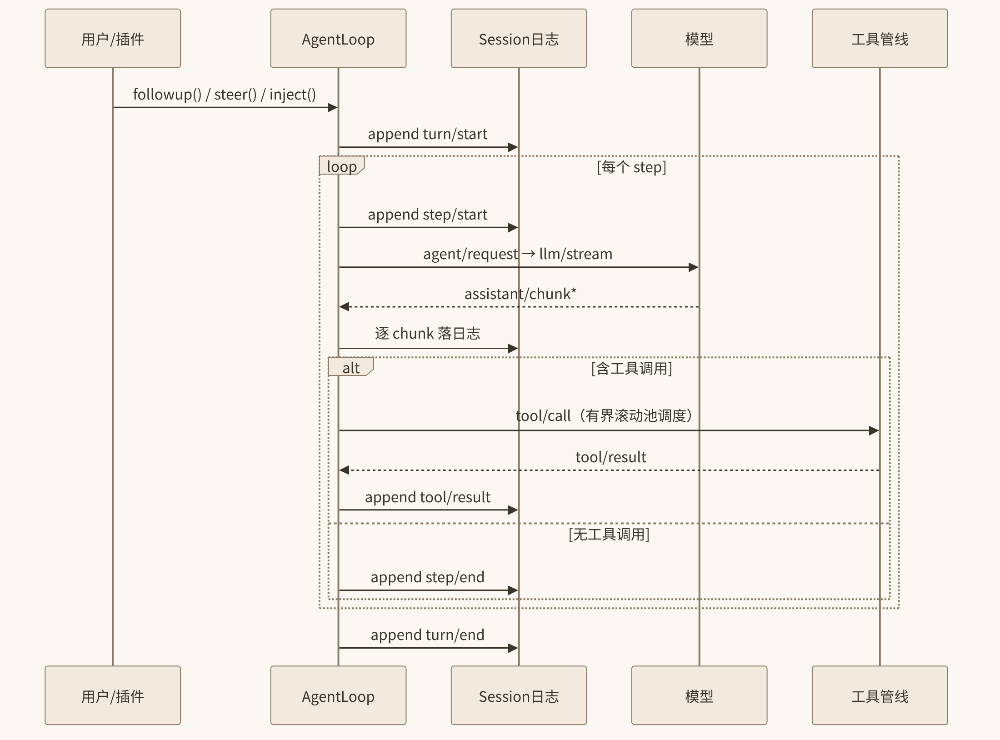

# 8. Session 事件溯源与 Agent 主循环

上一章我们看到，dsh 里连 agent 主循环都只是一个插件。但这个插件跳动的方式决定了整个系统的气质：dsh 选择了**事件溯源（event sourcing）**作为会话的根本模型——Session 是一条 append-only 的 `SessionEvent` 日志，是系统里唯一的事实源；模型看到的历史、UI 渲染的轨迹、fork/resume/压缩，全部是从这条日志派生出的投影。本章先讲日志与投影，再剖析 `ReactLoopAgent` 的 `turn()` 与 `step()` 两个核心方法（逐段读真实源码），最后梳理输入路径、并行工具调度与三个事件域的拦截点清单。

## 8.1 Session：唯一事实源

`packages/core/session`（`@deepseek-ai/dsh-session`，自述 *"Event-sourced session store"*）把一次会话建模为一条**只追加**的事件日志。事件的词表覆盖了一次智能体会话的全部事实：`turn/start | turn/end`、`step/start | step/end`、`user/message`、`assistant/chunk | assistant/message`、`tool/call | tool/result`、`request/header | request/context`，以及各插件通过 declaration merging 扩展的合并事件（如 `approval/asked`、`fs/observed`、`compaction/*`）。

这套设计的支柱是上一章提到的不变量：**Model-visible ⟺ logged**。凡进入模型请求的内容，必须能从 session 日志重建；运行时在每个请求派生时断言这条不变量。其推论非常强大：

- **模型历史是投影，不是存储。** `session.deriveMessages()` 从日志计算出送给模型的消息序列。存的是“发生过什么”，而不是“模型看到什么”——后者永远可以由前者重算。
- **fork / resume / transcript / telemetry / 压缩全部从同一流派生。** fork 是复制一段日志继续追加；resume 是重放日志恢复相位机；UI 轨迹、OTLP 遥测只是日志的不同消费者。
- **压缩 = 替换投影区间。** 摘要本身复用 `user/message` 事件，附带 `surfaceOp: { op: 'replace', start, end }` 做唯一一次 surface 替换——模型历史是日志的投影，压缩只是换了一段投影（详见 10.4.2 节）。
- **请求可重建。** `buildRequest` 会把 `request/header`、`request/context` 记入日志，因此每一次模型请求都可以事后从日志完整重放——这对调试“模型为什么这样回答”是无价之宝。


*图 8-1 事件溯源：append-only 日志记录一切，投影从中派生*

## 8.2 Turn / Step 相位模型

dsh 把会话时间划分为两级相位：

- **Step = 一次模型请求 + 其工具调用。** 一次 step 以 `step/start` 开始、以 `step/end` 结束，中间包含流式接收、工具执行。
- **Turn = 0..n 个 Step。** 一个 turn 从一次用户输入（或 followup）的兑现开始，直到模型给出不含工具调用的回答、且没有 next-step 输入插队为止。

典型事件流为：

```text
turn/start → step/start → agent/request → llm/stream → assistant/chunk*
→ tool/call → tools/pre-execute → execute → tools/post-execute → tool/result
→ step/end → (step/start …)* → turn/end
```



*图 8-2 Turn/Step 事件流*

图 8-1 展示了这条流水线。注意 `step/end` 在 `finally` 中追加——即使 step 中途失败，日志仍然闭合，replay 永远合法。

## 8.3 ReactLoopAgent 源码剖析

默认驱动是 `ReactLoopAgent`（`packages/core/agent-loop/src/agent.ts`），内部维护一个 **inbox 收件箱** 和一台 turn/step 相位机。收件箱按唤醒语义区分：followup 进入 next-turn（唤醒循环开启新 turn）；steer 进入 next-step（唤醒循环，插队进下一 step）；inject 也写入 next-step，但**不唤醒**——等下一条消息把它顺带带入。下面逐段精读。

### 8.3.1 `turn()`：相位机的外环（`agent.ts:246-330`，节选）

```ts
private async turn(): Promise<boolean> {
  ...
  this.session.append('turn/start', { turn })
  while (true) {
    signal.throwIfAborted()
    const decision = await this.preStep(target, { turn, step })   // agent/pre-step waterfall
    if (decision.kind === 'reject') { turnEnds = { kind: 'blocked' }; return false }
    this.session.append('step/start', { turn, step })
    try {
      for (const message of decision.messages) {
        this.session.append('user/message', message, { surfaceOp: 'append' })
      }
      const stepEnd = await this.step(decision.assembly)
      ...
    } finally { this.session.append('step/end', { turn, step }) }
    if (turnEnds && this.inbox.nextStep.length === 0) {
      await this.dispatch.serial('agent/turn-stopping', { turn, signal })
    }
    if (turnEnds && this.inbox.nextStep.length === 0) break
    target = 'next-step'
  }
  ...finally { this.session.append('turn/end', { turn, reason: turnEnds! }) }
}
```

逐段解读：

1. **落 `turn/start`。** 每个 turn 以日志事件开幕，`turn` 序号贯穿之后所有事件的归属字段。
2. **`preStep`：第一个拦截闸。** `agent/pre-step` 是一个 waterfall——所有插件可以在此审查、改写甚至**否决**这一步。返回 `reject` 时整个 turn 以 `{ kind: 'blocked' }` 收场。自动上下文压缩就挂在这里（serial 模式，请求派生前执行）。
3. **先落 `step/start`，再落输入消息。** `decision.messages`（本步要带入的用户/插队消息）以 `surfaceOp: 'append'` 追加为 `user/message` 事件——先落日志，再进请求，Model-visible ⟺ logged 的微观体现。
4. **`step/end` 在 `finally` 中。** 无论 `step()` 成功、抛错还是被 abort，step 事件对永远闭合。
5. **`agent/turn-stopping`：serial 终点检查点。** 当循环判断 turn 即将结束（模型已给出终结回答且 inbox 无 next-step 插队）时，以 serial 模式派发一次“turn 停止”事件，给插件最后一次挽留/善后机会（例如 goal 插件检查目标未达成则追加一条 next-step 消息让 turn 继续）。
6. **`turn/end` 携带结束原因。** `reason` 是 `completed | blocked | max-tokens` 等封闭判别联合，同样是日志事实。

### 8.3.2 `step()`：一次请求的生命周期（`agent.ts:332-401`，节选）

```ts
private async step(assembly: PromptAssembly): Promise<StepEndReason | null> {
  const system = renderPrompt(assembly)
  while (true) {
    const { request, preparedCall } = await this.buildRequest(
      turn, step, assembly.tools, system, this.session.deriveMessages(), signal)
    const assembler = new BlockAssembler()
    const stream = preparedCall?.stream(request) ?? this.loopCtx.llm.stream(request)
    for await (const chunk of stream) {
      chunkSeqs.push(this.session.append('assistant/chunk', { turn, step, chunk }).seq)
      assembler.push(chunk)
    }
    // 失败走 agent/request-error waterfall，可返回 retry action
    ...
    this.session.append('assistant/message', { turn, step, message, usage },
      { surfaceOp: 'append', sourceEventSeqs: chunkSeqs })
    if (finish.kind === 'max-tokens') return { kind: 'max-tokens' }
    const toolCalls = message.content.filter(b => b.type === 'tool-call')
    if (toolCalls.length === 0) return { kind: 'completed' }
    const { concluded } = await executeToolCalls(this.loopCtx, turn, step, toolCalls, signal,
      context => this.inbox.splice('next-step', this.inbox.nextStep.length, 0, [context]))
    return concluded ? { kind: 'completed' } : null
  }
}
```

逐段解读：

1. **构建请求。** `buildRequest` 做三件事：用 `this.session.deriveMessages()` 投影出模型历史（再次注意：历史是算出来的）；经 `agent/request` waterfall 让插件改写请求 config；调用 `ctx.llm.prepareCall()` 把 config 绑定到具体适配器。同时把 `request/header`、`request/context` 落日志——请求从此可重建。
2. **流式接收 + BlockAssembler。** `assistant/chunk` 事件**逐 chunk** 落日志，同时喂给 `BlockAssembler` 把碎片组装成完整消息块（文本 / reasoning / tool-call）。chunk 事件的序号被收集到 `chunkSeqs`。
3. **失败恢复。** 流出错走 `agent/request-error` waterfall：插件可返回 retry action 让循环原地重试。协议层的 canonical context-overflow 错误也走这条路——仅当压缩令 surface 替换代数前进时才返回 retry，避免无限循环。
4. **组装完成，落 `assistant/message`。** 注意 `sourceEventSeqs: chunkSeqs`：这条汇总事件显式声明自己由哪些 chunk 事件派生，日志内部自带血缘关系。
5. **终结判定。** `max-tokens` 直接以同名单元的 `StepEndReason` 返回；消息里没有 tool-call 则 `{ kind: 'completed' }`，step（以及可能的 turn）就此结束。
6. **有 tool-call 则执行。** `executeToolCalls` 负责并行调度（见 8.5）；它的最后一个参数是 context 追加回调——工具结果附带的 context 通过 `inbox.splice('next-step', ...)` 进入收件箱，等下一条 step 带入。若调度器报告 `concluded`（例如 steer 消息已经回答了问题），step 直接判完成。

返回 `null` 表示“本 step 的工具已执行完，继续同 step 内的下一轮模型请求”——`step()` 里的 `while (true)` 正是 ReAct 循环的体现：一次 step 内部可以进行多轮“请求 → 工具 → 再请求”。

## 8.4 输入路径：followup / steer / inject

人在 loop 运行中说话，有三种语义，分别写入 inbox 的不同槽位、携带不同的唤醒语义：

| 路径 | 槽位 | 语义 |
|---|---|---|
| `followup()` | next-turn | 追加到下一 turn，唤醒循环开始新 turn |
| `steer()` | next-step | 立即插队进下一 step，唤醒循环（打断当前方向） |
| `inject()` | next-step | 写入但不唤醒——等下一条消息把它顺带带入 |

三者最终都变成 `user/message` 事件落日志（Model-visible ⟺ logged），区别只在相位机的唤醒时机。这让“用户随时插话”成为一等公民，而不是 UI 层的补丁。

## 8.5 并行工具调度：有界滚动池 + 屏障

模型一次返回多个 tool-call 时，`packages/core/agent-loop/src/tool-calls.ts` 用“有界滚动池 + 屏障”调度：exclusive 调用形成屏障（其前其后的 parallel 组不得跨越它），parallel 调用在 `maxParallelToolCalls` 上限内重叠 dispatch，但**结果永远按模型给出的顺序提交**——模型看到的工具结果序列与其请求顺序一致。核心代码：

```ts
const fillPool = async (): Promise<void> => {
  while (!aborted && nextToStart < group.length && inFlight.size < maxParallelToolCalls) {
    if (nextToStart > 0 && mode === 'parallel'
      && ctx.tools.executionMode(nextCall.exec).kind !== 'parallel') break
    await startCall(nextToStart++)
    await commitReady()   // 只跨连续的模型序 slot 前进
  }
}
```

三个细节值得注意：

1. **每组开始前重读 `ctx.tools.executionMode()`。** 如果某个插件在两次调用之间改了注册表（例如用 `restrict()` 收紧了某工具的并发分类），调度器立刻感知，可能即时制造一道屏障。注册表的动态性被尊重到每一次 dispatch。
2. **`commitReady()` 只跨越连续的模型序 slot 前进。** 即便第 3 个调用先完成，只要第 2 个还没好，结果就不能提交——顺序一致性优先于吞吐。
3. **abort 时补写合成错误结果。** 循环被中断时，未启动的调用会被补写一条 `tool call aborted before dispatch` 的合成 `tool/result`——日志里每个 `tool/call` 都有配对的 `tool/result`，replay 永远合法。

## 8.6 三个事件域与关键拦截点

dsh 的事件分三个域，职责清晰：

1. **durable session 事件**（重放事实）：`turn/*`、`step/*`、`user/message`、`assistant/*`、`tool/*`、`request/*`——落日志，是唯一事实源。
2. **live `agent/*` 事件**（协调/拦截在飞工作）：不落日志，作用于“正在进行”的循环。
3. **capability 事件**（`fs/*`、`tools/*`、`llm/*`）：挂策略的地方，如 read-before-write 由 `fs/write-intent` / `fs/edit-intent` 事件门实现。

关键 waterfall 拦截点清单（写插件时最常用）：

| 拦截点 | 模式 | 用途 |
|---|---|---|
| `agent/pre-step` | waterfall/serial | 否决或改写一步；自动压缩挂载点 |
| `agent/request` | waterfall | 改写模型请求 config（路由、温度、工具集） |
| `agent/request-error` | waterfall | 请求失败恢复，返回 retry action |
| `llm/stream` | waterfall | 流层面包装（重试、计量） |
| `tools/pre-execute` | waterfall | 工具执行前：hooks、权限、沙箱 |
| `tools/execute` | around-waterfall | 包超时、重试、指标 |
| `tools/post-execute` | waterfall | accept/block/replace 结果、追加 context |
| `agent/turn-stopping` | serial | turn 终点检查，可挽留 |

记住宪章：waterfall 监听器必须调用 `next()`，否则短路整条链。

## 8.7 本章小结

- Session 是 append-only 的 `SessionEvent` 日志，唯一事实源；模型历史由 `deriveMessages()` 投影，fork/resume/压缩/telemetry 全部从同一流派生；`Model-visible ⟺ logged` 由运行时断言。
- 相位模型：Step = 一次模型请求 + 其工具调用；Turn = 0..n 个 Step；事件对在 `finally` 中闭合。
- `ReactLoopAgent` 的 `turn()` 是外环相位机（preStep 闸、turn-stopping 检查点），`step()` 是 ReAct 内环（chunk 落日志、BlockAssembler 组装、request-error 恢复、工具调度）。
- 输入三路径 followup/steer/inject 语义分明；并行调度用有界滚动池 + 屏障，结果按模型序提交，abort 补写合成结果保证 replay 合法。
- 三个事件域（durable / live / capability）+ 八个关键 waterfall 拦截点，是插件介入循环的全部合法入口。

下一章聚焦循环里最大的扩展面：工具系统与执行管线。

## 8.8 本章参考资料

- [packages/core/agent-loop/src/agent.ts](https://github.com/zenHeart/deepseek-harness/blob/master/packages/core/agent-loop/src/agent.ts) — `ReactLoopAgent` 的完整源码：inbox 收件箱、turn/step 相位机、主循环全在这一个文件里。8.3 节的每段摘录都标了行号，建议打开原文对照精读。
- [packages/core/agent-loop/src/tool-calls.ts](https://github.com/zenHeart/deepseek-harness/blob/master/packages/core/agent-loop/src/tool-calls.ts) — 并行工具调度的全部实现，百余行。"有界滚动池 + 屏障"与按模型序提交结果的原文，8.5 节的三个细节都可在此复核。
- [docs/subsystems/session.md](https://github.com/zenHeart/deepseek-harness/blob/master/docs/subsystems/session.md) — session 子系统官方文档：append-only 事件日志、"回放即重新派生"投影模型的权威说明，想自己实现事件溯源会话时的范本。
- [docs/architecture.md](https://github.com/zenHeart/deepseek-harness/blob/master/docs/architecture.md) — 官方架构文档：Turn/Step 事件流、"Model-visible ⟺ logged" 不变量与三个事件域划分的出处，本章概念地图的官方版本。
- [AGENTS.md](https://raw.githubusercontent.com/deepseek-ai/deepseek-harness/master/AGENTS.md) — dsh 工程宪章原文，waterfall 监听器必须调用 `next()` 等循环侧约定在此；准备在 `agent/*` 事件上写拦截插件前，先读它。
