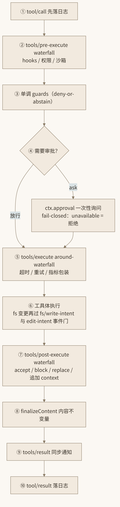

# 9. 工具系统与执行管线

工具是模型与“执行世界”之间的唯一通道，也是 dsh 扩展面最大、防护最严密的子系统。本章分四步：解剖 `ToolDefinition` 的结构，用 `defineTool` DSL 的真实源码（`tool-fs` 的 `edit` 工具）做一次逐段精读，走一遍工具执行管线的全流程，最后盘点内置工具清单与支撑它们的底层工具链。

## 9.1 ToolDefinition 解剖

工具 = `ToolDefinition`（权威定义见 `packages/core/tools/src/index.ts` 与 `docs/subsystems/tools.md`）。一个完整的工具定义由六部分组成：

1.  **模型可见的 `ToolSchema`**：`name` / `description` / `parameters`。关键约束是——注册表的 `schemas()` 方法用**显式白名单**构造模型可见 schema，宿主侧字段（沙箱策略、内部标记等）**绝不泄漏**进模型请求。这是“白名单而非黑名单”的安全姿态。
2.  **强制的 canonical 输出声明 `output: { schema, render, presentationMeta? }`**：dsh 不允许工具“随便返回点什么”。`output.schema` 是输出值的运行时契约；`render(args, value)` 把结构化输出渲染成模型可读的 content block；`presentationMeta` 则给 UI 递送结构化呈现素材（如 diff 数据）。模型、日志、UI 三者消费的是同一个值的不同投影。
3.  **`execute(args, exec)`**：工具体，真正的副作用发生地。
4.  **可选 `finalizeContent`**：最后一道同步的内容不变量——无论结果经历了多少层 waterfall 改写，落日志前都要过它，保证“模型可见 ⟺ logged”的内容层面收口。
5.  **`timeoutMs` 与 `isConcurrencySafe`**：前者供 `tools/execute` around-waterfall 包超时；后者是并行分类器，第 8 章调度器据此把调用分为 parallel / exclusive。
6.  **UI 呈现器 `presentCall / presentResult`**：客户端约 40 个 React UI 插件用它们渲染工具调用的卡片（如 edit 的 diff 视图），工具作者对自己的调用如何“被看见”有一等控制权。

## 9.2 defineTool DSL 精读：edit 工具

第一方工具用 `defineTool` DSL 编写。下面是真实代码（`packages/fs/tool-fs/src/edit.ts:83`，节选），这是“模型可见 schema + 沙箱策略 + 事件门”三位一体的教科书样本：

``` ts
ctx.tools.register(defineTool({
  name: 'edit',
  description: 'Edit an existing UTF-8 text file by replacing literal text.',
  parameters: {
    file_path:  { type: 'string', required: true, description: 'Path to edit...' },
    old_string: { type: 'string', required: true, description: 'Literal text to replace...' },
    new_string: { type: 'string', required: true, description: 'Literal replacement text...' },
    replace_all:{ type: 'boolean', description: 'Replace all matches...' },
    ...sandbox.escalationModes.length > 0 ? sandbox.schemaFields() : {},
  },
  output: {
    schema: { type: 'object', additionalProperties: false, properties: {
      path: { type: 'string', required: true },
      before: { type: 'string', required: true },
      after: { type: 'string', required: true } } },
    render: (args, value) => [{ type: 'text', text: formatEditOutput(...) }],
    presentationMeta: (args, value) => ({ diffs: computeHunkDiffs(...) }),
  },
  async execute(args: EditToolArgs, exec) {
    const sandboxPolicy = await sandbox.resolvePolicy('edit', args, exec)
    const target = await ctx.fs.resolve(input.filePath, ...)
    const intent = await ctx.waterfall('fs/edit-intent', target, exec, () => undefined)
    outcome = await ctx.fs.editText(target, {...}, intent, exec.signal, sandboxPolicy)
    ctx.emit('fs/observed', target, { kind: 'present', version: outcome.version }, exec)
    return { path: target.displayPath, before: outcome.before, after: outcome.after }
  },
}))
```

逐段讲解：

- **参数 schema 的条件展开**：`...sandbox.escalationModes.length > 0 ? sandbox.schemaFields() : {}`——只有当沙箱支持一次性提权时，才把提权参数拼进模型可见 schema。模型看到的工具形态随宿主能力动态裁剪，但裁剪发生在白名单构造时，依然可控。
- **`output.schema` 收紧**：`additionalProperties: false`，输出恰好是 `{path, before, after}` 三字段——编辑前后的完整文本，供投影、审计与 UI diff 共用。
- **`render` vs `presentationMeta`**：`render` 产出给模型的文本；`presentationMeta` 用 `computeHunkDiffs` 算出 hunk diff 交给 UI 卡片。一份值，三种投影。
- **`execute` 的四步守护**：① `sandbox.resolvePolicy('edit', args, exec)` 解析本次调用的完整沙箱执行策略（mode + canonicalized workspaceRoot + sessionId）；② `ctx.fs.resolve` 经文件系统 seam 解析目标——注意工具不直接碰 `node:fs`，fs 是 provider 可换的 capability（指向 E2B 即整体上云）；③ `ctx.waterfall('fs/edit-intent', ...)` 过**事件门**：read-before-write 策略（由 `dsh-fs-observation-policy` 实现）在此拦截“没读过就想改”的调用；④ `ctx.fs.editText` 执行字面量替换。完成后 `ctx.emit('fs/observed', ...)` 广播新的文件版本，让观测策略更新账本。
- **返回值即 `output.schema` 的实例**，注册表将负责后续渲染与落日志。

## 9.3 工具执行管线全流程

`docs/tool-execution-pipeline.md` 定义了每一次工具调用的完整旅程，如图 9-1：



*图 9-1 工具执行管线*

1.  **`tool/call`**：执行前先把调用落日志（事实先于副作用）。
2.  **`tools/pre-execute` waterfall**：hooks、权限、沙箱检查在此拦截；任一监听器可改写参数、直接 deny，或返回 `ask` 触发审批。
3.  **单调 guards**：只能“deny 或弃权”，永不放行升级——guard 之间无否决竞争，语义单调。
4.  **`ctx.approval` 一次性询问**：pre-execute 返回 `ask` 时弹出。`ApprovalOutcome` 封闭且 fail-closed：`'allowed-once' | 'rejected' | 'cancelled' | 'unavailable'`；应答者缺失或抛错一律归为 `unavailable` → 拒绝。每次询问记 `approval/asked` + `approval/decided` 审计对（log-only，不进模型 transcript）。会话级策略 `'never'` 在服务内部强制执行，连 prepend 的应答者也绕不过。
5.  **`tools/execute` around-waterfall**：超时、重试、指标包装的真正执行体。
6.  **工具体 `execute`**：其中 fs 变更再过 `fs/write-intent` / `fs/edit-intent` 事件门（见 9.2）。
7.  **`tools/post-execute` waterfall**：结果可以 accept / block / replace，还能追加 context（经 FIFO 注入下一条 step 的收件箱）。注意：**denied 的调用也走 post**——否决本身也是一个可被观察、改写的“结果”。
8.  **注册表外层归一化**：快照/渲染失败转为 `isError` 结果而非异常逃逸。
9.  **`finalizeContent`**：最后一道同步内容不变量。
10. **`tools/result` 同步通知 → `tool/result` 落日志**：每个 `tool/call` 都有配对的 `tool/result`（包括 8.5 节说的合成 abort 结果），replay 永远合法。

三层 waterfall（pre / execute / post）都可改写调用，这是插件介入工具系统的全部合法入口——再次呼应宪章“Plugins, not loop changes”。

## 9.4 作用域注册、restrict() 与 Code Mode

注册表 `register()` 支持**作用域注册**（`packages/core/tools/src/index.ts:1037`）：scoped tools 遮蔽同名全局工具，使子智能体可以拥有受限或特化的工具集；`restrict()` 则对某个 agent 作用域做 allow/deny 过滤。两者都返回 disposer——注册即 effect。

有一个保留名：`run_code` **永不可注册**，因为它是 **Code Mode** 的传输层。Code Mode 下模型不再逐个发起 tool-call，而是写一段代码（TS/Python SDK，跑在 worker-thread 的 `code-runtime` seam 上），代码中对子工具的调用作为绑定**重新进入完整受守护工具管线**——审批、沙箱、guards 一层不少，子调用记录 `tool/code-dispatch` 事件。这等价于把“ReAct 循环的一步”编译成了一段可审计的程序。

## 9.5 内置工具清单

dsh-base bundle 中的内置工具（均见第 7 章 bundle 清单与 `docs/tool-catalog.md`）：

| 工具 | 包 | 说明 |
|----|----|----|
| `bash` / `pwsh` | `tool-bash` / `tool-pwsh` | 平台互斥（`!!js process.platform === 'win32'` 切换） |
| `edit` / `read` / `read_image` / `write` | `tool-fs` | 字面量替换编辑，fs seam 之上 |
| `glob` / `grep` | `tool-fs-search` | 内置 ripgrep，无宿主依赖 |
| `str_replace_editor` | `tool-str-replace-editor` | 独立 view/create/replace/insert |
| `todo` | `tool-todo` | 任务清单 |
| `goal` | `tool-goal` | 目标管理 |
| `skill` | `tool-skill` | 技能加载 |
| `subagent` 系列 | `tool-subagent(-control/-report)` | 子智能体派生与汇报 |
| `workflow` | `tool-workflow` | 持久工作流 |
| `ralph` | `tool-ralph` | 循环执行器 |
| `web` | `tool-web` | **默认禁用**——SSRF 考量，需显式开启 |
| `jobs` | `tool-jobs` | 后台任务 |
| `exit_plan_mode` | `dsh-plan-mode` | 计划模式出口 |
| `terminal_*`（六个） | `terminal-*` | 持久 PTY 会话 |
| `run_code` | `dsh-tools`（保留） | Code Mode 传输层，不可注册 |

默认禁用的还有 `dsh-session-telemetry-otel`（OTLP 遥测，须 env 显式开启）与 `dsh-session-query-sqlite` 的自动打开（`openAt: never`）——一切有外部副作用或成本的能力默认关闭，是 dsh 的一致姿态。

## 9.6 底层工具链

工具系统脚下踩着一批精挑细选的第三方/自研组件：

| 层 | 依赖/机制 | 角色 | 证据 |
|----|----|----|----|
| 文件搜索 | `@vscode/ripgrep` 打包的 rg 二进制 | glob/grep 经 `ctx.subprocess` 前台调用，无宿主安装依赖、不过 shell 层 | `packages/fs/tool-fs-search/package.json`、`src/glob.ts`、`src/grep.ts` |
| 终端 PTY | `node-pty` | 持久 PTY 会话 seam（`ctx.terminals`），支撑六个 `terminal_*` 工具 | `packages/terminal/*` |
| 沙箱 | Linux bwrap / Landlock（自研 `native/landlock-run`，Rust 原生启动器，三平台 npm 包 optional dep 分发）、macOS Seatbelt、Windows ACL restricted-token | 功能探测、fail-closed；后端须上报 `SandboxEnforcement`（`'full'` 或 `'partial'`；旧 Landlock ABI、Windows ACL 为 partial，消费者必须区分） | `docs/subsystems/sandbox.md`、`native/README.md` |
| diff | `diff@^9`（jsdiff） | edit 结果 hunk 计算与 UI diff 卡片 | `packages/fs/tool-fs/package.json`、`packages/client/ui-trajectory/package.json` |
| 存储 | SQLite（FTS5 全文检索，单调 `SCHEMA_VERSION`）+ JSONL | JSONL 为默认 session 持久化；SQLite 供查询 | `packages/session-query/session-query-sqlite` 等 |
| 校验 | vendored **schemastery** | 所有插件 `Config` 的运行时校验 | 各包 `import z from '@deepseek-ai/schemastery'` |
| Code Mode | 自研 `code-runtime`（worker-thread） | `run_code` 的执行 seam | `packages/code-runtime` |
| 远程执行 | E2B SDK | fs/subprocess 的远程 provider | `packages/e2b/*` |

两个“没有”同样说明设计取向：**没有 tree-sitter/AST 工具进入模型侧**——代码理解走 LSP seam（`packages/lsp`）；**没有自研 diff 应用算法**——`edit` 是字面量替换，`str_replace_editor` 是独立工具。模型侧的接口保持简单、确定、可审计，复杂性被推到 seam 的另一边。

## 9.7 本章小结

- `ToolDefinition` = 白名单模型 schema + 强制 `output.{schema, render}` + `execute` + `finalizeContent` + `isConcurrencySafe` + UI presenter；宿主字段永不泄漏进模型请求。
- `defineTool` 的 `edit` 样本展示了沙箱策略解析、fs seam、`fs/edit-intent` 事件门、`fs/observed` 广播的四步守护写法。
- 执行管线十站：`tool/call` 落日志 → pre-execute → 单调 guards → fail-closed 审批 → execute around-waterfall → 工具体（再过 fs 事件门）→ post-execute → 归一化 → finalize → `tool/result` 落日志；denied 也走 post，abort 有合成结果，replay 永远合法。
- 作用域注册与 `restrict()` 让工具集可按 agent 裁剪；保留工具 `run_code` 承载 Code Mode，子调用重新进入完整受守护管线。
- 内置工具默认最小暴露（web 工具、遥测默认禁用），底层链（ripgrep、node-pty、jsdiff、SQLite FTS5、Landlock）各司其职且有据可查。

至此，架构篇已过半：总览给了我们坐标系，会话与循环给了我们心脏，工具系统给了我们双手；接下来两章看模型接入与上下文工程、安全双层。下一章先解决“模型这一端”的问题：多 provider 如何接入，以及长会话的上下文如何被压缩进有限的窗口。

## 9.8 本章参考资料

- [docs/subsystems/tools.md](https://github.com/zenHeart/deepseek-harness/blob/master/docs/subsystems/tools.md) — 支撑本章 ToolDefinition 结构、强制 canonical 输出声明与模型可见 schema 白名单机制。
- [packages/core/tools/src/index.ts](https://github.com/zenHeart/deepseek-harness/blob/master/packages/core/tools/src/index.ts) — 支撑本章工具注册表、作用域注册与 `restrict()` 的源码依据。
- [docs/tool-execution-pipeline.md](https://github.com/zenHeart/deepseek-harness/blob/master/docs/tool-execution-pipeline.md) — 支撑本章 `tool/call` → 三层 waterfall → `finalizeContent` → `tool/result` 的完整执行管线顺序。
- [packages/fs/tool-fs/src/edit.ts](https://github.com/zenHeart/deepseek-harness/blob/master/packages/fs/tool-fs/src/edit.ts) — 支撑本章 `defineTool` DSL 与 edit 工具沙箱策略解析的真实代码示例。
- [packages/core/tools/src/code-mode.ts](https://github.com/zenHeart/deepseek-harness/blob/master/packages/core/tools/src/code-mode.ts) — 支撑本章 Code Mode（`run_code` 保留工具）子调用重入受守护管线的实现。
- [Anthropic Engineering：Writing Effective Tools for Agents](https://www.anthropic.com/engineering) — 支撑本章”Agent 是确定性工具的非确定性用户”、工具描述即 prompt engineering 的工具设计原则。
