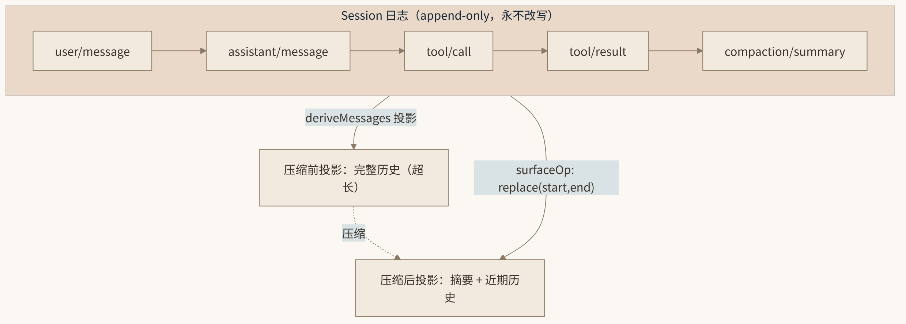

# 10. 模型接入层与上下文工程

在 DeepSeek Harness（dsh）的世界里，"接哪个模型"不是一个编译期决策，而是一行运行时配置。第 7 章我们看到，`agent-loop` 主循环本身也只是一个注册在 `ctx.agentLoop` 上的插件；本章把镜头拉近到它的上下游：模型如何被接入（`ctx.llm` 适配器 seam），以及上下文如何在漫长的会话中被工程化地维护（压缩、外溢、提醒）。这两件事决定了 harness 的上限——前者决定"能用什么脑子"，后者决定"脑子能连续工作多久而不失忆"。

## 10.1 ctx.llm：一个只认识"路由"不认识"厂商"的 seam

`dsh-llm` 包（`packages/llm/llm`）提供的是整个 harness 的模型词汇表与适配器 seam。它对外的全部承诺可以浓缩成两个方法：

- `registerAdapter(providers, adapter)`：把一组 provider 路由（如 `deepseek-official`）绑定到一个适配器实现上，返回一个 disposer——遵循 Cordis "注册即 effect" 的铁律，插件卸载时路由自动消失。
- `prepareCall(config, signal)`：把一次请求的配置（provider、model、temperature 等）绑定到具体适配器，并解析 exact-model 级别的默认值——`contextWindow`、`adapterDefaults` 等。返回的 `preparedCall` 对象带着自己的 `stream(request)`。

为什么需要 `prepareCall` 而不是直接 `ctx.llm.stream(request)`？看主循环里的实际调用（`packages/core/agent-loop/src/agent.ts`）就能明白：

```ts
// buildRequest 把 agent/request waterfall 提出的 config 交给 ctx.llm.prepareCall()
// 绑定适配器；随后单步内优先使用绑定结果：
const stream = preparedCall?.stream(request) ?? this.loopCtx.llm.stream(request)
```

`prepareCall` 是"把泛化请求落到具体线路"的那一下：它完成路由解析、默认值合并、连接快照，产出一个这次调用专用的、不可再被设置热更新干扰的执行体。这就是 dsh 模型层最重要的设计姿态——**每次请求都是一次完整的解析**，而不是插件加载时冻结一份配置用到底。

`dsh-agent-default-model` 插件则给出了兜底的默认路由：`deepseek-official / deepseek-v4-flash`。换掉它，整个 harness 的"默认脑子"就换了。

请求路径上还有两个与模型层紧密相关的拦截点值得记住。其一是 `agent/request` waterfall：`buildRequest` 在每次发请求前先跑这条链，任何插件都可以在此改写请求配置（换模型、调温度、增删工具集），改写结果连同 `request/header`、`request/context` 一起记入 session 日志——这正是"每次模型请求都可从日志重建"承诺的落地方式。其二是 `llm/stream` 事件：流式 chunk 以 `assistant/chunk` 事件逐条落日志，随后由 `BlockAssembler` 组装成完整消息再以 `assistant/message`（携带 `sourceEventSeqs` 指回 chunk 序列）追加。换句话说，连"流"这种瞬态物在 dsh 里都是可重放的事实。

模型层还有两个配套插件。`dsh-llm-retry` 提供请求级重试：当一次请求失败，主循环走 `agent/request-error` waterfall，监听器可以返回 retry action 让同一个 step 重试；它与 provider 自带的传输级 retryPolicy 形成内外两层——内层处理网络抖动，外层处理语义级失败（比如后面会讲的 context-overflow 恢复）。`dsh-token-meter` 则负责计量：它消费适配器在 `prepareCall` 时解析出的 `contextWindow`（DeepSeek 路由为 1,000,000），持续估算当前投影的 token 占用，是 10.4 节压力压缩策略的"仪表盘"。计量、重试、适配器三者都通过 seam 协作而非互相 import——这正是 capability seam 三角色（Service Definition / Provider / Consumer）在模型层的完整展开。

## 10.2 llm-deepseek 适配器剖析：四个"按请求"的工程决定

官方适配器 `@deepseek-ai/dsh-llm-deepseek`（`packages/llm/llm-deepseek/src/index.ts`）是理解 dsh 模型层哲学的最佳样本。它做了四个与直觉相反的决定：

**第一，连接事实按请求解析，而非加载时冻结。** base URL、模型目录、API key 这些"连接事实"都存在 `llm-deepseek` 设置段里（`$DSH_HOME/settings.yaml`，Web UI 的 Models 页可写），由 settings 文件热加载驱动。你改了 base URL，**下一个请求**就用新值；而进行中的流式响应保留它开始时的快照——`prepareCall` 绑定的正是这份快照。这就是为什么 Web UI 里改模型配置"无需重启"：根本就没有一份需要重启才能重建的常驻连接。

**第二，凭据按请求解析，缺 key 不是加载错误。** API key 经 `ctx.credentials` 在每次请求时解析（默认环境变量 `DEEPSEEK_API_KEY`）。没配 key 时，插件照常加载、路由照常注册，只有真正发请求那一刻才报 `MISSING_CREDENTIAL`。这个设计把"配置缺失"从启动期故障降级为运行期、可恢复的、指向明确补救动作的错误——对 headless/CI 场景尤其友好。

**第三，默认目录内嵌但可热覆盖。** 适配器默认路由 `deepseek-official`，默认模型目录 `deepseek-v4-flash` 与 `deepseek-v4-pro`，默认值相当激进：`contextWindow` 1,000,000（1M tokens）、`maxTokens` 256,000、`reasoningEffort: high`。1M 的上下文窗口声明直接喂给下游的 token-meter 与压缩策略——上下文工程的所有阈值都从这个数字推导。

**第四，传输与翻译分层。** SSE 流解析独立在 `sse.ts`，消息格式翻译独立在 `translate.ts`。适配器还支持 `streamIdleTimeoutMs`（默认 5 分钟，流空闲超时）和 provider 自有的 `retryPolicy`——注意这与通用的 `dsh-llm-retry` 插件是两层：provider 层重试处理传输级抖动，`llm-retry` 处理请求级失败。

```yaml
# $DSH_HOME/settings.yaml 中的 llm-deepseek 段（Web UI Models 页写入的也是这里）
llm-deepseek:
  baseURL: https://api.deepseek.com   # 可热覆盖：下一请求即生效
  # API key 不写在这里！密钥经 ctx.credentials 解析，
  # 存于 $DSH_HOME/.credentials.yaml 或 DEEPSEEK_API_KEY 环境变量
```

## 10.3 llm-pi-ai：多 provider 与自定义网关

如果说 `llm-deepseek` 是"一个厂商做到透"，`llm-pi-ai` 就是"多 provider 一网打尽"。它在 base bundle 中默认休眠，由 settings 文件热加载 provider profile 唤醒。Web UI 的 "Add provider" 可以选择 Anthropic、OpenAI 等目录内置 provider；但注意原生鉴权的例外——Bedrock 要 AWS 凭据加 region，Vertex 要 ADC project，Azure 要 api-version，Codex 走 OAuth——这些不是填一个 key 能搞定的。

对于公司网关或自托管模型，走自定义 provider。一份完整的 `settings.yaml` 配置长这样：

```yaml
llm-pi-ai:
  defaultInput: [text, image]        # 路由级模态兜底；不设则默认 [text]
  providers:
    my-gateway:                      # Provider ID：小写，创建后永久不可改
      apiKeyEnv: GATEWAY_API_KEY     # 凭据仍走环境变量/凭据链，不内联
      api: openai-completions        # 线协议：openai-completions 等
      baseURL: https://gateway.example/v1
      models:
        - id: legacy-chat            # 未声明 input → 纯文本模型
        - id: vision-preview
          input: [text, image]       # 显式声明视觉模态，图片才能发出去
```

这里埋着本章最重要的一个坑：**手工录入的模型默认被视为纯文本**。`input: [text, image]` 不是装饰——它是发送图片时的准入检查依据。声明缺失时，带图的请求会在发送前被拒，而报错往往不直接指向模态。排错图片发送失败时按这个顺序查：`MISSING_CREDENTIAL`（key 没到）→ `UNKNOWN_MODEL`（模型 id 不在目录）→ 401（key 错了）→ 模态未声明（模型根本不是视觉模型）。另外，DeepSeek 官方的 chat-completions 路由是纯文本且不可配置的，别指望给官方路由塞图片。

catalog provider 还可以用 `modelOverrides` 按模型 id 收窄能力声明，"Fetch available models" 则通过 `GET /models` 从网关拉取模型清单，避免手抄 id 出错。

工程实践中还有一个组织建议：把 `llm-pi-ai` 的多 provider 当作"路由表"来管理，而不是"收藏夹"。每个 provider 的 Provider ID 会出现在会话日志的请求头里，事后审计"这个回答是谁家的模型给的"全靠它；ID 起得随意（`test1`、`aaa`）会让日志失去可读性。又因为 ID 创建后永久不可改，命名规范（如 `corp-gateway-prod` / `corp-gateway-staging`）应在第一次录入前就定好。密钥则永远走 `apiKeyEnv` 指向环境变量或凭据链——settings.yaml 是会进备份、可能被贴进 issue 的文件，它里面只允许出现"去哪找 key"，不允许出现 key 本身。

模型层的失败也遵循与凭据相同的"运行期化"原则：路由不存在报 `UNKNOWN_MODEL`、网关拒绝返回透传的 401/403，这些错误都会经 `agent/request-error` waterfall 暴露给重试与恢复策略，而不是以异常栈的形式炸掉整个 turn。对插件作者而言，这意味着你写的恢复逻辑可以精确地区分"换个模型重试"与"通知用户改配置"两种动作。

**传输与翻译的代码分层**值得再展开一句，因为它是给自定义适配器作者看的模板。`sse.ts` 只负责把 Server-Sent Events 的字节流切成结构化事件，不理解任何 DeepSeek 语义；`translate.ts` 只做双向的消息格式翻译——把 dsh 的统一消息词汇（`dsh-llm` 包定义的 block 类型）翻成 DeepSeek chat-completions 的请求体，再把响应与流式 delta 翻回来。适配器主文件 `index.ts` 则只管注册路由、解析设置、绑定凭据。三层各司其职的结果是：当上游 API 加了一个字段，你只需要动 `translate.ts`；当网络层要换传输（比如 WebSocket），你只需要动 `sse.ts`。写一个 `llm-pi-ai` 之外的自有适配器时，照抄这个分层是最稳的起点——官方文档的 adding-an-llm-adapter 烹饪书也是按这个结构讲的。

## 10.4 上下文工程四件套

模型接入解决的是"出去"的问题，上下文工程解决的是"留下来"的问题。dsh 提供了四个相互配合的插件：`dsh-agent-instructions`、`compaction-basic`、`dsh-spill-*`、`dsh-repeat-tool-reminder`。

### 10.4.1 dsh-agent-instructions：项目宪章注入

启动时（确切说是进入工作区时），`dsh-agent-instructions` 加载调用目录的 `AGENTS.md` / `CLAUDE.md`，渲染进系统提示词，预算上限 **65,536 字节（64KB）**。这个硬上限本身就是工程判断：项目宪章值得占上下文，但不值得占满上下文。有经验的团队会把 AGENTS.md 写成"宪法"而非"百科全书"——约定、禁区、构建命令，而不是把整个 README 塞进去。

### 10.4.2 compaction-basic：把压缩做成投影替换

压缩在 dsh 里不是 agent 循环的脊柱，而是一个**可选能力 seam**：Service Definition（`dsh-compaction`，即 `ctx.compaction` 接口）+ Provider（`compaction-basic`：token-meter 压力策略 + LLM 摘要后端）+ 人类消费者（`/compact` 命令）。这套设计让"要不要压缩、怎么压缩"成为可替换的策略。

`compaction-basic` 的机制值得逐条拆解，因为它体现了 dsh "日志是唯一事实源"的架构哲学：

1. **三个 log-only 事件构成崩溃可检测的锁。** `compaction/start | summary | end` 只写日志、不进模型 transcript。如果进程在压缩中途崩溃，重放时会看到一个没有配对 `end` 的孤儿 `start`——锁可以被识别并恢复，而不是让会话处于说不清的半压缩状态。

2. **摘要复用 `user/message` + `surfaceOp: replace`。** 这是全章最精妙的一笔。模型看到的历史不是日志本身，而是日志经 `deriveMessages()` 的**投影**。压缩做的就是：把摘要写成一条 `user/message` 事件，携带 `surfaceOp: { op: 'replace', start, end }`，在投影层把 `[start, end)` 区间整段替换成摘要。日志一个字没删（append-only 不可违背），模型看到的却已经是压缩后的历史。这是全书反复强调的"模型历史是日志的投影"最直接的应用。



*图 10-1 上下文压缩的投影替换*

3. **压力驱动的两个触发点。** 自动压力压缩挂在 serial 的 `agent/pre-step`（请求派生之前），由 token-meter 计量驱动；而当请求已经撞上 canonical 的 context-overflow 错误时，走 `agent/request-error` 恢复路径——但只有当 surface 替换代数确实前进过（即压缩真的改写了投影）才返回 retry，否则重试同样的请求只会撞同样的墙。

4. **toolResultPruner 先行裁剪。** 在动用 LLM 写摘要之前，先跑一个无模型、replay-safe 的头/中/尾裁剪器，把可安全丢弃的超长工具结果先裁掉，然后**重新计量**。很多时候裁剪完压力就解除了，根本轮不到摘要上场——省一次模型调用，也保住了原文的精确性。

5. **tool-call/result 配对边界。** 替换区间不能把一个 tool-call 和它的 result 劈开（`toolPairingBalancedBefore/After` 保证），否则模型会看到语义非法的历史。这条边界规则还允许一个超限 turn 的早期已闭 step 先行压缩——不必等整个 turn 结束。

把五条机制连起来看一次完整生命周期：某次 `agent/pre-step` 上 token-meter 报告投影占用越过压力阈值 → `compaction-basic` 先跑 `toolResultPruner`，把若干超长工具结果按头/中/尾策略裁掉并重新计量 → 压力仍在，则选定一个不劈开 tool-call/result 配对的区间 `[start, end)` → 写 `compaction/start`（锁）→ 调 LLM 生成摘要 → 以 `surfaceOp: { op: 'replace', start, end }` 写摘要 `user/message` → 写 `compaction/end`（解锁）。此后 `deriveMessages()` 的投影里，那段历史已被摘要替换；而磁盘上的 JSONL 日志一字未少，fork 回压缩前的任意点依然可行。若进程在第三步与第六步之间崩溃，重放时孤儿的 `compaction/start` 会被识别，压缩按未完成处理——不会出现"日志被改了一半"的中间态。

人类消费者 `/compact` 命令走的是同一个 seam：手动触发与自动压力触发复用同一套 Provider 逻辑，区别只在入口。这也意味着你可以写一个自己的压缩 Provider（比如"按 step 边界直接丢弃而非摘要"的激进策略）注册到 `ctx.compaction`，`/compact` 与自动压缩会同时换行为——seam 替换的杠杆效应在这里体现得淋漓尽致。

### 10.4.3 spill 外溢存储与 repeat-tool-reminder

剩下两件套较轻量但同样实用。`dsh-spill-local` / `dsh-spill-policy` 处理超大工具结果的外溢：当一个结果大到不值得进上下文时（比如一次 `grep` 命中了几百行、一张大图的 base64），把它存到外溢存储，模型拿到的是引用而非全文——需要时再用工具去读。这与第 8 章 attachment 的处理哲学一致：图片字节存内容寻址引用、不入日志；spill 则是把同样的思路推广到超大文本。两者共同守护一条不变量——**session 日志（以及它的投影）只装"决策需要的信息"，大宗字节一律外置**。`dsh-repeat-tool-reminder` 则盯着模型行为本身：当模型陷入重复调用同一个工具的循环时（agent 系统里最经典的退化模式之一）注入提醒，避免 token 的无谓燃烧。它不改变任何状态、不拦截任何调用，只是一个"行为后视镜"——但作为默认开启的插件，它体现了 harness 作者的经验：上下文工程不只是空间问题（装不装得下），也是行为问题（模型在拿空间干什么）。

四件套合起来是一条完整的上下文供应链：**注入有预算（64KB）、压力有计量（token-meter）、超长有裁剪与外溢（pruner/spill）、溢出最后才压缩（projection replace）、行为异常有提醒**。每一环都是可替换插件，这正是"everything is a plugin"在看不见的地方的体现。

## 10.5 本章小结

- `ctx.llm` 是适配器 seam：`registerAdapter` 注册 provider 路由，`prepareCall` 把请求配置绑定到具体适配器并解析 exact-model 默认值（contextWindow 等），产出的 `preparedCall` 持有本次调用的连接快照。
- `llm-deepseek` 的四个"按请求"决定：连接事实按请求解析（settings.yaml 热覆盖，下一请求生效，进行中流保留快照）、凭据按请求解析（缺 key 报 `MISSING_CREDENTIAL` 而非加载失败）、默认目录 `deepseek-v4-flash`/`deepseek-v4-pro`（1M contextWindow / 256K maxTokens / reasoningEffort high）、SSE 解析（`sse.ts`）与消息翻译（`translate.ts`）分层。
- `llm-pi-ai` 承载多 provider 与自定义网关；自定义 provider 的 Provider ID 永久不可改，**手工录入的模型默认纯文本**，视觉模型必须显式 `input: [text, image]`。
- 上下文工程四件套：`dsh-agent-instructions`（AGENTS.md/CLAUDE.md，64KB 预算）；`compaction-basic`（三个 log-only 事件锁、`surfaceOp: replace` 投影替换、toolResultPruner 先行裁剪、tool-call/result 配对边界）；spill 外溢存储；repeat-tool-reminder。压缩不是删除日志，而是替换投影——模型历史永远是日志的函数。

模型接入与上下文工程让 harness “能跑、跑得久”；但要让它“跑得让人放心”，还差最后一层。下一章看 dsh 的安全双层：沙箱与审批。

## 10.6 本章参考资料

- [packages/llm/llm/src/index.ts](https://github.com/zenHeart/deepseek-harness/blob/master/packages/llm/llm/src/index.ts) — 支撑本章 `ctx.llm` adapter seam 与 `prepareCall` 绑定适配器的机制。
- [packages/llm/llm-deepseek/src/index.ts](https://github.com/zenHeart/deepseek-harness/blob/master/packages/llm/llm-deepseek/src/index.ts) — 支撑本章 DeepSeek 适配器按请求解析连接事实、热覆盖设置与默认模型目录的细节。
- [docs/subsystems/compaction.md](https://github.com/zenHeart/deepseek-harness/blob/master/docs/subsystems/compaction.md) — 支撑本章压缩作为可选能力 seam、三个 log-only 事件锁与 surface 投影替换的设计。
- [packages/compaction/compaction-basic](https://github.com/zenHeart/deepseek-harness/tree/master/packages/compaction/compaction-basic) — 支撑本章 token-meter 驱动压力策略、toolResultPruner 先行裁剪与 tool-call/result 配对边界的实现。
- [AGENTS.md](https://raw.githubusercontent.com/deepseek-ai/deepseek-harness/master/AGENTS.md) — 支撑本章"Model-visible ⟺ logged"作为新增模型可见输入必须扩展 SessionEventMap 的约束。
