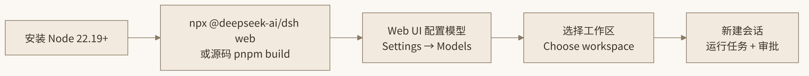

# 12. 安装与使用实战

前五章看完了 dsh 的内部机理，本章回到地面：从零把它跑起来、配好、用顺，并把那些文档里散落各处的坑一次性填平。提醒一句贯穿全章的前提：dsh 处于 Developer Preview（v0.1），官方明示**会有兼容性破坏变更**——本文所有命令与字段以 `0.1.0-rc.7` 为准，升级后第一件事是看 changelog。

## 12.1 环境准备

硬性要求只有一条：**Node.js 22.19+ 或 24+**（仓库引擎声明 `^22.19.0 || >=24.0.0`）。从源码构建还需要 pnpm 11.7（仓库用 `packageManager` 字段钉死版本，先 `corepack enable` 让 Corepack 自动对齐）和 Git ≥ 2.26。

```sh
node -v          # 确认 >= 22.19.0；nvm 用户：nvm install 24
corepack enable  # 启用 Corepack，让 pnpm 版本随仓库锁定（源码运行才需要）
```

## 12.2 npm 零安装体验

最快的体验路径不需要 clone 任何东西：

```sh
npx @deepseek-ai/dsh web   # 拉取官方 npm 包并以 web profile 启动
# 启动后打开 http://127.0.0.1:3080
```

`dsh web` 不是一个独立命令，而是 `dsh --profile web` 的**硬编码别名**——这个细节在 12.5 节理解 profile 体系后会变得重要。

第一次启动会做两件事：在 `$DSH_HOME` 下初始化 home 目录结构（settings、credentials、profiles），并从内置模板物化 `web` profile。之后每次启动都是同一套组合逻辑。由于 npx 缓存的存在，想换版本时显式指定：

```sh
npx @deepseek-ai/dsh@latest web   # 强制拉最新版
npx @deepseek-ai/dsh@0.1.0-rc.7 web  # 钉到某个 rc 复现行为
```

另外提醒：官方分发渠道**只有** npm 的 `@deepseek-ai/dsh` 与 GitHub 仓库。PyPI 上存在同名的 `deepseek-harness` / `deepseek-harness-cli`（第三方协议探针工具），与官方项目毫无关系——12.8 节的坑清单还会再强调一次。

## 12.3 Web UI 四步上手

浏览器打开 `http://127.0.0.1:3080` 后，按四步走：

1. **配模型**：Settings → Models，在 DeepSeek 卡片填入 API key 保存。路由**立即生效，无需重启**——这正是第 10 章"连接事实按请求解析"的用户侧体现。密钥是**只写**的：保存后页面只显示脱敏描述符，实际值落在 `$DSH_HOME/.credentials.yaml`。
2. **选工作区**：点 "Choose workspace"，添加并选中你的项目目录。**未选工作区前会话输入框不可用**——因为 `SandboxExecutionPolicy` 的 workspaceRoot 无从谈起，沙箱无法建立边界。
3. **跑任务**：新建会话，发一条指令，如 "Summarize this repository and identify its main packages." Agent 会读写工作区文件、执行命令、委派子任务、维护计划。
4. **审批交互**：触及权限策略的操作（比如执行 bash 命令）会在 UI 里弹出确认框。回忆第 11 章：每次批准都是 `allowed-once`，没有"永远允许"——这是特性，不是麻烦。

走完一遍四步后，建议再做两个探索动作建立手感：在会话里输入 `/` 看看命令系统（`dsh-commands` 提供，`/compact` 手动压缩就在这里）；会话列表里找到刚才的会话点进去，对比"你看到的对话"与"日志里的 turn/step 事件"——理解第 8、10 章反复讲的投影模型，最快的方法就是亲眼看一次压缩前后模型历史的变化。另外注意 Web UI 的设置分两层：General 页的部分选项（如权限）**只影响之后新建的会话**，而 Models 页的配置改动是**立即对存量会话生效**的——差异的根源正是第 11 章讲的"策略随调用携带、按 sessionId 划分"与第 10 章讲的"连接事实按请求解析"。



*图 12-1 dsh 上手四步流程*

## 12.4 源码运行完整流程

要读源码、改插件或跑 demo，走完整构建流程：

```sh
git clone https://github.com/deepseek-ai/deepseek-harness.git
cd deepseek-harness
pnpm install        # Corepack 已启用时会自动使用仓库锁定的 pnpm@11.7.0
pnpm run build      # 生产运行必须先构建：含前端 bundle 在内的全部产物
pnpm dsh web        # 以 tsx 直接运行 TypeScript 入口，并透传所有参数
```

这里有一个**必须记住的坑**：`pnpm dsh` 用 `node --import tsx/esm` 直接跑 TypeScript 源码，**不检查构建产物的新旧**。你改了前端 React 代码、直接 `pnpm dsh web`，看到的仍然是上一次的旧 bundle——没有任何警告。症状是"改了不生效"，解法是重新 `pnpm run build`。

如果开发环境在 HTTP 代理后面：

```sh
export NODE_USE_ENV_PROXY=1   # 让 Node 的 fetch 走 HTTP_PROXY/HTTPS_PROXY 环境变量
```

想理解 `pnpm run build` 到底做了什么，可以把构建脚本拆开手动执行（双聚合 TypeScript 工程，Host/Client 分离以避免 Cordis `Context` 声明合并冲突）：

```sh
tsc -b tsconfig.host.json                 # 类型检查 + 构建 host 面（CLI/服务端）
tsdown --env.DSH_BUILD_FACE host          # tsdown 打包 host 面产物
tsc -b tsconfig.client.json               # 构建 client 面（浏览器侧插件）
tsdown --env.DSH_BUILD_FACE client        # 打包 client 面
pnpm run build:web                        # 前端 React bundle（Vite）
```

日常开发的高频命令还有：`pnpm run typecheck`（克隆后跑通即说明环境就绪）、`pnpm run check:all`（oxlint/knip/jscpd 等卫生检查全家桶）、`pnpm run test:e2e`（真机 API e2e，无 key 自动跳过）。`pnpm install` 会顺带安装 Lefthook 的 git hooks，因此不要在团队里教人用 `--no-verify` 绕过提交检查。

顺带一个可以立刻跑的演示（需要 `DEEPSEEK_API_KEY`）：

```sh
pnpm dsh --profile headless "summarize this workspace"  # 无头模式总结当前仓库
```

## 12.5 CLI profile 体系全解

`dsh` 本质上是一个 **profile 启动器**。一个 profile 是 `$DSH_HOME/profiles/<name>/` 下的一组有序插件 bundle 补丁层（详见第 7 章的分层机制）；启动 `dsh` 就是选定一个 profile 并把它组合成插件树。

### 12.5.1 四个核心命令

```sh
dsh --profile <name>                      # 启动指定 profile
dsh --profile headless "任务文本"          # 一次性无头模式（见 12.7）
dsh web                                   # --profile web 的别名
dsh plugin --profile <name> <pnpm 参数>    # 管理 profile 的插件
```

`dsh plugin` 值得展开：它把参数**直接转发给 profile 目录下的 pnpm**，所以 `add` / `remove` / `why` / `update` 都能用：

```sh
dsh plugin --profile tui add github:deepseek-harness/turtle-ui  # 装一个社区 TUI
dsh --profile tui --resume <session-id>                          # 启动并恢复会话
dsh plugin --profile tui why @deepseek-ai/dsh-tools             # 排查依赖来源
```

第三方插件包只要在 `package.json` 声明 `"dsh": { "bundle": { "patch": "./cordis.patch.yml" } }`，就会作为 bundle 加入层叠。spec 支持 npm 包、`github:owner/repo`、本地路径 `./`、`file:`/`link:`。

**profile 的初始化规则**：`web` 和 `headless` 首次使用会从自带模板自动初始化；其他任何名字（如 `tui`）必须先用 `dsh plugin --profile <name> add ...` 创建，直接启动会报 profile 不存在。

### 12.5.2 flag 解析规则

启动器只解析**自己的** flag，从第一个不认识的 token 起全部交给 app。所以：

```sh
dsh --profile web --port 8080
#   ^^^^^^^^^^^^ 启动器消费           ^^^^^^^^^^ 属于 web app，透传
```

web app 支持的 flag：`--host`、`--port`、可重复的 `--trusted-host`。**当前不支持 `--host 0.0.0.0`**——想对外暴露，正确姿势是保持监听回环地址，用 `--trusted-host` 声明受信主机名，再在前面挂反向代理。这是刻意收窄默认面的安全决定（第 11 章）。

### 12.5.3 --dump-config：插件树调试利器

不启动进程就能看到组合后的完整插件树：

```sh
dsh --profile web --dump-config   # 打印实际生效的插件树
dsh --dump-default-config          # 打印默认模板
```

输出约 70 行插件配置，**每行注释标明来源文件**（base bundle？profile 层？全局 patch？）。"这行配置到底从哪来的"这个调试中最常问的问题，被这一条命令终结。配合第 7 章的 patch 语义记住一句：**树里任何一行都可被用户 patch 整行替换**。

### 12.5.4 关机语义

SIGINT/SIGTERM 触发最多 5 秒的优雅释放（插件 disposer 链回滚），第二次信号强制退出。脚本里别 `kill -9` 打头——那会让 session 日志留下未闭合的 turn。

### 12.5.5 官方没有 TUI 这件事

很多从 Claude Code / Codex 转来的用户第一反应是找终端界面。dsh 官方界面只有 Web UI 和 headless，**没有自带 TUI**——终端界面由社区插件提供（如 turtle-ui；类似的还有 `dsh-tianshu-tui`）。这本身就是 profile 体系的最好广告：交互层不过是可以整体替换的一层 bundle。在 GitHub 上搜 topic `dsh-plugin` 可以发现数千个社区插件（截至 2026 年 8 月 18 日，该 topic 下已有 7000+ 公开仓库），包括 Web UI 皮肤、视觉/OCR 工具、VS Code 集成等；生态里甚至出现带"每日兼容性追踪"的 Awesome 目录——侧面印证 Developer Preview 阶段 breaking change 的频繁程度，装第三方插件前务必核对它声明兼容的 dsh 版本。

## 12.6 配置体系：settings、credentials 与 profiles

### 12.6.1 文件地图

```text
$DSH_HOME/
├── settings.yaml            # 主设置文件（热重载：改完下一请求生效）
├── .credentials.yaml        # 密钥存储（Web UI 写入；切勿提交）
├── .env                     # 环境变量兜底
├── cordis.patch.yml         # 全局 patch 层（优先级高于单 profile 层）
└── profiles/<name>/
    ├── package.json         # profile 的插件依赖
    └── cordis.patch.yml     # profile 自己的补丁层
```

### 12.6.2 凭据解析顺序

`dsh-credentials-local` 按以下顺序解析凭据，**先到先得**：

1. 继承的环境变量（如 `DEEPSEEK_API_KEY`）
2. `$DSH_HOME/.credentials.yaml`（Web UI 写入处）
3. 调用目录的 `.env`
4. `$DSH_HOME/.env`

源码开发时最简单的做法：

```sh
# 调用目录的 .env
DEEPSEEK_API_KEY=sk-...
DEEPSEEK_BASE_URL=https://...   # 可选，改官方路由端点
```

铁律：**密钥绝不写进 `cordis.yml` 或任何会进版本库的文件**——凭据链就是为这件事存在的。

### 12.6.3 三类 provider 配置

**DeepSeek 官方**：Web UI Models 页填 key 即可，或环境变量 `DEEPSEEK_API_KEY`。默认目录 `deepseek-v4-flash` / `deepseek-v4-pro`。

**目录内置 provider**："Add provider" 选 Anthropic、OpenAI 等，填 key。原生鉴权例外：Bedrock 要 AWS 凭据+region、Vertex 要 ADC project、Azure 要 api-version、Codex 走 OAuth。

**自定义 provider**（公司网关/自托管）："Add a custom provider"，填小写 Provider ID（**永久不可改**）、base URL、API 协议（如 `openai-completions`）、凭据和至少一个模型；"Fetch available models" 可通过 `GET /models` 拉取模型清单。等价的 `settings.yaml` 手写形式（含模态声明的坑）见第 10 章 10.3 节。

### 12.6.4 权限与遥测环境变量

```sh
export DSH_PERMISSION_MODE=workspace-write   # read-only | workspace-write | danger-full-access
export DSH_TOOLS_MODE=native                 # native | code | both：工具暴露方式
# 遥测默认全本地；三档控制：
export DSH_TELEMETRY_MODE=FULL               # OTLP/HTTP 完整遥测
export DSH_TELEMETRY_MODE=FEEDBACK_ONLY      # 仅反馈
export DSH_TELEMETRY_DISABLED=1              # 硬性关闭
```

`DSH_PERMISSION_MODE` 是进程级默认；Web UI General 设置里的权限选项只影响之后新建的会话。

### 12.6.5 minimal 极简预设

想用最纯净的形态验证 loop 行为，或给子任务瘦身，自带 `minimal` agent 预设：固定系统提示词 "You are a helpful software engineer assistant."，只挂持久 `bash` + `str_replace_editor` 两个工具。没有 todo、没有子代理、没有计划模式——是排查"某行为到底来自 loop 还是来自某插件"时的对照组。

### 12.6.6 $DSH_HOME 的定位与多 home 实践

默认情况下 `$DSH_HOME` 指向用户主目录下的固定位置，但它是可覆盖的——把不同项目群、不同信任等级的 agent 活动拆进不同 home，是最朴素也最有效的隔离手段：每个 home 有独立的 settings、credentials、profiles 与 patch 层，互不可见。配合调用目录即工作区根的约定，一个推荐的目录纪律是：进入项目目录 → 确认（或设置）home → 再启动 dsh。需要排查"我的配置到底生没生效"时，记住 12.5.3 的 `--dump-config`——它打印的是组合后的最终树，每行标注来源文件，比逐个文件肉眼 diff 可靠得多。

## 12.7 headless 与脚本化 / CI

headless profile 是一次性无头模式：新建持久会话、执行任务、把最终答案打到 stdout 并退出。不开端口、不写 stderr，退出码语义干净——`completed` 为 0，其余为 1，可直接进 shell 条件判断：

```sh
#!/usr/bin/env bash
# CI 中的只读仓库分析示例
export DSH_PERMISSION_MODE=read-only          # 只读预设：agent 无法改任何文件
export DEEPSEEK_API_KEY="$CI_DEEPSEEK_KEY"    # 从 CI secret 注入

dsh --profile headless \
  "检查本仓库是否存在硬编码密钥，列出文件与行号。" > report.txt

if [ $? -eq 0 ]; then
  cat report.txt          # completed：任务正常收尾
else
  echo "agent 未能完成任务" >&2
  exit 1
fi
```

三点注意：会话**仍然持久化**（headless 不是临时的，事后可用 `--resume <id>` 回看）；无 UI 意味着审批应答者不可用——按第 11 章的 fail-closed 语义，`ask` 策略下需要审批的操作会得到 `unavailable` 即拒绝，所以 CI 场景要么用 `read-only` 让操作无需审批，要么明确接受相关操作被拒；`minimal` 预设可与 headless 叠加进一步压缩 token 开销。

脚本化还有一个更工程化的入口值得一提：monorepo 里的 `packages/sdk`（TS/Python SDK）与 ACP（`@agentclientprotocol/sdk`，JSON-RPC stdio，可用 `pnpm run demo:acp` 体验）允许外部程序以协议方式驱动 harness，而不是解析 headless 的文本输出。当你的集成从"CI 里跑个一次性任务"升级为"把 agent 能力嵌进自己的产品"时，应切换到这条路径——headless 的 stdout 契约是给人读的，SDK/ACP 的契约才是给程序依赖的。

## 12.8 常见坑清单

| 坑 | 症状 | 解法 |
|---|---|---|
| 不支持 `0.0.0.0` | `--host 0.0.0.0` 被拒 | 监听回环 + `--trusted-host <域名>` + 反向代理 |
| `MISSING_CREDENTIAL` | 发请求时报缺 key | 按 12.6.2 的解析顺序检查四处凭据来源；注意这是**请求时**错误，插件加载正常不代表 key 配好了 |
| `UNKNOWN_MODEL` | 指定模型被拒 | 模型 id 不在该 provider 目录；用 "Fetch available models" 拉清单核对拼写 |
| 图片发不出去 | 带图请求发送前被拒 | 手工录入的模型默认纯文本，补 `input: [text, image]`（第 10 章）；DeepSeek 官方路由纯文本不可配置 |
| tsx 不检查产物 | 改了前端/产物代码不生效 | `pnpm dsh` 直接跑源码，重新 `pnpm run build` |
| pnpm allowBuilds 拦截 | 首次 `dsh plugin add github:...` 失败 | 预期行为：Git 源码包靠 `prepare` 脚本构建，pnpm ≥10 默认拦截；把提示打印的 key 拷进 profile 的 `pnpm-workspace.yaml` 的 allowBuilds 后重跑 |
| Web UI 权限不生效 | 改了权限设置老会话照旧 | 权限只影响之后新建的会话；进程级用 `DSH_PERMISSION_MODE` |
| PyPI 同名混淆 | `pip install deepseek-harness` 装到陌生工具 | PyPI 上的 `deepseek-harness` / `deepseek-harness-cli`（0.2.0，第三方协议探针）与官方 DSH **不是同一项目**；官方渠道只有 npm `@deepseek-ai/dsh` 与 GitHub 仓库 |

最后一条值得单独划线：PyPI 同名包是最典型的供应链混淆面，团队内部推广 dsh 时请在文档里写明唯一安装命令 `npx @deepseek-ai/dsh web`，别让同事自己去搜索引擎猜。

## 12.9 本章小结

- 环境只需 Node 22.19+/24+；零安装体验 `npx @deepseek-ai/dsh web`（`web` 是 `--profile web` 的别名），默认 `http://127.0.0.1:3080`。
- Web UI 四步：配模型（立即生效、密钥只写）→ 选工作区（不选不能发消息）→ 跑任务 → 审批交互（一律 `allowed-once`）。
- 源码运行 `pnpm install && pnpm run build && pnpm dsh web`；**tsx 不检查产物新旧**，改了代码必须重新 build；代理环境设 `NODE_USE_ENV_PROXY=1`。
- CLI 是 profile 启动器：`--profile`、headless 一次性模式（退出码 0/1）、`dsh plugin` 转发 pnpm、`--dump-config` 看组合后插件树；flag 从第一个不认识的 token 起透传给 app；不支持 `0.0.0.0`。
- 配置三件套：`settings.yaml`（热重载）、`.credentials.yaml`（密钥只写）、`profiles/<name>/`；凭据解析顺序：环境变量 → `.credentials.yaml` → 调用目录 `.env` → `$DSH_HOME/.env`。
- headless + `read-only` 预设 + 退出码语义，是 CI 集成的基础姿势；记住常见坑清单，尤其是 PyPI 同名混淆项目与 allowBuilds 拦截。

## 12.10 本章参考资料

- [npm @deepseek-ai/dsh](https://www.npmjs.com/package/@deepseek-ai/dsh) — 支撑本章 `npx @deepseek-ai/dsh web` 安装运行方式与官方分发渠道（区别于 PyPI 同名混淆项目）。
- [DeepSeek Harness 仓库](https://github.com/deepseek-ai/deepseek-harness) — 支撑本章从源码运行（pnpm install / build / dsh web）与 Developer Preview 破坏性变更警告。
- [DeepSeek Harness 官网](https://deepseek.com/harness/) — 官方入口，支撑本章 Web UI 默认地址与产品定位。
- [apps/cli/reference/README.md](https://github.com/zenHeart/deepseek-harness/blob/master/apps/cli/reference/README.md) — 支撑本章 CLI profile 启动器、headless 模式、权限预设与遥测环境变量的细节。
- [docs/user/guide/index.md](https://github.com/zenHeart/deepseek-harness/blob/master/docs/user/guide/index.md) — 支撑本章 Web UI 四步上手流程（配置模型、选择工作区、运行任务）。
- [docs/user/guide/providers.md](https://github.com/zenHeart/deepseek-harness/blob/master/docs/user/guide/providers.md) — 支撑本章目录 provider、自定义 provider 与凭据解析顺序的配置说明。
