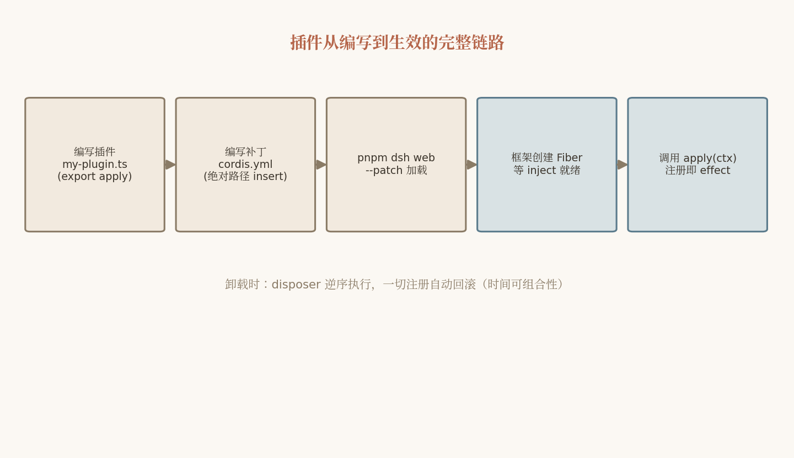

# 13. 插件开发实战：从 Hello Plugin 到发布生态

前面几章我们从原理层面拆解了 Cordis 的时空可组合性与 DeepSeek Harness 的"一切皆插件"架构。本章转入实战：我们将亲手写出第一个插件，逐步升级为工具插件、拦截器插件，最后把它发布到社区生态。读完整章，你应当能够独立开发、调试、发布一个生产级的 dsh 插件。

> 提醒：dsh 处于 Developer Preview（v0.1），官方明确声明 **会有兼容性破坏变更**。本章所有 API 与配置字段以 v0.1.0-rc.5 源码为准，实操时请以仓库 `docs/user/develop/` 目录的最新文档校核。

## 13.1 插件的三形态与 inject 声明

### 13.1.1 插件的本质

一个 dsh 插件，归根结底是一个 TypeScript 模块，它导出一个 `apply` 函数，框架加载时把共享的 `Context` 传进来：

```ts
import type { Context } from '@deepseek-ai/cordis'

export const name = 'hello-plugin'

export function apply(ctx: Context) {
  console.log('[hello-plugin] plugin loaded!')
}
```

寥寥七行，却是一个完整的插件。它揭示了两个关键事实：

1. **插件不是类库，而是对上下文的变换**。`apply(ctx)` 拿到整个 harness 的共享上下文，可以做任何事：注册服务、挂事件监听、注册工具、启动定时器。
2. **插件可以只有导出约定，没有注册 API**。框架通过模块顶层导出的 `name` / `inject` / `apply`（或默认导出对象）识别插件，这就是 Cordis 的 `Plugin` 联合类型。

### 13.1.2 三种形态

Cordis 定义 `Plugin = Function | Constructor | Object`，对应三种写法：

**形态一：函数式（最常用）**

```ts
export const name = 'my-plugin'
export const inject = ['tools']

export function apply(ctx: Context, config: MyConfig) {
  ctx.tools.register(/* ... */)
}
```

**形态二：对象式**——当插件需要携带更多元数据（如 `Config` schema、`provide` 声明）时，把元数据和 `apply` 收进一个默认导出对象：

```ts
export default {
  name: 'my-plugin',
  inject: ['tools'],
  Config: MyConfigSchema,          // Standard Schema，见 13.7 节
  apply(ctx: Context, config: MyConfig) {
    ctx.tools.register(/* ... */)
  },
}
```

**形态三：类式 Service**——当插件本身要向上下文提供一个**服务**（占据稳定的 `ctx.<key>` 槽位）时，继承 `Service` 基类。`Service` 子类构造时自动执行 `ctx.reflect.provide(name, this)`，把自己注册为服务实现：

```ts
import { Service, Context } from '@deepseek-ai/cordis'

export default class MyBackend extends Service {
  static inject = ['fs']

  constructor(ctx: Context, config: MyConfig) {
    super(ctx, 'myBackend', config)   // 此后其他插件可 inject ['myBackend']
  }

  async doSomething() { /* ... */ }
}
```

三种形态的选择准则很直白：**只消费服务用函数式；要声明配置 schema 用对象式；要提供服务给别人 inject 用类式 Service**。dsh 仓库里绝大多数插件是函数式/对象式；`ctx.llm`、`ctx.tools`、`ctx.sessions` 这类能力 seam 的 provider 才是 Service。

### 13.1.3 inject：反应式依赖声明

`export const inject = ['tools']` 这行代码的意义远超"导入依赖"——它是 Cordis **反应式余效果（reactive coeffect）** 的入口：

- **加载顺序由服务可用性驱动**。声明 `inject = ['tools']` 后，框架会等到 `ctx.tools` 服务就绪才调用你的 `apply`。base bundle 的注释原文是："Row order carries no load semantics (activation is service-availability driven)"——配置树里的行序**没有**加载语义。
- **依赖消失自动卸载，依赖重载自动级联重启**。每个插件实例（Fiber）维护一个由全部依赖提供方 uid 拼成的 "epoch" 字符串；任何依赖变化都会触发 epoch 重算，不一致就先执行全部 disposer 卸载、再重新执行插件体。这意味着你的插件**不需要也不应该**手写启动顺序和清理时机。
- **未声明 inject 就访问服务会直接抛错**。Context 是 Proxy 化的，这里要区分两种错误：**未声明 inject 访问服务**，抛出 `cannot get property "tools" without inject`；**已声明 inject 但依赖未就绪**（Fiber 处于休眠态）时访问，抛出 `cannot get required service "tools" in inactive context`。这条硬性约束把"依赖未声明"与"依赖未就绪"从运行期偶发 bug 变成了即时报错。

## 13.2 注册即 effect：自动清理与 ctx.effect()

Cordis 最重要的工程承诺是"**注册即 effect，卸载即回滚**"。只要你通过 `ctx` 上的 API 注册东西——`ctx.on()` 挂事件、`ctx.tools.register()` 注册工具、`ctx.provide()` 提供服务——框架都会把对应的注销函数登记进当前 Fiber 的 `DisposableList`。插件卸载时，这些 disposer **逆序（LIFO）** 执行，就像一叠 defer。

这带来一条重要的编写纪律：**不要绕过 ctx 直接持有全局状态**。比如用 Node 裸 API 起一个定时器：

```ts
export function apply(ctx: Context) {
  const timer = setInterval(() => poll(), 5000)   // 反例：插件卸载后定时器仍在跑！
}
```

裸 `setInterval` 不在框架的 effect 追踪范围内，卸载后它会变成泄漏的幽灵任务。正确做法有两个：要么用 vendored 的 `cordis-plugin-timer` 提供的 `ctx.setInterval()`（effect 化封装），要么用 `ctx.effect()` 显式登记清理逻辑：

```ts
export function apply(ctx: Context) {
  ctx.effect(() => {
    const timer = setInterval(() => poll(), 5000)
    return () => clearInterval(timer)   // 返回 disposer，卸载时自动调用
  })
}
```

`ctx.effect(execute, label?)` 的 `execute` 可以同步返回 disposer、返回 `Promise<disposer>`、甚至用生成器逐个 `yield` 多个 disposer——框架全部会登记并按逆序释放。凡是涉及"获取资源"的操作（打开端口、建立连接、订阅外部事件源、写临时文件），都应该走 `ctx.effect()`。

## 13.3 最小复刻路径完整演练

现在把上面的知识跑通一遍。以下步骤基于源码运行的 dsh（前置：`git clone`、`pnpm install && pnpm run build`，Node 22.19+/24+，pnpm 11.7.0）。

**第 1 步：建目录**

```sh
mkdir -p scratch-plugin/src
```

**第 2 步：写插件** `scratch-plugin/src/my-plugin.ts`：

```ts
import type { Context } from '@deepseek-ai/cordis'

export const name = 'hello-plugin'

export function apply(ctx: Context) {
  console.log('[hello-plugin] plugin loaded!')
}
```

**第 3 步：写补丁层** `scratch-plugin/cordis.yml`（补丁文件名可自定义；profile 内的固定补丁层文件名为 cordis.patch.yml，见第 7 章）。注意：**`name` 字段必须是绝对路径**（相对路径会按包名解析而失败）：

```yaml
- insert:
    - id: hello
      name: '/absolute/path/to/deepseek-harness/scratch-plugin/src/my-plugin.ts'
```

`cordis.yml` 是一个 patch 文件：`insert` 表示向插件树插入新行；每行的 `id` 是唯一键，后续层可以用同 `id` 的行整体替换它（整行替换，非深合并）。

**第 4 步：以 patch 覆盖层启动并验证**

```sh
pnpm dsh web --patch ./scratch-plugin/cordis.yml
# 打开 http://127.0.0.1:3080，启动日志中出现：
# [hello-plugin] plugin loaded!
```

`--patch` 是分层蛋糕的最顶层：profile 列出的各 bundle → profile 的 `cordis.patch.yml` → `$DSH_HOME/cordis.patch.yml`（全局层，优先级高于单 profile 层）→ `--patch` 覆盖层。你可以随时用 `dsh --profile web --dump-config` 查看组合后的完整插件树，每行注释标明来源文件——这是调试"我的插件到底加载没有"的第一工具。



*图 13-1 插件从编写到生效的完整链路*

## 13.4 工具插件完整教程：greet-tool

工具是模型可见的能力。写一个工具插件，就是向 `ctx.tools` 注册一个 `ToolDefinition`。以下是完整的 greet-tool（来自官方教程 `docs/user/develop/basic/tool.md`）：

```ts
import type { Context } from '@deepseek-ai/cordis'
import { defineTool } from '@deepseek-ai/dsh-tools'

export const name = 'greet-tool'
export const inject = ['tools']

export function apply(ctx: Context) {
  ctx.tools.register(defineTool({
    name: 'greet',
    description: 'Greet someone by name.',
    parameters: {
      name: { type: 'string', required: true, description: 'The name to greet' },
    },
    output: {
      schema: { type: 'string' },
      render: (_args, value) => [{ type: 'text', text: value }],
    },
    async execute(args) {
      return `Hello, ${args.name}!`
    },
  }))
}
```

逐段拆解：

**声明段**：`inject = ['tools']` 声明对工具注册表服务的依赖。没有这个声明，`ctx.tools` 访问会直接抛错。

**注册动作**：`ctx.tools.register(...)` 是 effect 化注册——它返回 disposer，插件卸载时工具自动从注册表摘除，模型下一轮的 schema 列表里就不再有 `greet`。这正体现了"注册即 effect"。

**`defineTool` 的三个关键字段**：

1. **`parameters`**：模型可见的输入 schema。dsh 用显式白名单构造发给模型的 `ToolSchema`，宿主侧字段绝不泄漏进模型请求。每个参数写 `type` / `required` / `description`，支持嵌套对象与数组。
2. **`output.schema` 与 `output.render`**：这是 dsh 区别于多数框架的**强制 canonical 输出声明**。`execute` 返回的是结构化值，`output.schema` 描述其形状；`render(args, value)` 负责把这个值转成发给模型的内容块（`[{ type: 'text', text: ... }]`，也支持图片块）。把"程序消费的值"和"模型消费的呈现"分开，使得同一工具可以同时服务模型与 UI（`presentationMeta` 还能给 Web UI 提供 diff 卡片之类的呈现元数据）。
3. **`execute(args, exec)`**：工具体。`exec` 携带 `AbortSignal`、会话上下文等执行环境。第一方工具在这里还会先解析沙箱策略（见 dsh 自带 `edit` 工具的 `sandbox.resolvePolicy(...)`），我们自己的简单工具暂不需要。

**验证**：按 13.3 节方式以 `--patch` 加载后，在 Web UI 里输入 "Use the greet tool to greet Ada."，模型就会发起 `greet` 工具调用并回显 `Hello, Ada!`。

进阶话题（嵌套 schema、后台任务、策略钩子、Code Mode、UI 卡片）参考仓库 `docs/cookbook/adding-a-tool.md`。

## 13.5 扩展点地图：想加什么功能挂哪里

dsh 架构文档给出了一张"新功能挂哪里"的对照表。这是插件开发者最常用的一页，值得抄在桌上：

| 你想加的东西 | 挂在哪里 | 机制 |
|---|---|---|
| 新的模型 provider / 适配器 | `ctx.llm.registerAdapter(providers, adapter)` | 注册返回 disposer；`prepareCall()` 按请求绑定适配器 |
| 模型可见的新能力（工具） | `ctx.tools.register(defineTool(...))` | 支持作用域注册与 `restrict()` 过滤；保留名 `run_code` 不可注册 |
| 面向人类的斜杠命令 | `ctx.commands` | 命令系统（`dsh-commands`） |
| 后台任务 | `ctx.jobs` | 持久后台任务（`tool-jobs`） |
| 文件系统能力/策略 | `ctx.fs` provider，或 `fs/*` 事件（`fs/write-intent`、`fs/edit-intent`、`fs/observed`） | 换一个 provider 可把 fs 整体迁到远程沙箱 |
| 进程沙箱 | `ctx.sandbox` provider | `SandboxMode` 三档，fail-closed |
| 拦截模型请求 / 工具执行 / 回合相位 | `agent/*`、`tools/*` waterfall 事件 | 监听器收 `(...args, next)`，**必须调 `next()`** 否则短路整条链 |
| 向模型可见上下文注入信息 | `agent.inject()` | next-step 生效但不唤醒 loop，等下一条消息带入 |
| 分叉会话（子代理、并行探索） | `ctx.sessions.fork(...)` | 从同一 append-only 日志派生分支 |

关键的 waterfall 拦截点，按工具执行管线顺序排列：

```text
tool/call（落日志）→ tools/pre-execute（权限、沙箱、审计）
  → tools/execute（超时、重试、指标包装的环绕层）
  → 工具体（fs 变更再过 fs/*-intent 事件门）
  → tools/post-execute（可 accept / block / replace / 追加 context）
  → tools/result → tool/result（落日志）
```

回合级还有 `agent/pre-step`（请求派生前，压缩挂在这里）、`agent/request`（改写请求 config）、`llm/stream`、`agent/request-error`（错误恢复，可返回 retry）、`agent/turn-stopping`（serial 终点检查点）。

## 13.6 拦截器插件实战：pre-execute 审计

理解了扩展点地图，我们来写一个真实可用的拦截器插件：在 `tools/pre-execute` waterfall 上挂审计日志，记录每次工具调用的名称与参数摘要，并对 `danger-full-access` 之外的 `bash` 命令追加一条风险提示。

```ts
// audit-plugin/src/index.ts
import type { Context } from '@deepseek-ai/cordis'

export const name = 'tool-audit'
export const inject = ['tools']

export function apply(ctx: Context) {
  ctx.on('tools/pre-execute', async (call, exec, next) => {
    const startedAt = Date.now()
    console.log(`[audit] tool call: ${call.name}`,
      JSON.stringify(call.args).slice(0, 200))

    if (call.name === 'bash') {
      // 只追加提示，不拦截；真正的拒绝应交给审批/沙箱层
      console.warn(`[audit] bash command queued: ${String(call.args?.command ?? '')}`)
    }

    // waterfall 铁律：必须 next() 委派下游，否则整条执行链在此短路
    const result = await next()

    console.log(`[audit] ${call.name} finished in ${Date.now() - startedAt}ms`)
    return result
  })
}
```

三个设计要点：

1. **监听器必须调 `next()`**。waterfall 是环绕中间件（around-middleware）：监听器收到 `(...args, next)`，不调 `next()` 就短路整个链——下游的权限检查、沙箱、工具体全部不会执行。这是 dsh `AGENTS.md` 的硬性约定。反过来，想**主动拦截**时你可以不调 `next()` 而直接返回一个合成结果，但那应当是审慎的决定而非疏忽。
2. **`ctx.on()` 本身就是 effect**。插件卸载时监听器自动摘除，不留残钩。
3. **审计记日志，拦截交给专门的层**。dsh 的安全姿态是分层 fail-closed：`tools/pre-execute` 返回 `ask` 时会触发 `ctx.approval` 的一次性询问（应答者缺失或抛错一律视为 `unavailable` → 拒绝）。审计插件只观察；要做权限决策应该实现审批应答者或沙箱 guard，而不是在 waterfall 里随手 throw。

验证方式同样是 `--patch` 加载后跑任意任务，观察控制台输出的 `[audit]` 行。

## 13.7 配置 Schema 校验

插件往往需要配置。dsh 的做法是用 vendored 的 **schemastery**（Zod 风格）声明 `Config` schema，框架在 `ctx.plugin(p, config)` 时用 Standard Schema（`StandardSchemaV1`）校验，不合法直接抛 `ValidationError`：

```ts
import z from '@deepseek-ai/schemastery'
import type { Context } from '@deepseek-ai/cordis'

export const Config = z.object({
  verbose: z.boolean().default(false),
  maxLength: z.number().default(200),
})

export default {
  name: 'tool-audit',
  inject: ['tools'],
  Config,
  apply(ctx: Context, config: z.infer<typeof Config>) {
    if (config.verbose) console.log('[audit] verbose mode on')
    // ...
  },
}
```

由于 `Config` 字段是 Standard Schema 接口，Zod、schemastery 等任何实现该标准的库都可以使用。配置值来自 cordis.yml 中该行的 `config:` 字段，且支持 `!!js` 表达式插值（如 `!!js process.env.MY_FLAG ?? 'off'`）。运行时配置变更走 `internal/update` 瀑布链，Fiber 会被热更新，loader 还会把变更回写配置文件（reconciliation）。

## 13.8 安装与发布第三方插件

### 13.8.1 安装：`dsh plugin add` 与各种 spec

profile 的插件管理直接转发给 profile 目录下的 pnpm：

```sh
dsh plugin --profile <name> add <spec>     # 也支持 remove / why / update 等 pnpm 子命令
```

`<spec>` 支持多种形式：npm 包名、`github:owner/repo`、本地路径 `./my-plugin`、`file:` / `link:` 协议。一个 npm 包只要在 `package.json` 里声明：

```json
{
  "name": "my-dsh-plugin",
  "type": "module",
  "peerDependencies": { "@deepseek-ai/cordis": "*" },
  "dsh": { "bundle": { "patch": "./cordis.patch.yml" } }
}
```

就会作为 bundle 加入 profile 的层叠（其 `cordis.patch.yml` 描述它插入/替换哪些插件行）。`web` 与 `headless` profile 首次使用自动从模板初始化；其他名字的 profile 必须先 `dsh plugin --profile <name> add ...` 创建。

**pnpm allowBuilds 坑**：Git 源码形式的包靠 `prepare` 脚本在 install 时构建，而 pnpm ≥ 10 默认拦截 install 脚本。因此首次 `add` 一个 GitHub 插件**预期会失败**，并提示你把打印出的 key 拷进 profile 的 `pnpm-workspace.yaml` 的 `allowBuilds` 列表后重跑。这不是 bug，是供应链安全设计。

### 13.8.2 发布与生态现状

发布插件的流程：正常发布 npm 包（或直接用 GitHub 仓库分发），给仓库加上 GitHub topic **`dsh-plugin`** 即可被社区发现。截至 2026 年 8 月 18 日，该 topic 下已有 **7000+ 个公开仓库**（GitHub Topics 实时计数；据新浪等媒体报道，内测期间社区已产出约 300 个插件，开源后呈爆发式增长），生态包括：

- TUI 界面（`dsh-tianshu-tui`——官方无自带 TUI，终端界面靠社区）；
- Web UI 皮肤与面板；
- 视觉 / OCR 工具插件；
- agent 搜索、`@file` 提及、VS Code 集成；
- "Awesome DSH Plugins" 目录——它附带**每日兼容性追踪**，侧面印证 Developer Preview 阶段 breaking change 的频繁程度。

这也意味着发布插件时的现实建议：README 中注明测试通过的 dsh 版本，关注 awesome 目录的兼容性追踪，必要时为不同版本提供分支。

## 13.9 开发调试工具链

在 dsh 仓库内开发插件的日常命令：

| 命令 | 用途 |
|---|---|
| `pnpm run typecheck` | 克隆后跑通即说明环境就绪（Node 22.19+/24+、corepack 启用的 pnpm 11.7.0、Git ≥ 2.26） |
| `pnpm run check:all` | 完整检查套件（含 lint、knip、jscpd 等） |
| `pnpm run doc-sync` | 文档与代码同步校验（`docs/tool-catalog.md` 等是生成文件，CI 校验新鲜度） |
| `pnpm run hygiene` | 仓库卫生检查 |
| `pnpm dsh --profile headless "summarize this workspace"` | 无头冒烟测试（需 `DEEPSEEK_API_KEY`） |

两个特别值得体验的 demo：

- **`pnpm run demo:cordis`**：自指（self-referential）demo——一个可以**检查并修改自己运行时**的 harness 实例。它直观展示了 Cordis 时空可组合性的威力：插件树本身是运行时可观测、可重组的对象，这正是"创造模式"（agent 动态挂载自写插件）的地基。
- **`pnpm run demo:acp`**：以 JSON-RPC stdio 运行的 ACP（Agent Client Protocol）server demo，演示如何把 harness 接入 Zed 等外部客户端。

调试插件加载问题的排查顺序：先 `--dump-config` 确认插件行确实进入了组合树；再看启动日志里 Fiber 状态变化（`internal/status`）；依赖未就绪时插件会处于休眠态而非报错——检查 `inject` 拼写与服务是否真的被提供。

## 13.10 本章小结

本章走完了一个插件从诞生到发布的完整生命周期：

- 插件的三形态（函数式 / 对象式 / 类式 Service）分别对应"只消费服务 / 带配置 schema / 提供服务"三种角色；`inject` 声明驱动反应式加载，未声明即访问会立即报错。
- "注册即 effect"：一切经 `ctx` 的注册都会自动清理；裸资源用 `ctx.effect()` 登记 disposer，卸载时 LIFO 逆序释放。
- 最小复刻路径四步：mkdir scratch-plugin → 写 my-plugin.ts → 写绝对路径 cordis.yml → `pnpm dsh web --patch` 看日志。
- 工具插件的骨架是 `ctx.tools.register(defineTool({ parameters, output: { schema, render }, execute }))`；canonical 输出声明把"程序值"与"模型呈现"分离。
- 扩展点地图回答了"想加什么功能挂哪里"；waterfall 拦截器的铁律是必须 `next()`。
- 配置用 schemastery / Standard Schema 校验；第三方插件经 `dsh plugin add` 安装、`package.json` 的 `dsh.bundle.patch` 声明身份、`dsh-plugin` topic 发布；注意 pnpm ≥10 的 allowBuilds 拦截是预期行为。
- 日常开发用 `typecheck` / `check:all` / `doc-sync` / `hygiene`，并用 `demo:cordis`、`demo:acp` 体验框架的自指与协议能力。

下一章，我们将把这些知识推到极致：不满足于给 dsh 写插件，而是用 Cordis 亲手造一个迷你 agent harness。

## 13.11 本章参考资料

- [docs/user/develop/basic/index.md](https://github.com/zenHeart/deepseek-harness/blob/master/docs/user/develop/basic/index.md) — 支撑本章插件三形态（函数式/对象式/类式）、`inject` 声明与注册自动清理的最小教程。
- [docs/user/develop/basic/tool.md](https://github.com/zenHeart/deepseek-harness/blob/master/docs/user/develop/basic/tool.md) — 支撑本章用 `defineTool` 编写工具插件的完整示例与验证流程。
- [docs/architecture.md](https://github.com/zenHeart/deepseek-harness/blob/master/docs/architecture.md) — 支撑本章"新功能挂哪里"扩展点对照表与 profile/bundle 层叠顺序。
- [docs/development.md](https://github.com/zenHeart/deepseek-harness/blob/master/docs/development.md) — 支撑本章 Host/Client 双聚合构建、typecheck/check:all 等日常开发命令。
- [GitHub topic: dsh-plugin](https://github.com/topics/dsh-plugin) — 支撑本章插件发现机制与社区插件生态（TUI、VS Code 集成、Awesome DSH Plugins 等；截至 2026-08-18 该 topic 下已超 7000 个公开仓库）。
- [DeepSeek Harness 仓库](https://github.com/deepseek-ai/deepseek-harness) — 支撑本章 `dsh plugin add` 安装第三方插件与 pnpm allowBuilds 拦截的预期行为。
