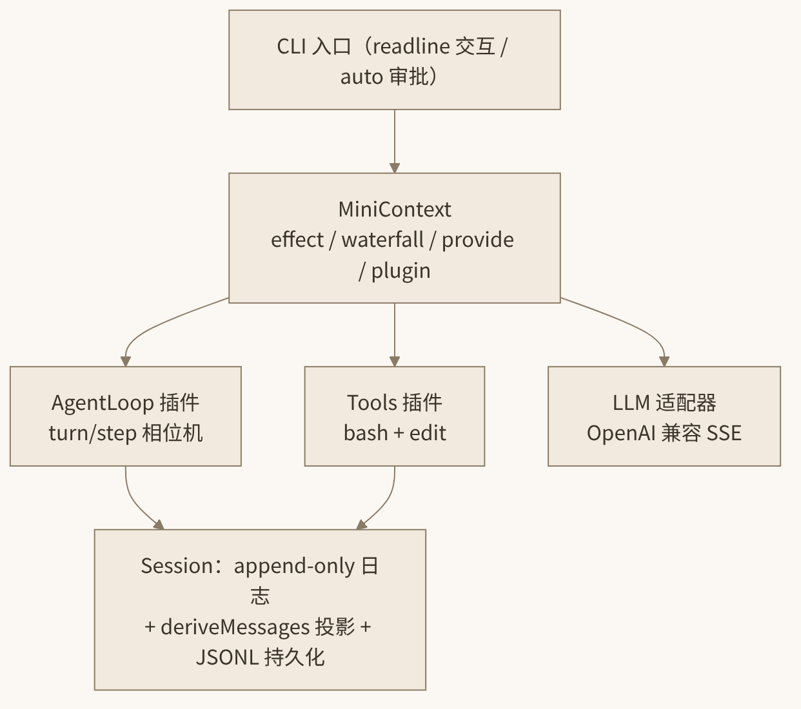

# 14. 从 0 到 1 复刻：用 Cordis 造一个迷你 Agent Harness

这是全书的顶点。前面十三章我们读了论文、拆了 Cordis 源码、分析了 dsh 的架构、写了自己的插件——现在我们把所有知识压缩进一个**最小但完整**的 agent harness：约 400 行 TypeScript，能连真实模型、流式收 chunk、调 bash 和 edit 工具改你的文件、逐条审批、把会话持久化成 JSONL 并可恢复。

更重要的是结构而非功能：这个迷你 harness 的每一块都严格对应 dsh 的设计——append-only 会话日志 + 投影、能力 seam、turn/step 主循环、waterfall 拦截点、**loop 本身也是插件**。复刻它，你就真正拥有了从 0 到 1 复刻 DeepSeek Harness 全部能力的地基。

## 14.1 技术选型与骨架

**选型决策**：

| 决策点 | 选择 | 理由 |
|---|---|---|
| 运行时 | Node.js 22+ | 自带 `fetch`、Web Streams，零原生依赖 |
| 模块体系 | ESM（`"type": "module"`） | 与 dsh 全仓一致；`.js` 后缀的相对导入是 ESM + TypeScript 的标准写法 |
| 执行方式 | `tsx` 直接跑 TS | 免构建，对齐 dsh 的 `node --import tsx/esm` 开发体验 |
| 插件框架 | **自研 40 行 MiniContext** | Cordis 的 npm 包可用，但把 `effect`/`waterfall`/disposer 亲手写一遍，理解不可替代；接口刻意对齐 Cordis，未来可整体换成 `cordis` |
| 模型接入 | OpenAI 兼容协议（chat/completions + SSE） | DeepSeek 官方 API 即兼容该协议，一个适配器通吃 |
| 依赖 | 仅 `tsx`（devDependency） | 工具、SSE、持久化全部手写 |

**文件树**：

```text
mini-harness/
├── package.json
├── tsconfig.json
└── src/
    ├── context.ts    # MiniContext：effect / on / waterfall / provide / plugin
    ├── session.ts    # append-only 事件日志 + deriveMessages 投影
    ├── llm.ts        # LLM seam：OpenAI 兼容 SSE 流式适配器
    ├── tools.ts      # 工具注册表 + bash / edit 两个工具
    ├── plugins.ts    # 审批插件 + agent-loop 插件
    └── cli.ts        # CLI 入口、JSONL 持久化、整树组装
```

**`package.json`**：

```json
{
  "name": "mini-harness",
  "private": true,
  "version": "0.1.0",
  "type": "module",
  "scripts": {
    "start": "tsx src/cli.ts"
  },
  "devDependencies": {
    "tsx": "^4.19.0",
    "typescript": "^5.6.0"
  }
}
```

**`tsconfig.json`**：

```json
{
  "compilerOptions": {
    "target": "ES2022",
    "module": "NodeNext",
    "moduleResolution": "NodeNext",
    "strict": true,
    "skipLibCheck": true,
    "noEmit": true
  },
  "include": ["src"]
}
```

初始化：

```sh
mkdir mini-harness && cd mini-harness
# 写入上面的 package.json / tsconfig.json
pnpm install
```



*图 14-1 迷你 Harness 的组件结构*

## 14.2 Session：append-only 事件日志与投影

dsh 的第一性原理是"**Session 日志是唯一事实源**"：模型历史不是被直接维护的消息数组，而是从事件日志**投影（derive）**出来的。fork、resume、压缩、审计都从同一流派生。我们也照此办理。

`src/session.ts`：

```ts
// ---- 消息词汇（模型可见） ----
export interface ToolCall {
  id: string
  name: string
  args: Record<string, unknown>
}

export type Message =
  | { role: 'system' | 'user'; content: string }
  | { role: 'assistant'; content: string; toolCalls: ToolCall[] }
  | { role: 'tool'; toolCallId: string; name: string; content: string }

// ---- 会话事件（持久事实） ----
export type SessionEvent =
  | { type: 'turn/start'; turn: number }
  | { type: 'step/start'; turn: number; step: number }
  | { type: 'user/message'; message: Extract<Message, { role: 'user' }> }
  | { type: 'assistant/message'; turn: number; step: number
      message: Extract<Message, { role: 'assistant' }> }
  | { type: 'tool/call'; turn: number; step: number; call: ToolCall }
  | { type: 'tool/result'; turn: number; step: number; call: ToolCall
      content: string; isError: boolean }
  | { type: 'turn/end'; turn: number }

export type LoggedEvent = SessionEvent & { seq: number }
```

逐段讲解：

- `ToolCall` 是模型发起工具调用的结构化表示：`id` 用于把 tool 结果与调用配对（OpenAI 协议要求），`args` 已解析为对象。
- `Message` 是**模型可见**的判别联合。assistant 消息恒带 `toolCalls`（可为空数组），这让主循环的判空逻辑简单统一。
- `SessionEvent` 是**持久事实**的判别联合，对应 dsh 的 `SessionEventMap`。注意 `assistant/message` 携带 turn/step 坐标——日志天然支持审计与回放。真实 dsh 还有 `assistant/chunk`（每个流式 chunk 落日志），我们省略它，只记组装后的完整消息。

接下来是 `Session` 类——日志本体与投影：

```ts
export class Session {
  private events: LoggedEvent[] = []

  constructor(
    private systemPrompt: string,
    private onAppend?: (e: LoggedEvent) => void,   // 持久化钩子
  ) {}

  /** 追加一个事件，返回带序号的事件。append-only，永不修改。 */
  append(event: SessionEvent): LoggedEvent {
    const logged = { ...event, seq: this.events.length } as LoggedEvent
    this.events.push(logged)
    this.onAppend?.(logged)
    return logged
  }

  /** 从日志投影出模型可见的消息历史。 */
  deriveMessages(): Message[] {
    const out: Message[] = [{ role: 'system', content: this.systemPrompt }]
    for (const e of this.events) {
      switch (e.type) {
        case 'user/message':
          out.push(e.message)
          break
        case 'assistant/message':
          out.push(e.message)
          break
        case 'tool/result':
          out.push({ role: 'tool', toolCallId: e.call.id,
                     name: e.call.name, content: e.content })
          break
        // turn/*、step/*、tool/call 是协调事实，不进模型请求
      }
    }
    return out
  }

  get turnCount(): number {
    return this.events.filter((e) => e.type === 'turn/end').length
  }

  /** 恢复：把已有日志整批灌入（不触发 onAppend，避免重复写盘）。 */
  static load(events: SessionEvent[], systemPrompt: string,
              onAppend?: (e: LoggedEvent) => void): Session {
    const s = new Session(systemPrompt, onAppend)
    for (const e of events) {
      s.events.push({ ...e, seq: s.events.length } as LoggedEvent)
    }
    return s
  }
}
```

设计要点：

1. **`append` 是唯一写入口**，且只增不改（append-only）。`onAppend` 回调是给持久化层的接缝——日志本体不关心自己落在 JSONL 还是 SQLite。
2. **`deriveMessages()` 就是 dsh 的同名投影**。哪些事件进模型请求、哪些只是协调事实，全在这个函数里决定。这实现了 dsh 的不变量"Model-Visible ⟺ Logged"的迷你版：模型看到的一切都能从日志重建。
3. `turn/*`、`step/*`、`tool/call` 不进投影（`tool/call` 的内容已由 assistant 消息的 `toolCalls` 承载）；`tool/result` 投影为 `role: 'tool'` 消息。

## 14.3 LLM 适配 seam：OpenAI 兼容协议的 SSE 流

dsh 的 `ctx.llm` 是一个 adapter seam：消费者只面对统一的 `stream(request)` 词汇，具体协议由适配器实现。我们定义同样的接缝。

`src/llm.ts` 前半——词汇定义：

```ts
import type { Message, ToolCall } from './session.js'

export interface ToolSchema {
  name: string
  description: string
  parameters: Record<string, unknown>          // JSON Schema
}

export interface ChatRequest {
  messages: Message[]
  tools: ToolSchema[]
}

/** 流式 chunk：文本增量 / 工具调用增量 */
export type Chunk =
  | { type: 'text'; text: string }
  | { type: 'tool-call-delta'; index: number
      id?: string; name?: string; args?: string }

/** 能力 seam 的 Service Definition */
export interface LlmProvider {
  stream(req: ChatRequest, signal: AbortSignal): AsyncIterable<Chunk>
}
```

`LlmProvider` 就是三角色中的 Service Definition；`OpenAICompatProvider` 是 Provider；agent-loop 是 Consumer。换 Anthropic、换本地 vLLM，只需再写一个 Provider，loop 一行不改。

后半——OpenAI 兼容适配器：

```ts
export class OpenAICompatProvider implements LlmProvider {
  constructor(
    private opts: { baseURL: string; apiKey: string; model: string },
  ) {}

  async *stream(req: ChatRequest, signal: AbortSignal): AsyncIterable<Chunk> {
    const res = await fetch(`${this.opts.baseURL}/chat/completions`, {
      method: 'POST',
      headers: {
        'content-type': 'application/json',
        authorization: `Bearer ${this.opts.apiKey}`,
      },
      body: JSON.stringify({
        model: this.opts.model,
        stream: true,
        messages: req.messages.map(toWire),
        ...(req.tools.length
          ? { tools: req.tools.map((t) => ({
              type: 'function',
              function: { name: t.name, description: t.description,
                          parameters: t.parameters },
            })) }
          : {}),
      }),
      signal,
    })
    if (!res.ok || !res.body) {
      throw new Error(`LLM request failed: ${res.status} ${await res.text()}`)
    }

    // ---- SSE 解析：按行切分 data: 帧 ----
    const reader = res.body.getReader()
    const decoder = new TextDecoder()
    let buf = ''
    while (true) {
      const { done, value } = await reader.read()
      if (done) return
      buf += decoder.decode(value, { stream: true })
      let nl: number
      while ((nl = buf.indexOf('\n')) >= 0) {
        const line = buf.slice(0, nl).trim()
        buf = buf.slice(nl + 1)
        if (!line.startsWith('data:')) continue
        const data = line.slice(5).trim()
        if (data === '[DONE]') return
        const delta = JSON.parse(data).choices?.[0]?.delta
        if (!delta) continue
        if (delta.content) yield { type: 'text', text: delta.content }
        for (const tc of delta.tool_calls ?? []) {
          yield {
            type: 'tool-call-delta',
            index: tc.index ?? 0,
            id: tc.id,
            name: tc.function?.name,
            args: tc.function?.arguments,
          }
        }
      }
    }
  }
}

/** 内部消息 → OpenAI wire 格式 */
function toWire(m: Message): Record<string, unknown> {
  switch (m.role) {
    case 'system':
    case 'user':
      return { role: m.role, content: m.content }
    case 'assistant':
      return {
        role: 'assistant',
        content: m.content || null,
        ...(m.toolCalls.length
          ? { tool_calls: m.toolCalls.map((c) => ({
              id: c.id, type: 'function',
              function: { name: c.name, arguments: JSON.stringify(c.args) },
            })) }
          : {}),
      }
    case 'tool':
      return { role: 'tool', tool_call_id: m.toolCallId, content: m.content }
  }
}
```

三个易错点值得强调：

1. **SSE 是字节流不是行流**。`reader.read()` 返回的块边界与 `\n` 不对齐，必须先 `decoder.decode(chunk, { stream: true })` 拼入缓冲再按行切。多字节 UTF-8 字符跨块时 `{ stream: true }` 保证不乱码。
2. **tool_calls 是增量下发的**。流式协议中工具调用的 `id`、`name`、`arguments` 分散在多个 chunk 里（`arguments` 是 JSON 字符串的碎片），所以我们的 `Chunk` 是 delta 而不是完整调用——组装逻辑在 loop 的收集器里（14.5 节）。
3. **`toWire` 是单向翻译**。内部词汇（`Message`）与协议词汇（wire JSON）分离，与 dsh `llm-deepseek` 的 `translate.ts` 同构。assistant 消息在没有工具调用时**不能**带空的 `tool_calls` 字段，部分网关会报错。

## 14.4 工具注册表与 bash / edit 两个工具

`src/tools.ts`。注册表对应 dsh 的 `ctx.tools`——注意 `register` 返回 disposer（注册即 effect）：

```ts
import { execFile } from 'node:child_process'
import { readFile, writeFile } from 'node:fs/promises'
import type { ToolSchema } from './llm.js'
import type { Disposable } from './context.js'

export interface Tool {
  name: string
  description: string
  parameters: Record<string, unknown>
  execute(args: Record<string, unknown>, signal: AbortSignal): Promise<string>
}

export class ToolRegistry {
  private tools = new Map<string, Tool>()

  /** 注册即 effect：返回 disposer，调用即从注册表摘除。 */
  register(tool: Tool): Disposable {
    this.tools.set(tool.name, tool)
    return () => this.tools.delete(tool.name)
  }

  get(name: string): Tool | undefined {
    return this.tools.get(name)
  }

  /** 模型可见 schema：显式白名单构造，execute 绝不泄漏给模型。 */
  schemas(): ToolSchema[] {
    return [...this.tools.values()].map((t) => ({
      name: t.name, description: t.description, parameters: t.parameters,
    }))
  }
}
```

`schemas()` 的白名单构造复刻了 dsh 的纪律：`ToolSchema` 只有 name/description/parameters，`execute` 函数是宿主侧实现，永远不进模型请求。

bash 工具——用 `execFile` 而非 `exec` 以避开 shell 注入面，加超时与工作区约束：

```ts
export function bashTool(workspace: string): Tool {
  return {
    name: 'bash',
    description: 'Run a bash command in the workspace and return its output.',
    parameters: {
      type: 'object',
      properties: {
        command: { type: 'string', description: 'The command to run' },
      },
      required: ['command'],
      additionalProperties: false,
    },
    async execute(args, signal) {
      const command = String(args.command)
      const { stdout, stderr } = await new Promise<{
        stdout: string; stderr: string
      }>((resolve, reject) => {
        execFile('bash', ['-c', command], {
          cwd: workspace, timeout: 30_000, maxBuffer: 1024 * 1024,
          signal,
        }, (err, stdout, stderr) => {
          if (err && !stdout && !stderr) reject(err)
          else resolve({ stdout, stderr })   // 非零退出码也把输出给模型看
        })
      })
      return (stdout + stderr).slice(0, 32_000) || '(no output)'
    },
  }
}
```

一个细节：**非零退出码不视为工具错误**。`grep` 没匹配到就退出 1，这恰恰是模型需要看到的信息。真正的工具错误（超时、abort）才抛异常。

edit 工具——字面量替换，与 dsh 自带 `edit` 工具语义一致（"Literal text to replace. Must match exactly."）：

```ts
export function editTool(workspace: string): Tool {
  return {
    name: 'edit',
    description:
      'Edit a UTF-8 text file by replacing literal text. ' +
      'old_string must match exactly and uniquely.',
    parameters: {
      type: 'object',
      properties: {
        file_path:  { type: 'string', description: 'Path relative to workspace' },
        old_string: { type: 'string', description: 'Literal text to replace' },
        new_string: { type: 'string', description: 'Literal replacement text' },
      },
      required: ['file_path', 'old_string', 'new_string'],
      additionalProperties: false,
    },
    async execute(args) {
      const path = `${workspace}/${String(args.file_path)}`
      const oldStr = String(args.old_string)
      const newStr = String(args.new_string)
      const before = await readFile(path, 'utf8')
      const count = before.split(oldStr).length - 1
      if (count === 0) throw new Error('old_string not found in file')
      if (count > 1) {
        throw new Error(`old_string matches ${count} locations; ` +
          'provide more context to make it unique')
      }
      const after = before.replace(oldStr, newStr)
      await writeFile(path, after, 'utf8')
      return `edited ${args.file_path}: replaced ${oldStr.length} chars ` +
             `with ${newStr.length} chars`
    },
  }
}
```

设计取舍：要求 `old_string` **唯一匹配**，不唯一就报错让模型带更多上下文重试——这是 Claude Code / dsh 系工具的通行做法，比"默认替换第一个"安全得多。

## 14.5 主循环与 MiniContext

主循环运行在一个迷你 Cordis 上。先看 MiniContext 的实现——它是全书的"压轴代码"，把第 5 章读过的 Cordis 内核压缩成不足百行。

`src/context.ts`：

```ts
export type Disposable = () => void | Promise<void>
type AnyFn = (...args: any[]) => any

/** 迷你 Cordis：effect 追踪 + 事件 + waterfall + 服务 + 插件 */
export class MiniContext {
  private listeners = new Map<string, AnyFn[]>()
  private services = new Map<string, unknown>()
  private rootDisposers: Disposable[] = []
  private fiberStack: Disposable[][] = []     // 当前正在执行的插件栈

  /** 把 disposer 登记进当前插件（无插件则登记进根）。 */
  private track(d: Disposable): void {
    (this.fiberStack.at(-1) ?? this.rootDisposers).push(d)
  }

  /** 显式 effect：执行体返回 disposer，卸载时调用。 */
  effect(execute: () => Disposable | void): void {
    const d = execute()
    if (d) this.track(d)
  }

  /** 事件监听：返回注销函数，且自动登记为当前插件的 effect。 */
  on(event: string, fn: AnyFn): Disposable {
    const list = this.listeners.get(event) ?? []
    this.listeners.set(event, list)
    list.push(fn)
    const dispose = () => {
      const i = list.indexOf(fn)
      if (i >= 0) list.splice(i, 1)
    }
    this.track(dispose)
    return dispose
  }

  emit(event: string, ...args: unknown[]): void {
    for (const fn of this.listeners.get(event) ?? []) fn(...args)
  }

  /**
   * waterfall：环绕中间件。最后一个参数是终端 next。
   * 监听器收 (...args, next)；不调 next() 即短路整条链。
   */
  waterfall(event: string, ...argsAndFinal: unknown[]): Promise<unknown> {
    const final = argsAndFinal.pop() as AnyFn
    const args = argsAndFinal
    const list = this.listeners.get(event) ?? []
    const dispatch = (i: number, cur: unknown[]): Promise<unknown> =>
      i === list.length
        ? Promise.resolve(final(...cur))
        : Promise.resolve(list[i](...cur, (...nextArgs: unknown[]) =>
            dispatch(i + 1, nextArgs.length ? nextArgs : cur)))
    return dispatch(0, args)
  }

  /** 服务提供与获取（迷你版 inject：取不到就立即报错）。 */
  provide(name: string, value: unknown): Disposable {
    this.services.set(name, value)
    const dispose = () => this.services.delete(name)
    this.track(dispose)
    return dispose
  }

  get<T>(name: string): T {
    if (!this.services.has(name)) {
      throw new Error(`cannot get required service "${name}"`)
    }
    return this.services.get(name) as T
  }

  /** 加载插件：其间的所有注册都归入该插件的 disposer 袋。 */
  plugin(apply: (ctx: MiniContext) => void): void {
    const bag: Disposable[] = []
    this.fiberStack.push(bag)
    try {
      apply(this)
    } finally {
      this.fiberStack.pop()
    }
    // 整个插件的清理作为一个 effect 登记到父级：LIFO 逆序释放
    this.rootDisposers.push(async () => {
      for (const d of [...bag].reverse()) await d()
    })
  }

  /** 卸载一切：逆序执行全部 disposer。 */
  async dispose(): Promise<void> {
    for (const d of [...this.rootDisposers].reverse()) await d()
    this.rootDisposers.length = 0
  }
}
```

对照 Cordis 内核逐一验证我们复刻了什么：

| Cordis 概念 | MiniContext 对应 |
|---|---|
| `ctx.effect(execute)` 返回 Disposable | `effect()`，disposer 登记进当前 Fiber 袋 |
| Fiber 的 DisposableList，卸载时 LIFO | `fiberStack` + `bag`，`dispose()` 中 `reverse()` |
| `ctx.on()` 注册即 effect | `on()` 内部自动 `track(dispose)` |
| waterfall 环绕中间件，必须 `next()` | `waterfall()` 递归 dispatch，不调 `next` 即短路 |
| `ctx.provide()` / `ctx.get()` | 同名方法；缺失服务立即报错（迷你版 inject） |
| `ctx.plugin(p)` 创建 Fiber | `plugin()` 收集插件期间的一切注册 |

waterfall 的实现有个值得玩味的细节：监听器调 `next()` 时可以**改写参数**（`nextArgs.length ? nextArgs : cur`）——这正是 dsh 中 `tools/pre-execute` 能改写工具调用的机制。我们的审批插件用它的反面：不调 `next()`，直接返回合成结果，实现短路拒绝。

`src/plugins.ts`——先是审批插件（对应 dsh 的 `dsh-user-approval`，挂在 `tools/pre-execute`）：

```ts
import type { MiniContext } from './context.js'
import type { Session } from './session.js'
import type { ToolCall } from './session.js'
import type { LlmProvider } from './llm.js'
import type { ToolRegistry } from './tools.js'

export interface ToolResult { content: string; isError: boolean }

/** 审批应答者：返回 true 放行，false 拒绝。 */
export type Approver = (call: ToolCall) => Promise<boolean>

/** 拦截器插件：tools/pre-execute waterfall 的迷你版。 */
export function approvalPlugin(ctx: MiniContext): void {
  ctx.on('tools/pre-execute', async (
    call: ToolCall,
    next: (c: ToolCall) => Promise<ToolResult>,
  ): Promise<ToolResult> => {
    const approver = ctx.get<Approver>('approver')
    if (await approver(call)) {
      return next(call)              // 放行：委派下游
    }
    // 拒绝：不调 next()，短路执行链，回填合成结果
    return { content: `tool call "${call.name}" denied by user`, isError: true }
  })
}
```

注意这里体现了两个 dsh 原则：**拒绝也走正常回填路径**（被拒绝的调用仍以 tool 结果身份进入会话日志与模型历史，replay 合法）；**审批器本身是可替换的服务**（`approver`），CLI 里可以是 readline 询问，也可以是 `--yes` 全自动，还可以是按工具名白名单。

然后是全书的核心——**agent-loop 插件**。它消费 `session` / `llm` / `tools` 三个服务，向上下文提供 `runTurn` 能力：

```ts
/** Agent 主循环：它本身也只是一个插件。 */
export function agentLoopPlugin(ctx: MiniContext): void {
  const runTurn = async (signal: AbortSignal): Promise<string> => {
    const session = ctx.get<Session>('session')
    const llm = ctx.get<LlmProvider>('llm')
    const tools = ctx.get<ToolRegistry>('tools')

    const turn = session.turnCount
    session.append({ type: 'turn/start', turn })

    let step = 0
    try {
      while (true) {
        signal.throwIfAborted()
        session.append({ type: 'step/start', turn, step })

        // 1) 组装请求：消息历史是日志的投影，工具 schema 来自注册表
        const stream = llm.stream(
          { messages: session.deriveMessages(), tools: tools.schemas() },
          signal,
        )

        // 2) 流式收集：文本增量直接回显，tool-call 增量按 index 拼装
        let content = ''
        const partials: { id: string; name: string; args: string }[] = []
        for await (const chunk of stream) {
          if (chunk.type === 'text') {
            content += chunk.text
            process.stdout.write(chunk.text)
          } else {
            const p = partials[chunk.index] ??= { id: '', name: '', args: '' }
            if (chunk.id) p.id += chunk.id
            if (chunk.name) p.name += chunk.name
            if (chunk.args) p.args += chunk.args
          }
        }
        const message = {
          role: 'assistant' as const,
          content,
          toolCalls: partials.map((p) => ({
            id: p.id, name: p.name, args: JSON.parse(p.args || '{}'),
          })),
        }
        session.append({ type: 'assistant/message', turn, step, message })

        // 3) 无工具调用 → turn 完成
        if (message.toolCalls.length === 0) {
          session.append({ type: 'turn/end', turn })
          return content
        }

        // 4) 逐个执行工具调用，经 pre-execute waterfall，结果回填日志
        for (const call of message.toolCalls) {
          session.append({ type: 'tool/call', turn, step, call })
          const result = await ctx.waterfall(
            'tools/pre-execute', call,
            async (c: ToolCall): Promise<ToolResult> => {
              const tool = tools.get(c.name)
              if (!tool) return { content: `unknown tool: ${c.name}`, isError: true }
              try {
                return { content: await tool.execute(c.args, signal), isError: false }
              } catch (err) {
                return { content: `tool error: ${String(err)}`, isError: true }
              }
            },
          ) as ToolResult
          session.append({ type: 'tool/result', turn, step, call,
                           content: result.content, isError: result.isError })
        }
        step++   // 有工具调用 → 进入下一 step，模型将看到工具结果
      }
    } finally {
      // turn/end 已在正常路径 append；异常路径补记保证日志闭合
      if (session.turnCount === turn) session.append({ type: 'turn/end', turn })
    }
  }

  ctx.provide('runTurn', runTurn)
}
```

这段循环精确对应 dsh `ReactLoopAgent` 的 turn/step 相位机（`agent.ts`）：

- **Step = 一次模型请求 + 其工具调用；Turn = 0..n 个 Step**。`turn/start → step/start → assistant/message → (tool/call → tool/result)* → turn/end` 的事件序列与 dsh 的 durable 事件域一一对应。
- **循环退出条件**是"模型不再发起工具调用"，而不是"模型说了完成"——这是 ReAct 式循环的机械本质。
- **工具结果先落日志再进下一轮投影**，保证任何时刻崩溃都能从 JSONL 恢复出一致状态。
- 真实 dsh 会把每个 chunk 也落日志（`assistant/chunk`）、用 `agent/pre-step` 挂压缩、用有界滚动池并行执行工具调用——这些都在扩展路线里（14.9 节），但脊柱已经完整。

## 14.6 审批钩子的两种实现

审批服务 `approver` 的两种 provider，放在 `cli.ts` 中按 flag 选择（以下 `cli.ts` 各代码段顶部的一众 `import` 略去不表——均为本章前文写过的模块与 Node 内置库）：

```ts
import readline from 'node:readline/promises'

/** 交互式审批：逐个询问 y/n。 */
function cliApprover(): Approver {
  const rl = readline.createInterface({
    input: process.stdin, output: process.stderr,
  })
  return async (call) => {
    const args = JSON.stringify(call.args).slice(0, 120)
    const answer = await rl.question(
      `\n[approval] allow ${call.name}(${args})? [y/N] `)
    return answer.trim().toLowerCase() === 'y'
  }
}

/** 全自动审批：--yes 模式。 */
const autoApprover: Approver = async () => true
```

真实 dsh 的审批是 fail-closed 的（应答者缺失/抛错一律拒绝）且与沙箱策略联动（审批后一次性提权重试）；我们的迷你版保留了最核心的形态——**waterfall 拦截 + 可替换应答者**，fail-closed 留给读者作为练习。

## 14.7 CLI 入口与 JSONL 持久化

JSONL 持久化就是把 `onAppend` 接到文件追加写上。每行一个事件，天然 append-only、崩溃友好、可 `tail -f` 观察：

```ts
import { appendFileSync, readFileSync, existsSync, mkdirSync } from 'node:fs'
import path from 'node:path'

/** 创建持久化钩子 + 可选恢复已有日志。 */
function openSessionLog(file: string, systemPrompt: string): Session {
  mkdirSync(path.dirname(file), { recursive: true })
  const persist = (e: LoggedEvent) => {
    appendFileSync(file, JSON.stringify(e) + '\n', 'utf8')
  }
  if (existsSync(file)) {
    const events = readFileSync(file, 'utf8')
      .split('\n').filter(Boolean)
      .map((line) => JSON.parse(line) as SessionEvent)
    return Session.load(events, systemPrompt, persist)   // 恢复：旧事件不重写
  }
  return new Session(systemPrompt, persist)
}
```

恢复语义值得说一句：`Session.load` 直接灌入旧事件而**不触发** persist（否则每行会再写一遍）。恢复后继续 `append`，新事件接在旧文件末尾——seq 重新编号但顺序保持，对迷你版足够。真实 dsh 用 `SESSION_FORMAT_VERSION` 管格式演进，还有 SQLite 投影做全文检索。

## 14.8 全部组装成插件：loop 也是插件

最后一块拼图是 `cli.ts` 的组装段——它回答了"为什么说 loop 也是插件"：

```ts
// ---- 命令行参数 ----
const argv = process.argv.slice(2)
const useYes = argv.includes('--yes')
const resumeIdx = argv.indexOf('--resume')
const sessionFile = resumeIdx >= 0
  ? argv[resumeIdx + 1]
  : `.mini-harness/sessions/${Date.now()}.jsonl`
const prompt = argv.filter((a, i) =>
  !a.startsWith('--') && argv[i - 1] !== '--resume').join(' ')

// ---- 依赖解析 ----
const workspace = process.cwd()
const systemPrompt =
  'You are a helpful software engineer assistant. ' +
  `The workspace is ${workspace}. Use tools to accomplish the task.`
const llm = new OpenAICompatProvider({
  baseURL: process.env.MINI_BASE_URL ?? 'https://api.deepseek.com/v1',
  apiKey: process.env.MINI_API_KEY ?? process.env.DEEPSEEK_API_KEY ?? '',
  model: process.env.MINI_MODEL ?? 'deepseek-chat',
})
const session = openSessionLog(sessionFile, systemPrompt)

// ---- 组装插件树：一切注册皆 effect，dispose 即整体回滚 ----
const ctx = new MiniContext()

ctx.plugin((ctx) => {                 // 核心服务插件
  ctx.provide('session', session)
  ctx.provide('llm', llm)
  ctx.provide('tools', new ToolRegistry())
})

ctx.plugin((ctx) => {                 // 工具插件：注册即 effect
  const tools = ctx.get<ToolRegistry>('tools')
  ctx.effect(() => tools.register(bashTool(workspace)))
  ctx.effect(() => tools.register(editTool(workspace)))
})

ctx.plugin((ctx) => {                 // 审批插件
  ctx.provide('approver', useYes ? autoApprover : cliApprover())
  approvalPlugin(ctx)
})

ctx.plugin(agentLoopPlugin)           // 主循环：也只是插件

// ---- 运行 ----
const ac = new AbortController()
process.on('SIGINT', () => ac.abort())
try {
  if (prompt) {
    session.append({ type: 'user/message',
                     message: { role: 'user', content: prompt } })
    await ctx.get<(s: AbortSignal) => Promise<string>>('runTurn')(ac.signal)
    process.stdout.write('\n')
  } else {
    const rl = readline.createInterface({
      input: process.stdin, output: process.stderr })
    while (true) {
      const input = await rl.question('\nYou: ')
      if (!input.trim() || input.trim() === '/exit') break
      session.append({ type: 'user/message',
                       message: { role: 'user', content: input } })
      await ctx.get<(s: AbortSignal) => Promise<string>>('runTurn')(ac.signal)
      process.stdout.write('\n')
    }
  }
} finally {
  await ctx.dispose()   // 优雅退出：所有插件的 effect 逆序回滚
}
```

组装段的每一行都在复刻 dsh 的架构判断：

1. **无特权核心**：`cli.ts` 里没有任何一行"框架级"特权代码——session、llm、tools、审批、loop 全是 `ctx.plugin()` 加载的插件，彼此只通过 `ctx.get('服务名')` 发现。把 `agentLoopPlugin` 换成 Plan-and-Execute 循环、把 `OpenAICompatProvider` 换成 Anthropic 适配器，都是改一行配置的事。这就是 dsh 说的 "everything is a plugin" 的最小完整形态。
2. **注册即 effect**：`provide` / `register` / `on` 全部返回 disposer 并被 `plugin()` 归袋；进程退出前 `ctx.dispose()` 逆序回滚——在本程序里它主要是仪式感，但一旦加上 HTTP server、PTY、文件 watcher，这个机制就是性命攸关的。
3. **启动顺序即依赖图**：这里我们手工按依赖顺序 `plugin()`；真实 Cordis 用 `inject` 声明把这个顺序也消灭了（服务可用性驱动加载）。这是迷你版与完整框架最显著的差距，也是你升级时第一个该引入的特性。

## 14.9 运行演示与扩展路线

### 14.9.1 运行演示

```sh
export DEEPSEEK_API_KEY=sk-...
# 一次性任务（headless 模式）
pnpm start -- "列出当前目录的文件，然后在 NOTES.md 里写一份仓库摘要"
# 交互模式
pnpm start
# 恢复会话
pnpm start -- --resume .mini-harness/sessions/1755000000000.jsonl "接着说"
```

一次典型运行的行为序列：用户消息落日志 → turn/start → 模型流式输出 → 发起 `bash` 工具调用 → `[approval] allow bash(...)?` 询问 → 执行并回填 → 模型看到结果继续 → 发起 `edit` 调用 → 最终无工具调用 → turn/end。与此同时 `tail -f .mini-harness/sessions/*.jsonl` 能看到事件逐行追加——你亲手造的事件溯源系统在工作。

### 14.9.2 扩展路线（对应 dsh 的子系统）

| 下一步 | 挂在哪里 | 对应 dsh 子系统 |
|---|---|---|
| **上下文压缩**：token 压力超阈值时把早期消息摘要为一条 user 消息 | loop 每 step 开头检查（dsh 挂在 serial `agent/pre-step`），用 surface 替换改写投影区间 | `compaction-basic`、`tool-result-pruner` |
| **沙箱**：bash/edit 放进 bwrap/Landlock/Seatbelt 隔离执行 | 给工具 `execute` 加 `SandboxExecutionPolicy` 参数，审批通过后一次性提权 | `ctx.sandbox` seam、`sandbox-local` |
| **子代理**：fork 会话日志，让子 agent 在副本上跑完再把结论回填 | `Session.fork()`（拷贝事件前缀派生分支），工具化包装为 `subagent` 工具 | `ctx.sessions.fork()`、`subagent/` |
| **并行工具调用**：有界滚动池 + 屏障，结果按模型顺序提交 | loop 的工具执行段 | `agent-loop/tool-calls.ts` |
| **更多 waterfall 点**：`agent/request`（改写请求）、`tools/post-execute`（改写结果）、`agent/request-error`（失败重试） | MiniContext 已通用，loop 里加调用点即可 | 工具执行管线三层 waterfall |
| **换成真 Cordis**：MiniContext 接口刻意对齐，迁移后获得 inject 反应式加载、HMR、loader YAML 树 | `context.ts` 整体替换 | `cordiverse/cordis` |
| **更多 provider**：Anthropic、本地 vLLM、公司网关 | 再写一个 `LlmProvider` | `llm-pi-ai` 多 provider 适配器 |

升级路线表之外，值得知道同行也在同一方向上移动：pi 在 v0.84.0（2026-08-06）做了一次破坏性升级——pi-agent-core 换成 v4 lane-based 的 Session/SessionStorage/SessionRepo API，同时移除了 legacy JSONL 与 in-memory repo，等于官方宣告"事件日志 + 存储 seam"成为会话层的标准形态；Claude Code 2.1.232（2026-08-13）则把 subagent forking 默认打开（`subagent_type: "fork"` 的子代理继承完整对话与缓存）——与本章 `Session.fork()` 一行之遥的设计，在工业级产品里已经是默认行为。你今天复刻的这 400 行，恰好踩在整个行业收敛的骨架上。

## 14.10 本章小结

我们从空目录造出了一个可工作的 agent harness：

- **Session 是唯一事实源**：append-only 事件日志 + `deriveMessages()` 投影，模型可见的一切都能从日志重建；JSONL 持久化只是 `onAppend` 钩子的一种实现。
- **LLM 是 seam**：`LlmProvider` 接口 + OpenAI 兼容 SSE 适配器，字节流拼缓冲按行切 `data:` 帧，tool_calls 增量按 index 拼装。
- **工具是 effect**：注册表白名单构造模型可见 schema；bash 非零退出不算错误，edit 要求字面量唯一匹配。
- **主循环是相位机**：turn = 0..n step，step = 一次请求 + 其工具调用；退出条件是"无工具调用"；工具结果先落日志再进投影。
- **审批是 waterfall**：监听器必须 `next()`，不调即短路；拒绝也走正常回填路径。
- **loop 也是插件**：不足百行的 MiniContext 复刻了 Cordis 的 effect 追踪、waterfall、服务与插件机制；session/llm/tools/审批/loop 全部以插件身份组合，`dispose()` 逆序回滚一切。

约 400 行代码，覆盖了 DeepSeek Harness 架构精要的每一条：事件溯源、能力 seam、turn/step 循环、waterfall 拦截、一切皆插件。剩下的是工程量——而你现在知道每一块该挂在哪里。

本书的旅程到这里就结束了。从"Harness 为什么重要"出发，穿过 Cordis 的时空可组合性、dsh 的插件树与事件溯源日志，最终回到你亲手写下的这 400 行——它们不只是一个玩具，而是一套可生长的架构脊柱。愿你在自己的工程里，把它养成真正的 Harness。

## 14.11 本章参考资料

- [packages/core/agent-loop/src/agent.ts](https://github.com/zenHeart/deepseek-harness/blob/master/packages/core/agent-loop/src/agent.ts) — 本章迷你 Harness 的 turn/step 循环与 inbox 唤醒语义的原型源码。
- [docs/subsystems/session.md](https://github.com/zenHeart/deepseek-harness/blob/master/docs/subsystems/session.md) — dsh 会话子系统设计文档：事件溯源日志的完整事件清单与"模型历史由投影派生"的语义，可用来对照检查你的迷你版复刻了哪些、省略了哪些。
- [docs/tool-execution-pipeline.md](https://github.com/zenHeart/deepseek-harness/blob/master/docs/tool-execution-pipeline.md) — 工具执行管线文档：完整的 waterfall 拦截点清单，读完可以评估迷你版的管线简化掉了哪几层。
- [Cordis 入门（dsh 官方文档）](https://deepseek-harness.github.io/deepseek-harness/reference/cordis-primer) — 本章复刻所用 Cordis 五要素（插件、上下文、inject、类型化事件、可逆 effect）的官方定义。
- [Cordis 仓库](https://github.com/cordiverse/cordis) — 本章迷你 Harness 直接依赖的元框架源码（Context/Fiber/Events 原语）。
- [docs/architecture.md](https://github.com/zenHeart/deepseek-harness/blob/master/docs/architecture.md) — 本章结尾对照"架构精要"逐条验收复刻覆盖度的官方架构描述。
- [pi 仓库](https://github.com/earendil-works/pi) — pi 的源码与 CHANGELOG：v0.84.0 换用 lane-based Session/SessionStorage/SessionRepo 并移除 legacy JSONL 的破坏性升级记录在此，是"会话层标准化"趋势的一手证据。
- [Claude Code CHANGELOG](https://github.com/anthropics/claude-code/blob/main/CHANGELOG.md) — Claude Code 官方更新日志：2.1.232 起 subagent forking 默认开启，可与本章 `Session.fork()` 的迷你实现对照阅读。
