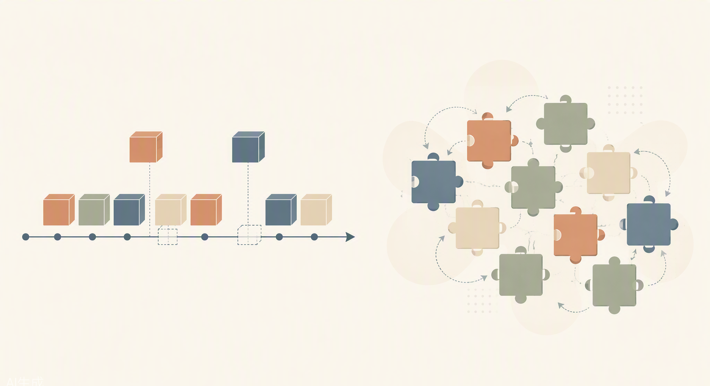

# 15. 设计动机与技术权衡：为什么这么造

## 15.1 从“怎么用”到“为什么造”：精通的三层境界

一本书的读者通常经历三层境界。第一层是**会用**：装好 dsh，跑通四种模式，写出自己的插件——实战篇的三章解决的是这一层。第二层是**懂原理**：知道 Cordis 的 effect 如何登记与回卷、session 日志如何投影出模型上下文、审批如何 fail-closed——概念篇、原理篇、架构篇解决的是这一层。但还有第三层：**理解权衡**。知道每一个设计决策“放弃了什么、换来了什么”，知道在另一种约束下自己也未必会这样选——只有到了这一层，你才算真正精通，因为此时你不再是在“学习一个产品”，而是在“与一个设计团队对话”。

本章就是这场对话。素材全部来自一手出处：Shigma 在 Koishi 官方 cookbook 上的长文《可逆的插件系统》（koishi.chat/zh-CN/cookbook/design/disposable.html）、cordiverse/paper 的论文预印本、dsh 仓库的 architecture.md、AGENTS.md、vendor/README.md 及各子系统文档、2026-08-13 的官方发布文，以及社区的正面与负面评价。我们尽量少做转述，多引原文，让每一个“为什么”都落在白纸黑字上。

## 15.2 Cordis 的思想源流：十年实战、一篇檄文与一个理论闭环

### 15.2.1 从聊天机器人到元框架

Cordis 不是为 dsh 而生的，它的血统要追溯到 2020 年 1 月 Shigma 发布的聊天机器人框架 Koishi（Koishi 官方 FAQ）。2022 年 5 月，Koishi 4.7.1 的 release notes 写下了 Cordis 独立的官方首次表述：“**infra:** 发布了新的核心包 cordis，它作为 Koishi 的底层框架提供了上下文、插件系统、事件模型等核心功能”（github.com/koishijs/koishi/discussions/691）。注意这个动作的方向：不是“为框架加插件系统”，而是**把与聊天领域无关的框架层从业务中抽出来**。这一步决定了 Cordis 后来的自我定位——Shigma 在 cookbook 中写道：

> “如果让我来定义的话，Cordis 是一个**元框架（Meta Framework）**，即一个用于构建框架的框架。……作为一个元框架，Cordis 并不耦合任何具体的领域或场景。它所提供的能力是大多数框架都不足为奇的——插件系统，但在这个系统背后却是大多数框架都没有达成的目标：**可逆性**。”（《可逆的插件系统》）

四年后，dsh 恰好验证了这一定位：同一个元框架，既支撑过 3000+ 插件的聊天机器人生态，又支撑起了一个 AI Agent Harness。

### 15.2.2 “软件文明在退步”：可逆性要解决的问题

为什么要做“可逆”？Shigma 的动机陈述罕见地激烈：

> “在过去，我们用 C 这样的语言编写程序时，我知道 `open()` 会返回一个 `fd`……而在如今，当我使用 Koa 时，我可以使用 `app.use()` 来注册一个中间件……但很遗憾的是，Koa 不会告诉你如何取消这个中间件，Vue 不会告诉你如何卸载这个组件，Node.js 甚至会永久占用这个 `.node` 文件。……或许是人们认为重启过于方便了，因此一些框架的开发者们已经完全不考虑回收资源的需求了。”（同上）

他把这称为软件文明的退步：注册容易、注销缺失，模块化退化为只增不减的堆积。针对这一诊断，他给出可逆性的三个好处，这三点后来全部成为 dsh 架构的地基：

- **可组合性**：“现实中的模块也应当是可拆卸的，现实中的插件也应当是可以拔出的。不可逆的软件即便进行了模块化，也只会随着时间推移而变得更加臃肿。”
- **可靠性**：“可逆性可以确保软件所使用的内存和其他资源都在可控范围内……即便某个模块出现了资源泄露，我们也可以快速定位错误的来源。”
- **可访问性**：“如果其中的每个组件都是可逆的，我们就可以在保证其他功能持续运行的情况下替换掉任何一个组件，甚至可以滚动更新整个程序自身。”（同上）

形式化地说，可逆性被定义为**路径无关**：“任意进行加载和卸载插件操作后，最终行为仅与最终启用的插件相关；与中间是否重复加载过插件、插件之间的加载或卸载顺序都无关。”（同上）这不是工程洁癖，而是一个可以断言、可以测试的运行时性质。Koishi 的工程红利也写得很直白：“热重载……显著降低了用户的开发和更新成本，并大幅提高了 Koishi 应用的 SLA。”

### 15.2.3 可组合性三分法与 2026-08-13 的闭环

同一篇文章的末尾，Shigma 把“可组合性”从一个模糊的赞美词拆成三个正交维度：

> “逻辑可组合性：代码自身的解耦能力（常见的理解方式）。**时间可组合性**：代码可以被同时加载、可以被回收副作用的能力（本文主要介绍的部分）。**空间可组合性**：代码之间能够有效声明和隔离依赖关系的能力。”（同上）

这就是“时空可组合性”一词的原始出处。2026 年 8 月 13 日，三件事同日发生：cordiverse/paper 公开预印本《A Programming Paradigm for Spatiotemporal Composability》，把可逆 effects 与响应式 coeffects 形式化为运行时机制，且摘要直接把 “self-evolving agent harnesses” 写进动机句；Cordis 仓库 tagline 改为 “Meta-Framework of Spatiotemporal Composability”；dsh 开发者预览版开源，README 明言 “dsh is powered by Cordis, whose design is described in *A Programming Paradigm for Spatiotemporal Composability*”。论文、框架、产品同日闭环——理论化与工程化出自同一作者之手，这在本行业几乎没有先例。

*图 15-1 从可逆性到时空可组合性*

值得诚实记录的是作者自己坦承的局限：“很遗憾，目前并不能（在语言层面确保资源安全）。开发者只需设置几个全局变量……就可以绕过 Cordis 的保护机制。……这种渐进性是 Cordis 的一大优势。”（同上）可逆性是一套纪律而非一道围墙——这个“放弃语言级强制、换取与主流 OOP/TS 生态无缝结合”的取舍，本身就是本章主题的第一个样本。

## 15.3 一切皆插件的深层动机

### 15.3.1 为什么把模型、工具、会话、循环、UI 全部降级为插件

dsh 架构文档给出的理由只有一句话，但分量极重：

> “Every part of the product is a plugin, including the model adapter, the tool registry, the session log, and the agent loop itself, so every part is replaceable from configuration. **There is no privileged core to patch**.”（docs/architecture.md）

“没有可供打补丁的特权核心”——这句话的反面就是 Claude Code 式单体核心 + 外围 hooks 的结构。全部插件化换来三样东西：**可替换**（模型、循环都可从配置层换掉）、**可重组**（四种运行模式只是不同的插件集合）、以及**生态卡位**——发布文结尾写得很明白：“我们期待与全球开发者一起，在开源、开放、可复用、可组合的基础设施之上，共同探索智能上限。”（华尔街见闻全文转载，wallstreetcn.com/articles/3779385）如果 harness 成为行业统一脚手架，那么“一切皆插件”就是这个位置上最重要的准入承诺。发布文截图里“插件列表 **132**”且逐条可启停，证明这不是口号而是 UI 可数的运行事实。

放弃的是什么？是单体架构的简单与性能余量：跨插件通信必须走服务与事件，边界处的显式性用 AGENTS.md 的条款强制维持（“Explicit > implicit at package boundaries……never a hidden `?? default` inside `run()`”）。

### 15.3.2 为什么 Cordis 元框架只做三件事

发布文对 Cordis 的定位刻意收窄：“**Cordis 元框架只负责插件的加载与卸载以及依赖关系**，Agent Harness 的所有具体组件都是不同的 Cordis 插件。”（发布文）加载、卸载、依赖——就这三件事。这是一个典型的“最小内核”权衡：元框架知道的越少，能被它承载的领域就越多。Cordis 不认识“模型”“工具”“审批”这些概念，因此它们全部可以被替换而不惊动内核；代价是所有领域语义都必须由插件层自己建立契约（工具 schema、审批协议、会话事件类型），契约的治理成本被转移到了文档与 AGENTS.md 的纪律条款上。

### 15.3.3 为什么 vendoring

dsh 没有通过 npm 依赖 Cordis，而是把它复制进自己的 monorepo。vendor/README.md 首段即动机：“They are copied into this monorepo instead of being depended on via npm, so that **the harness fully owns its framework layer (auditable, patchable, pinned)**.”——可审计、可打补丁、版本钉死。配套纪律同样硬：“every divergence from upstream must be listed”，目前共 18 条本地修改逐条留痕，其中 fiber.ts 生命周期加固修补了三个重入处置缺口、第 11 条修复了上游 patch 算法 “inserted rows silently unpatchable” 的问题；目录名与版本号刻意不变，“so the manifest below still reads as an upstream snapshot”。放弃的是跟随上游升级的便利，换来的是框架层的完全主权——对一个把“可审计”写进基因的团队，这不是可选项。

### 15.3.4 为什么 hooks/MCP/ACP 全部降级为普通插件

dsh 把竞争对手的扩展机制实现为**自己插件树里的普通插件**：packages/hooks 是 Claude Code/Codex hook 桥，packages/mcp/mcp-client 把 MCP 工具以 `mcp__<server>__<name>` 注册进 `ctx.tools`（README 明言这是 “the same server-qualified shape Claude Code and Codex use”），packages/acp 提供 Agent Client Protocol server。取舍的含义很清晰：MCP 和 hooks 是**生态入口**，不是**架构中心**。兼容它们可以获得现成的工具生态与社区心智，但若以它们为架构中心，就等于把 harness 的演化权交给外部协议委员会。入口与中心分离，是“兼容而非依赖”的姿态。

## 15.4 关键不变量背后的权衡

架构篇逐条讲过这些不变量“是什么”，这里逐条回答“为什么这么定”——每条都按“决策 → 放弃了什么 → 换来了什么”展开。

### 15.4.1 Model-visible ⟺ logged：回放可重建 vs 日志膨胀

architecture.md 的原文：“**Model-visible means logged.** Anything that reaches a model request must be reconstructable from the log, and a runtime invariant asserts it.”AGENTS.md 把它升级为双向约束 “Model-visible ⟺ logged”。**换来的**：任何一次模型请求都能从事后重建，调试不再依赖“当时屏幕上显示了什么”，遥测与审计天然完整。**放弃的**：任何新的模型可见输入都必须先定义新的会话事件（“extend `SessionEventMap` and render from the log”），加一个小功能也要动事件类型；且一切上下文注入（哪怕是瞬时的 UI 状态）都必须落账，日志体积持续增长。团队显然认为：可重建性是不可谈判的，存储是便宜的。

### 15.4.2 Plugins, not loop changes：稳定性 vs 灵活

AGENTS.md：“**Plugins, not loop changes**: new behavior goes on documented extension points; changing `agent-loop` requires updating docs/architecture.md.” 配套条款：“New behavior attaches to a documented extension point. Changing the loop itself updates this map.”（architecture.md “Where new behavior goes”，20 行目标→机制映射）。**换来的**：agent loop 成为整个系统中最慢变化、最受 review 保护的部件，扩展者的行为被收敛到文档化的扩展点上，生态插件不会因 loop 静默改动而集体失效。**放弃的**：改 loop 本身并非不可能，但被刻意提高了成本（必须同步改架构文档——变更显式化、留痕化）。这是用“摩擦”买“稳定”的典型设计。

### 15.4.3 事件溯源 session：可回放可分叉 vs 存储成本

session.md：“A `Session` is an **append-only log** of typed `SessionEvent`s……The LLM message history is *derived* from the log, never stored separately; **replay is re-derivation from the same events**.” 衍生红利：“Fork, resume, transcripts, telemetry, and persistence all derive from this stream.”**换来的**：单一事实来源，分叉/恢复/回放/转录全部免费；**放弃的**：不存“当前状态”意味着每次读取都要投影，投影逻辑的正确性成为关键路径，且事件只增不减。发布文把这一点直接做成产品卖点：“模型看到的一切，都会写入仅追加设计的会话日志……恢复、分叉、检索与回放也都共享同一份事件流。”

### 15.4.4 工具强制 output schema：机器可读 vs 编写成本

tools.md 把工具定义为模型可见 schema + “**a mandatory canonical output declaration**”。cookbook 的规则更直白：“**Declare and return one canonical JSON value.**……Do not return content blocks from the body or make callers parse prose for ids and fields.” 且注册表用显式白名单构造模型可见 schema，“`output`/`execute`……**must never leak into a model request**”。**换来的**：工具结果永远机器可读、可被下游编程式消费（这是 15.5 节 PTC 模式的前提），且失败被统一兜住（“Throwing or returning an invalid value means `isError`”）。**放弃的**：插件作者不能再“随手 return 一段散文”，每个工具都要先想清楚规范输出长什么样——编写成本前置。

### 15.4.5 审批 fail-closed：安全 vs 体验

approval.md：“`ApprovalOutcome` is closed and fail-closed……**A missing, non-owning, throwing, or non-conforming answerer becomes `unavailable` rather than opening the gate.**” 每次请求配发全新的 `ApprovalRequestId`，把 `approval/asked` 与 `approval/decided` 配成审计对。**换来的**：审批链路上任何一环掉链子（UI 没挂载、应答者抛异常、应答者不属于该请求）都默认拒绝，绝不因故障而开闸；`never` 策略支持“严格的 headless 立场——CI、无人值守运行”。**放弃的**：故障场景下的可用性——审批服务挂了，系统不是“继续跑”，而是“停下来”。对一个会执行 shell 命令的 agent，这个方向是唯一负责任的选择。

### 15.4.6 MCP 默认关闭与 web_fetch 默认禁用：SSRF 与可信代码边界

base bundle 不挂载任何 MCP client 行；MCP 是 “bridge the harness to the MCP ecosystem” 的 opt-in 桥接，“每个 MCP server 一个插件实例，写在用户自己的 cordis.yml 里”。配套细节见动机：`env` 是“在清洗过的环境变量之上合并”（防环境泄漏），工具命名是 “pure functions of `(serverName, rawName)`”（连接顺序、重新同步都不会改名，模型可见契约稳定）。web_fetch 的取舍更直接，base cordis.patch.yml 内联注释：“**Fetch stays disabled and no fetch provider is mounted: that provider defers SSRF protection and the model would choose the request target.**”——请求目标由模型选择，而 SSRF 防护尚未就绪，所以默认不放行。**放弃的**是开箱即用的抓取能力和 MCP 生态即插即用的爽感；**换来的**是可信代码边界默认最小。配套的还有工具注册原则：“Tool registration follows product **enablement**, not backend availability……不让插件加载顺序、凭证状态、HMR 时机进入模型可见契约。”（tool-web README）

### 15.4.7 profile / bundle / patch 三层：可组合 vs 学习曲线

architecture.md：“A running `dsh` is a plugin tree composed at boot from ordered layers.”分层顺序：bundle → profile 补丁 → home 级补丁 → `--patch` overlay，且 bundle “inserts 的任何内容都仍可被其上层的层所 patch”。**换来的**：发行方、模式作者、用户、单次调用四个层级各管各的覆盖，声明式合并、越靠后优先级越高；**放弃的**：一个行为到底由哪一层决定，新人需要建立心智模型——这是用学习曲线换组合自由度。

### 15.4.8 发布前立场：正确的地基优先于兼容垫片

AGENTS.md：“**Pre-release stance: foundation over blast radius**……prefer the correct foundation over compatibility shims.” 官方 README 与发布文同步压低预期：developer preview、“THERE WILL BE COMPATIBILITY-BREAKING CHANGES”。**换来的**：v0.1 不背历史包袱，错误的设计可以在用户基数还小时修正；**放弃的**：早期采用者的升级平顺性。配套条款 “Misconfiguration fails loud……never silently skip a missing referent” 是同一哲学：宁可响亮地坏，不可安静地错。

*图 15-2 每个设计决策都是一次权衡*

## 15.5 四种运行模式的设计意图

发布文定义了四种模式，“每种默认加载不同插件集合”。四种模式不是四个产品，而是同一棵插件树的四种剪枝——它们共同演示了 15.3 节“一切皆插件”的组合自由度，又各自回答一个具体的“为什么”。

**标准模式**提供完整工具组合，是日常使用的默认形态，设计意图是证明“全量插件化”不牺牲体验——132 个插件协同工作且逐条可启停。

**PTC 模式（程序化工具调用）**由模型生成的一段代码来组合多轮工具调用，模式选择器的描述是“通过 Code Mode SDK 呈现工具，让模型用一个 TypeScript 程序组合多步操作”。为什么这能省 token？传统 ReAct 循环中，每一步工具调用的结果都要完整回灌进模型上下文，再让模型决定下一步——N 步调用就是 N 次大模型往返、N 份中间结果占用上下文。PTC 把“顺序编排”从模型回合内移到沙箱程序内：模型一次性写出编排程序，中间结果在程序变量里流动，只有最终结果回到上下文。省的是 token 与往返时延，赌的是模型“一次写对一段编排代码”的能力。而它能成立的前提恰恰是 15.4 节的工具 output schema 纪律——工具返回规范 JSON，程序才能编程式地消费中间结果。两个设计互为因果。

**极简模式**仅保留一个 shell 工具与一个文件编辑工具（双工具：持久 bash + str_replace_editor），“用于最小环境下的模型基准测试”。为什么基准测试要极简？因为要隔离变量：工具越多、系统提示越复杂，基准分数里混入的“harness 工程贡献”就越多，模型之间就越不可比。V4-Flash 正式版 API 文档已写明 Code Agent 基准“使用 DeepSeek Harness 极简模式作为框架进行测试”——极简模式是官方基准的可复现底座，外部复现者拿到的环境与官方跑分环境逐字节对齐。这是量化行业“回测环境与现实对齐”纪律的直接迁移（详见 15.6 节）。

**创造模式**可以检查当前运行时、在内存中试验 Cordis 插件，并据此组合和创作新的模式。这是四种模式里最激进的一个：agent 在运行时给**自己**加载、卸载、修改插件——形象地说，是给高速行驶的汽车换发动机。为什么敢这么做？因为 15.2 节的可逆性兜底：每一次试验性注册都是可回卷的 effect，试错了就卸载，路径无关性保证“加载过又卸载”不留下幽灵状态。没有可逆性，运行时自省就是自杀按钮；有了可逆性，它变成安全的试验场。论文摘要把 “self-evolving agent harnesses” 写进动机句，落点就在这里。

*图 15-3 插件即积木：可自由组合、替换与创作*

## 15.6 量化交易纪律的迁移

dsh 的设计气质与大多数 AI 产品不同，原因是人的背景。崔添翼（Shigma）2013 年进入 Jane Street（香港/纽约，覆盖股票与固收），任职九年；2022 年联合创立 TSY Capital，用 Rust 自研低延迟执行系统；2026 年 3 月加入 DeepSeek 组建 Harness 团队（36 氪《在做 Harness 这件事上，DeepSeek 更信搞量化的》；钛媒体报道）。七牛云新闻给出了最直接的同构论述：

> “量化交易的核心工作之一，是把对市场的判断（‘模型’）翻译成能够在真实市场中执行的交易系统（‘Harness’）：信号必须在毫秒内转换为订单，**执行失败需要回退，所有状态必须可审计，系统不能有隐性行为**。这和 AI 编程 Agent 的工程挑战高度同构——在不确定的模型输出和确定的工程执行之间，需要极其严格的控制层。”（news.qiniu.com/archives/1786527719433）

把这句话拆开，dsh 几乎逐条对应：

| dsh 设计 | 出处 | 量化对应物 |
|---|---|---|
| Model-visible ⟺ logged，运行时不变量断言 | architecture.md §Session log | 全状态可审计、无隐性行为 |
| append-only 事件溯源，fork/resume 派生自同一事件流 | session.md | 交易日志 / 行情回放 |
| 审批 fail-closed，`unavailable` 不开闸 | approval.md | 风控默认拒绝 |
| `approval/asked` + `approval/decided` 审计对，ApprovalRequestId 品牌配对 | approval.md | 审计对 / 对账 |
| vendoring：auditable, patchable, pinned；18 条 divergence 全记录 | vendor/README.md | 供应链钉版 + 变更留痕 |
| “Misconfiguration fails loud”“never silently skip a missing referent” | AGENTS.md | 配置即风险敞口，必须显式 |
| “Explicit > implicit at package boundaries”，拒绝隐藏的 `?? default` | AGENTS.md | 无隐性行为 |
| Loader 事务化配置重 reconciliation，失败回滚（本地修改 #8） | vendor/README.md | 执行失败需要回退 |
| 极简模式 = 官方基准可复现底座 | 发布文 / V4-Flash 文档 | 回测环境与现实对齐 |

媒体侧的总结可以作注脚：“高频量化交易系统的核心壁垒从来不是策略创新，而是极端复杂环境下的稳定执行、异常兜底、全程日志追溯与风险精准可控”（clawpk）；“在量化里，不能被稳定执行的策略价值就是 0。在 AI 里，不能安全操作文件、命令、代码的模型，也只是一个聊天框罢了。”（36 氪）读到这里再回头看 15.4 节那些看似“过度工程”的不变量，会发现它们不是学院派的洁癖，而是另一个行业用真金白银买来的纪律的平移。

## 15.7 光谱中的位置与争议

### 15.7.1 三条路线的取舍

把 dsh 放进同代产品的光谱里看，取舍会更清晰。**Claude Code** 是 TypeScript 单体 + hooks + MCP（仅客户端），“它的很多精华都发生在‘这轮怎么接下一轮’这个问题上……它的 harness 首先是活着的，先得连续活下去，然后才谈如何把规则拆得更漂亮”（harness-books 对比卷）——它选择了迭代速度，扩展面止于 hooks 与 MCP。**Codex CLI** 是 Rust 单体，“把线程、rollout、state bridge、instructions、skills、hooks、sandboxing、exec policy、tools 拆成模块……让控制层显式地长成可组合、可导入、可序列化、可策略化的器官”（同上）——它选择了语言级的性能与类型安全，扩展面同样主要是 MCP。**dsh** 则把整个产品（含 agent loop 本身）放上运行时反应式插件系统。官方文档借媒体之口划出界限：“包括模型适配器、工具注册、Session Log，甚至 Agent Loop 本身都被设计成可以替换的插件……因此，它并不只是‘DeepSeek 版 Claude Code’或者‘DeepSeek 版 Codex’。”（DoNews 报道）

光谱的另一端还有一个参照系：同期爆火的 Pi（约 8.6 万 stars）走“核心极简 + 扩展点克制”路线，社区评论“Claude Code 给你 27 种钩子，Pi 就给你 before/after 两个”（36 氪/量子位报道）。于是这个光谱从极简（Pi：两个钩子）到中度（Claude Code：hooks + MCP）到全量（dsh：132 个插件）排开。没有哪一端天然正确：Pi 赌“约束产生清晰”，dsh 赌“可组合性产生生态”。这是两种关于“复杂性应该住在哪里”的不同回答——Pi 把它挡在核心之外，dsh 把它交给可逆的插件系统去治理。

### 15.7.2 掌声与质疑

正面评价集中在两点。其一是架构解放感：第一财经转引开发者称“‘一切皆插件’让模型仅仅成为代理技术栈中一个可替换的部分，同时采用 MIT 这一相对宽松的开源协议，也是一个激进的举措，这‘非常酷也非常早期’”；有用户称“这是他‘向 Claude Code 说再见的那一天’”。其二是生态卡位：Codex 生态合作伙伴宋斐指出，“Harness 对外开放，将意味着第三方进入同一环境后，官方分数与外部复现之间的落差就可以直接核对……如果 Harness 真的开源，行业统一脚手架这个位置，它就有机会先占住。”（南方财经）

质疑同样值得如实记录。InfoQ 评价“有创新但编排范式未突破”（经 aireadinghub.com 转引）——插件化改变了扩展方式，但 agent 与模型交互的基本回合结构仍是 ReAct 一脉。chooseai 在报道崔添翼招聘时给出迁移风险分析：“从量化交易系统迁移到面向开发者的 Agent 产品，目标用户、反馈循环与发布节奏完全不同，过往经验的可迁移性需要在实际产品中验证。”“Jane Street 风格的工程文化在国内招聘市场并不容易复制。”官方自己也压低了预期：developer preview，“THERE WILL BE COMPATIBILITY-BREAKING CHANGES”。

本书作者的视角是：这些质疑与 dsh 的设计并不矛盾，反而互相印证。“编排范式未突破”是事实，但 dsh 的赌注本来就不在编排范式上，而在**承载编排的基础设施**上——当范式真的被突破的那一天（无论是 PTC、自进化还是别的什么），能以最低成本接纳新范式的是“循环本身也是插件”的架构，而不是 loop 焊死在单体里的架构。创造模式就是这一赌注的提前演示。至于量化文化的可迁移性，15.6 节的映射表是设计层面的证据，但产品层面的证据只能由时间给出——这一点本书与批评者持同样的开放态度。

## 15.8 本章小结

本章把全书前十四章的“是什么、怎么用”收敛为一条“为什么”的主线：Koishi 十年实战暴露出现代框架“只注册不注销”的结构性缺陷，Shigma 以“软件文明在退步”为檄文提出可逆性，并把它形式化为路径无关与时空可组合性；dsh 继承这套理论，把模型、工具、会话、循环、UI 全部降级为插件，用 vendoring 握住框架层主权，用 Model-visible ⟺ logged、事件溯源、fail-closed 审批、默认收缩的可信边界等一组不变量，把量化交易“可审计、可回退、无隐性行为”的纪律平移进 Agent Harness；四种运行模式演示组合自由度，光谱对比与社区争议则标定了这条路线的真实代价与未决问题。

理解权衡的终极意义在于：当你有一天要造自己的 harness——或者用第 14 章的迷你版继续演化——你面对每一个分叉口时，脑子里装的不是“dsh 是怎么做的”，而是“它当时放弃了什么、换来了什么，而我的约束是否相同”。这才是“真正精通”的样子。

至于本章引用的全部 API、配置字段与命令细节，书末附录提供了速查表与版本快照，可作为随手回查的对照。设计会演进，版本会迭代，附录里的细节会过时，但权衡的思维方式不会——这是我们希望在附录之前留给读者的最后一段话。

## 15.9 本章参考资料

- [《可逆的插件系统》（Koishi 官方 cookbook）](https://koishi.chat/zh-CN/cookbook/design/disposable.html) — 本章最重要的一手文献：Shigma 自述 Cordis 元框架定位、可逆性动机与"时空可组合性"一词的原始出处。
- [Cordis 论文仓库（preprint）](https://github.com/cordiverse/paper) — 支撑本章 effect/coeffect 形式化与"理论—框架—产品"闭环的叙事主线。
- [DeepSeek Harness 官方发布文（微信公众号）](https://mp.weixin.qq.com/s/mANdGRI4fO_sEbC1ECEoZQ) — 支撑本章"一切皆插件"总纲、四种运行模式与 132 插件截图的权衡背景。
- [Jiayuan Zhang 推文](https://x.com/jiayuan_jy/status/2087911060154314963) — 乐高汽车隐喻、自进化软件雏形与函数式风格的解读，支撑本章对 dsh 设计哲学的讨论。
- [七牛云新闻：量化思维与 Harness 工程同构](https://news.qiniu.com/archives/1786527719433) — 支撑本章 Jane Street 经验迁移（可审计、可回退、无隐性行为）的方法论论述。
- [DoNews 报道](https://www.donews.com/news/detail/1/6670452.html) — 支撑本章 dsh 与 Claude Code / Codex 路线差异（"不只是 DeepSeek 版 Claude Code"）的取舍讨论。
- [Agent Harness 对比卷（harness-books）](https://harness-books.agentway.dev/book2-comparing/exported/book2-comparing.pdf) — 支撑本章三条路线结构性差异（hooks 单体 / Rust 单体 / 运行时插件系统）的社区一手分析。
- [chooseai 分析](https://www.chooseai.net/news/3901/) — 支撑本章"未决问题"小节中量化经验迁移风险与工程文化复制难度的质疑面材料。
